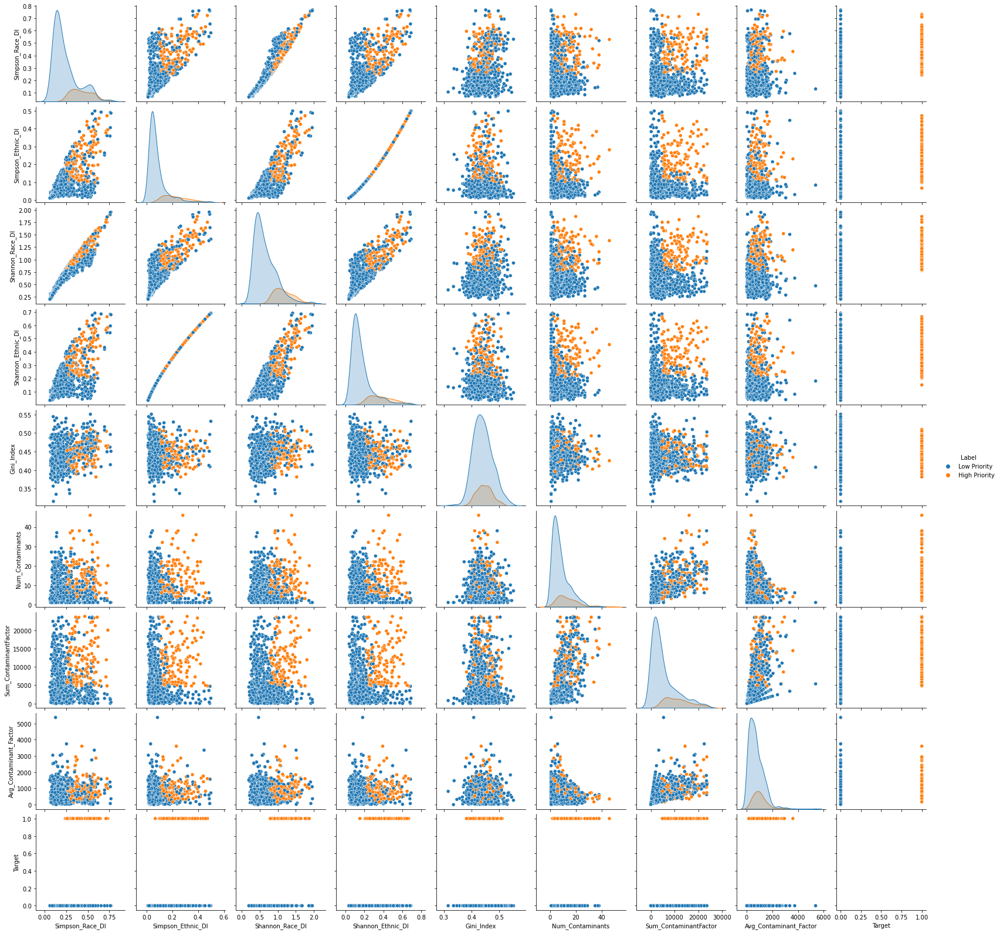

```python
import sqlite3
import warnings
warnings.filterwarnings('ignore')
import numpy as np
import pandas as pd
from pathlib import Path
from collections import Counter
from sklearn.preprocessing import StandardScaler
from sklearn.metrics import balanced_accuracy_score
from sklearn.metrics import confusion_matrix
from imblearn.metrics import classification_report_imbalanced
from sklearn.model_selection import train_test_split
from sklearn.metrics import roc_curve, auc, precision_recall_curve
import pickle


import os
```


```python
from plotly.subplots import make_subplots
import plotly.graph_objects as go
import plotly.express as px

```


```python
from scipy.stats import iqr

```


```python
import seaborn as sns
import matplotlib.pyplot as plt
```


```python
db = r'C:/Users/jonat/UO_Bootcamp/Group_project/git_Water_Quality_Analysis/Water_Quality_Analysis/Database/database.sqlite3'
# Connect to SQLite database
conn = sqlite3.connect(db)
  
# Create cursor object
cursor = conn.cursor()

#Read in the Data from the DB
df = pd.read_sql_query("SELECT * FROM Census_Data INNER JOIN Contaminant_Summary on Census_Data.county_FIPS = Contaminant_Summary.county_FIPS",conn)
```


```python
#Get the target binary data from the .csv file that was generated in the Priority_algo_dev.ipynb
target = pd.read_csv(os.path.join('..', '..', 'Priority_Algo_dev', 'new_priority.csv'), usecols=['New_Priority'])
target
```


<div>
<style scoped>
    .dataframe tbody tr th:only-of-type {
        vertical-align: middle;
    }

    .dataframe tbody tr th {
        vertical-align: top;
    }

    .dataframe thead th {
        text-align: right;
    }
</style>
<table border="1" class="dataframe">
  <thead>
    <tr style="text-align: right;">
      <th></th>
      <th>New_Priority</th>
    </tr>
  </thead>
  <tbody>
    <tr>
      <th>0</th>
      <td>0</td>
    </tr>
    <tr>
      <th>1</th>
      <td>1</td>
    </tr>
    <tr>
      <th>2</th>
      <td>1</td>
    </tr>
    <tr>
      <th>3</th>
      <td>1</td>
    </tr>
    <tr>
      <th>4</th>
      <td>0</td>
    </tr>
    <tr>
      <th>...</th>
      <td>...</td>
    </tr>
    <tr>
      <th>877</th>
      <td>0</td>
    </tr>
    <tr>
      <th>878</th>
      <td>0</td>
    </tr>
    <tr>
      <th>879</th>
      <td>0</td>
    </tr>
    <tr>
      <th>880</th>
      <td>1</td>
    </tr>
    <tr>
      <th>881</th>
      <td>1</td>
    </tr>
  </tbody>
</table>
<p>882 rows × 1 columns</p>
</div>


```python
sr = pd.Series(target.New_Priority)
sr
```


    0      0
    1      1
    2      1
    3      1
    4      0
          ..
    877    0
    878    0
    879    0
    880    1
    881    1
    Name: New_Priority, Length: 882, dtype: int64


```python
target_labels = sr.apply(lambda x : 'High Priority' if x>0 else 'Low Priority')
```


```python
df['Target'] = target.New_Priority
```

## Feature Selection


```python
df_model = df.drop(columns=['county_FIPS', 
                            'Geographic_Area_Name', 
                            'County', 'GEOID',
                            'Total_Population',
                            'White', 
                            'Black', 
                            'Native', 
                            'Asian',
                            'Pacific_Islander', 
                            'Other', 
                            'Two_or_more_Races', 
                            'Hispanic',
                            'Not_Hispanic', 
                            'Not_White',
                            'pct_White', 
                            'pct_Black', 
                            'pct_Native',
                            'pct_Asian', 
                            'pct_Pacific_Islander', 
                            'pct_Other', 
                            'pct_Not_White',
                            'pct_Hispanic', 
                            'pct_Not_Hispanic', 
                            'pct_Two_or_more_Races',
                            'County_FIPS',
                            'Sum_Population_Served',
                            'Min_Contaminant_Factor', 
                            'Max_Contaminant_Factor',
                            ])
```


```python
#Check to make sure the data types don't need fixing
df_model.dtypes
```


    Simpson_Race_DI           float64
    Simpson_Ethnic_DI         float64
    Shannon_Race_DI           float64
    Shannon_Ethnic_DI         float64
    Gini_Index                float64
    Num_Contaminants            int64
    Sum_ContaminantFactor       int64
    Avg_Contaminant_Factor    float64
    Target                      int64
    dtype: object


```python
#Check for Nan even though cleaning scripts should have excluded them by this stage
df_model.isna().sum()
```


    Simpson_Race_DI           0
    Simpson_Ethnic_DI         0
    Shannon_Race_DI           0
    Shannon_Ethnic_DI         0
    Gini_Index                0
    Num_Contaminants          0
    Sum_ContaminantFactor     0
    Avg_Contaminant_Factor    0
    Target                    0
    dtype: int64


## Filter the Data using the IQR method


```python
percentile25 = df_model['Sum_ContaminantFactor'].quantile(0.25)
percentile75 = df_model['Sum_ContaminantFactor'].quantile(0.75)
```


```python
SCF_IQR = iqr(df_model['Sum_ContaminantFactor'])
```


```python
print(percentile25, percentile75, SCF_IQR)
```

    1966.5 11049.5 9083.0
    


```python
upper_limit = percentile75 + 1.5 * SCF_IQR
lower_limit = percentile25 - 1.5 * SCF_IQR
```


```python
new_df = df_model[df_model['Sum_ContaminantFactor'] < upper_limit]

```


```python
new_df['Label'] = target_labels
```


```python
new_df.sample(20)
```


<div>
<style scoped>
    .dataframe tbody tr th:only-of-type {
        vertical-align: middle;
    }

    .dataframe tbody tr th {
        vertical-align: top;
    }

    .dataframe thead th {
        text-align: right;
    }
</style>
<table border="1" class="dataframe">
  <thead>
    <tr style="text-align: right;">
      <th></th>
      <th>Simpson_Race_DI</th>
      <th>Simpson_Ethnic_DI</th>
      <th>Shannon_Race_DI</th>
      <th>Shannon_Ethnic_DI</th>
      <th>Gini_Index</th>
      <th>Num_Contaminants</th>
      <th>Sum_ContaminantFactor</th>
      <th>Avg_Contaminant_Factor</th>
      <th>Target</th>
      <th>Label</th>
    </tr>
  </thead>
  <tbody>
    <tr>
      <th>811</th>
      <td>0.123800</td>
      <td>0.024524</td>
      <td>0.362783</td>
      <td>0.066826</td>
      <td>0.4616</td>
      <td>3</td>
      <td>3856</td>
      <td>1285.33</td>
      <td>0</td>
      <td>Low Priority</td>
    </tr>
    <tr>
      <th>461</th>
      <td>0.595608</td>
      <td>0.265007</td>
      <td>1.523013</td>
      <td>0.435026</td>
      <td>0.3817</td>
      <td>3</td>
      <td>8607</td>
      <td>2869.00</td>
      <td>1</td>
      <td>High Priority</td>
    </tr>
    <tr>
      <th>600</th>
      <td>0.149196</td>
      <td>0.041241</td>
      <td>0.443405</td>
      <td>0.102151</td>
      <td>0.4200</td>
      <td>4</td>
      <td>106</td>
      <td>26.50</td>
      <td>0</td>
      <td>Low Priority</td>
    </tr>
    <tr>
      <th>271</th>
      <td>0.126232</td>
      <td>0.050211</td>
      <td>0.418627</td>
      <td>0.119712</td>
      <td>0.4202</td>
      <td>5</td>
      <td>3964</td>
      <td>792.80</td>
      <td>0</td>
      <td>Low Priority</td>
    </tr>
    <tr>
      <th>563</th>
      <td>0.094933</td>
      <td>0.023446</td>
      <td>0.302269</td>
      <td>0.064395</td>
      <td>0.4524</td>
      <td>1</td>
      <td>926</td>
      <td>926.00</td>
      <td>0</td>
      <td>Low Priority</td>
    </tr>
    <tr>
      <th>148</th>
      <td>0.403550</td>
      <td>0.325308</td>
      <td>1.179164</td>
      <td>0.506509</td>
      <td>0.4353</td>
      <td>9</td>
      <td>2897</td>
      <td>321.89</td>
      <td>0</td>
      <td>Low Priority</td>
    </tr>
    <tr>
      <th>63</th>
      <td>0.487995</td>
      <td>0.100374</td>
      <td>1.076582</td>
      <td>0.207240</td>
      <td>0.4363</td>
      <td>15</td>
      <td>5281</td>
      <td>352.07</td>
      <td>0</td>
      <td>Low Priority</td>
    </tr>
    <tr>
      <th>408</th>
      <td>0.209698</td>
      <td>0.037032</td>
      <td>0.565055</td>
      <td>0.093614</td>
      <td>0.4291</td>
      <td>11</td>
      <td>13612</td>
      <td>1237.45</td>
      <td>0</td>
      <td>Low Priority</td>
    </tr>
    <tr>
      <th>401</th>
      <td>0.218188</td>
      <td>0.056749</td>
      <td>0.612333</td>
      <td>0.132048</td>
      <td>0.4381</td>
      <td>10</td>
      <td>7270</td>
      <td>727.00</td>
      <td>0</td>
      <td>Low Priority</td>
    </tr>
    <tr>
      <th>48</th>
      <td>0.399721</td>
      <td>0.089576</td>
      <td>0.956214</td>
      <td>0.189574</td>
      <td>0.4594</td>
      <td>1</td>
      <td>1096</td>
      <td>1096.00</td>
      <td>0</td>
      <td>Low Priority</td>
    </tr>
    <tr>
      <th>21</th>
      <td>0.228871</td>
      <td>0.075716</td>
      <td>0.679439</td>
      <td>0.166065</td>
      <td>0.4321</td>
      <td>9</td>
      <td>5812</td>
      <td>645.78</td>
      <td>0</td>
      <td>Low Priority</td>
    </tr>
    <tr>
      <th>6</th>
      <td>0.144976</td>
      <td>0.033514</td>
      <td>0.447271</td>
      <td>0.086308</td>
      <td>0.4265</td>
      <td>4</td>
      <td>7408</td>
      <td>1852.00</td>
      <td>0</td>
      <td>Low Priority</td>
    </tr>
    <tr>
      <th>151</th>
      <td>0.618971</td>
      <td>0.321972</td>
      <td>1.609691</td>
      <td>0.502678</td>
      <td>0.4296</td>
      <td>24</td>
      <td>11252</td>
      <td>468.83</td>
      <td>1</td>
      <td>High Priority</td>
    </tr>
    <tr>
      <th>445</th>
      <td>0.299979</td>
      <td>0.271371</td>
      <td>0.940018</td>
      <td>0.442787</td>
      <td>0.4328</td>
      <td>1</td>
      <td>985</td>
      <td>985.00</td>
      <td>0</td>
      <td>Low Priority</td>
    </tr>
    <tr>
      <th>708</th>
      <td>0.171324</td>
      <td>0.063603</td>
      <td>0.502696</td>
      <td>0.144568</td>
      <td>0.5167</td>
      <td>5</td>
      <td>719</td>
      <td>143.80</td>
      <td>0</td>
      <td>Low Priority</td>
    </tr>
    <tr>
      <th>68</th>
      <td>0.538178</td>
      <td>0.159892</td>
      <td>1.212859</td>
      <td>0.297000</td>
      <td>0.4741</td>
      <td>15</td>
      <td>11654</td>
      <td>776.93</td>
      <td>1</td>
      <td>High Priority</td>
    </tr>
    <tr>
      <th>92</th>
      <td>0.340404</td>
      <td>0.053646</td>
      <td>0.804621</td>
      <td>0.126235</td>
      <td>0.3916</td>
      <td>2</td>
      <td>2846</td>
      <td>1423.00</td>
      <td>0</td>
      <td>Low Priority</td>
    </tr>
    <tr>
      <th>568</th>
      <td>0.127527</td>
      <td>0.079044</td>
      <td>0.444908</td>
      <td>0.171803</td>
      <td>0.4232</td>
      <td>22</td>
      <td>21493</td>
      <td>976.95</td>
      <td>0</td>
      <td>Low Priority</td>
    </tr>
    <tr>
      <th>414</th>
      <td>0.114847</td>
      <td>0.036273</td>
      <td>0.357974</td>
      <td>0.092052</td>
      <td>0.4145</td>
      <td>4</td>
      <td>5199</td>
      <td>1299.75</td>
      <td>0</td>
      <td>Low Priority</td>
    </tr>
    <tr>
      <th>585</th>
      <td>0.401754</td>
      <td>0.083862</td>
      <td>0.999394</td>
      <td>0.180004</td>
      <td>0.4650</td>
      <td>9</td>
      <td>2963</td>
      <td>329.22</td>
      <td>0</td>
      <td>Low Priority</td>
    </tr>
  </tbody>
</table>
</div>


```python
new_df.shape
```


    (834, 10)


```python
df_model.shape
```


    (882, 9)


```python
new_df.columns
```


    Index(['Simpson_Race_DI', 'Simpson_Ethnic_DI', 'Shannon_Race_DI',
           'Shannon_Ethnic_DI', 'Gini_Index', 'Num_Contaminants',
           'Sum_ContaminantFactor', 'Avg_Contaminant_Factor', 'Target', 'Label'],
          dtype='object')


```python
fig = px.scatter(
    new_df, 
    x="Simpson_Ethnic_DI", 
    y="Sum_ContaminantFactor", 
    color="Label",
    size='Num_Contaminants', 
    hover_data=['Sum_ContaminantFactor'],
    labels={
        "Sum_ContaminantFactor": "Total Conatmainant Factor",
        "Simpson_Ethnic_DI" : " Simpson Ethnic Index"
                     
                 },
)

fig.update_layout(
    title={
        'text': "Plot of the Adaboost Top Feature Importance",
        'y':0.95,
        'x':0.5,
        'xanchor': 'center',
        'yanchor': 'top'})


fig.show()

```


<div>                            <div id="40918ca5-deaf-4714-bfb6-5c25a810ef66" class="plotly-graph-div" style="height:525px; width:100%;"></div>            <script type="text/javascript">                require(["plotly"], function(Plotly) {                    window.PLOTLYENV=window.PLOTLYENV || {};                                    if (document.getElementById("40918ca5-deaf-4714-bfb6-5c25a810ef66")) {                    Plotly.newPlot(                        "40918ca5-deaf-4714-bfb6-5c25a810ef66",                        [{"hovertemplate":"Label=Low Priority<br> Simpson Ethnic Index=%{x}<br>Total Conatmainant Factor=%{y}<br>Num_Contaminants=%{marker.size}<extra></extra>","legendgroup":"Low Priority","marker":{"color":"#636efa","size":[4,1,3,4,1,10,2,4,22,9,4,3,6,2,1,5,7,6,9,3,11,1,3,14,2,10,3,1,8,5,6,1,5,6,2,3,10,7,12,1,11,5,3,6,7,8,4,4,7,6,15,3,4,8,38,16,5,12,18,3,2,7,9,2,13,3,5,6,2,2,3,4,2,1,8,2,3,3,1,6,3,1,15,2,1,2,1,1,20,8,2,2,4,4,5,9,3,3,4,5,1,8,7,6,6,3,1,6,2,6,4,6,3,1,7,1,3,12,1,9,3,8,1,1,2,9,1,5,1,1,1,1,2,4,1,1,3,2,2,3,3,5,1,1,1,4,1,1,1,5,7,4,2,1,3,2,2,2,3,4,4,4,4,3,3,7,12,11,4,6,13,5,17,16,20,10,2,4,4,9,19,8,7,10,9,4,20,4,7,1,11,3,16,6,17,7,13,12,6,2,6,9,3,11,16,5,7,2,7,6,11,4,9,2,4,24,12,4,9,15,10,7,8,5,11,6,5,6,11,13,3,7,6,1,22,2,15,4,2,2,4,8,6,9,3,9,13,4,8,3,5,7,17,10,6,5,2,4,4,17,12,5,7,6,7,6,14,11,9,23,4,17,21,16,9,11,5,18,10,12,1,9,3,3,18,2,6,8,15,3,4,7,6,5,16,14,5,7,7,3,4,7,20,3,3,4,8,3,2,29,10,16,2,7,2,7,11,8,4,10,6,17,4,16,12,18,4,3,5,9,8,19,2,4,7,22,6,19,9,17,7,22,18,15,14,6,5,4,6,1,4,9,3,6,9,4,6,2,6,3,7,7,7,9,7,8,3,8,6,1,8,1,7,21,7,4,8,6,8,10,9,9,1,4,10,13,2,2,16,9,3,12,4,1,15,1,6,5,12,6,7,6,4,9,3,5,7,2,3,16,8,6,7,19,5,13,7,5,10,14,3,5,2,19,12,16,15,1,4,20,13,3,5,5,9,3,5,23,1,1,1,2,4,3,4,3,1,2,20,9,22,2,16,5,5,4,10,7,5,10,25,26,7,21,9,2,10,6,15,17,8,17,4,6,5,13,6,4,15,5,5,5,10,8,6,6,5,27,3,2,22,21,13,5,22,9,10,9,16,5,10,2,6,14,6,8,20,19,9,15,12,5,5,7,14,13,5,14,10,13,11,6,3,8,11,3,7,2,11,6,9,13,4,6,7,9,8,3,1,6,6,1,9,9,8,4,2,8,5,4,13,3,1,2,11,2,6,11,4,16,8,14,3,9,2,6,14,24,6,26,4,21,6,18,3,13,8,12,4,19,6,5,1,16,4,10,14,10,24,3,8,3,9,3,4,3,3,8,6,4,4,5,5,3,7,18,27,24,24,37,25,26,27,13,18,5,11,35,26,5,9,29,12,3,14,3,5,18,10,9,20,16,20,14,27,8,6,15,22,2,22,25,13,27,4,17,5,19,15,7,23,20,16,3,9,4,9,15,11,9,5,15,4,10,1,9,2,5,6,9,6,11,19,3,2,6,4,17,6,16,4,2,14,4,11,3,3,1,1,1,2,3,1,2,1,1],"sizemode":"area","sizeref":0.115,"symbol":"circle"},"mode":"markers","name":"Low Priority","orientation":"v","showlegend":true,"x":[0.2178255743095885,0.237761671562984,0.03220637479846211,0.03351391339051657,0.04552506501659048,0.04323718008747246,0.08251338685095888,0.06068435694633556,0.06476002233127254,0.07646187100565371,0.06349002245161783,0.05380151130825106,0.09496439665021228,0.022353230164578686,0.036636815920398025,0.04103576379609186,0.029837925128220255,0.05085842687603592,0.07571607169702699,0.04473848408917591,0.0684998248689207,0.035447857548106865,0.04611008609401057,0.04422380290164618,0.022232055851675425,0.046027337068248464,0.03181000027253866,0.0224378679203584,0.12604008550487467,0.03926455104075943,0.053419291964841076,0.030972059137660657,0.07152819876237981,0.018908499450743577,0.07358142357097519,0.10702723767940547,0.0680322257243583,0.034217103092590184,0.047105828110107995,0.0895758042703182,0.020962648123059147,0.04923904930249079,0.0666103044286277,0.1331586247383596,0.09391869350429016,0.04802458904801976,0.056551111612377025,0.04340009208850115,0.039572103007746495,0.060546034228186274,0.1003737202235232,0.12251040751136588,0.047476269257180626,0.04219618371548273,0.045618992015961535,0.09502537956276824,0.11754855999383018,0.07818993570969834,0.03910719262101037,0.12525553920319943,0.24531559664431835,0.07958115658240639,0.08287941271567256,0.039595343445896214,0.07685779971606954,0.052334025772238224,0.08423171235130855,0.05082046818475361,0.023305672388015508,0.06177458543285075,0.030449660850520366,0.037382800685553,0.030146289931951342,0.050302210666023583,0.1189960757164944,0.05364610007318016,0.04139002513412626,0.037341128654213795,0.023729362407318377,0.044839917290036,0.10359794162784064,0.06900377149331716,0.05020679241403747,0.023920017401112603,0.059711379149614774,0.043016533832658355,0.08336740798563458,0.03986122738050357,0.05708140293811703,0.096875806331023,0.026457764684064355,0.03106815761866777,0.040957954016783815,0.055777505198088995,0.07555143545533394,0.10027660579807818,0.02779513126452282,0.14365676155952045,0.08554253469698647,0.10625783526871502,0.06065977864711902,0.1339148560397585,0.06776506611106314,0.13693521087672844,0.05315308467530666,0.04759086344938057,0.06922685771136738,0.07783556083935228,0.12465099635520316,0.029903664663806562,0.033286453539643435,0.1121498963679356,0.07540378392267089,0.050697793462279206,0.04799845782299017,0.3002237027095862,0.38339059997567126,0.08949993484573648,0.11760565928779809,0.3253075609262842,0.13934525317878999,0.271980029430252,0.41922255971357447,0.4902188347287616,0.23961917268198285,0.12441317793959372,0.3833888118077363,0.26280483100497787,0.44628438338865273,0.20825717439321478,0.0768078979843686,0.20855493306433925,0.17796699774626557,0.05473376309724187,0.3171358906444811,0.2501363584252385,0.1657307785405212,0.07629427475565265,0.4986866564763307,0.29939669146990144,0.49227857923262897,0.1417690906268685,0.3398145942125692,0.3193803631370836,0.25606453867079293,0.17360082671873933,0.20080750485289856,0.2279080772930313,0.06017245130483573,0.19321560343959532,0.12255541004587645,0.13322724221100535,0.17307030890199193,0.09266782151882524,0.23607997379077106,0.05347455551010549,0.15769989053458033,0.09761856222777343,0.19112204325204352,0.0930700437991292,0.2276519347306133,0.1464679619238728,0.23246905760005354,0.24802814919193894,0.07427995163256285,0.059815807743784255,0.049022177248019605,0.039222889400394534,0.054857958830225706,0.022382741332310552,0.03596906182352988,0.03422611828277988,0.04892579460322122,0.032055499695972545,0.0331635574150706,0.03963037639727196,0.051093142706722494,0.056391252958538196,0.041688736606037446,0.07420183323952945,0.04665510826681152,0.05318300032622003,0.10302445902580215,0.11374012163861669,0.07046713101587221,0.03175330558614986,0.11528267422063376,0.03407613607143145,0.057252119036727556,0.028546990424926255,0.12066505372178027,0.033206060685338934,0.04646345227572024,0.07760927718967203,0.03764704604774882,0.06207533035639279,0.15264214551841004,0.05294144120847488,0.07783040471707714,0.04924421213247354,0.12252935400263365,0.04599187863712284,0.036541961375222476,0.09460393666863998,0.06244853511929571,0.05021113600667704,0.06064095008964232,0.042580067426574164,0.09394030989428237,0.06542177421192241,0.041993092792365516,0.056134177555284825,0.04122468516202049,0.07168530329150868,0.02528920607951579,0.058950570946077696,0.1744180217948058,0.03462252328234283,0.055642695170958434,0.0558791922965185,0.055328979574608805,0.2241924118247861,0.029758753464927734,0.03904006219725065,0.03532930444531612,0.06809930259246788,0.10154636961513219,0.0922865198974051,0.06198754662655881,0.16836989699968175,0.16556793302190587,0.14254268317676067,0.07368844096825056,0.07879359540134934,0.09315954747360677,0.05973941181749953,0.14850463454831353,0.08739686451300821,0.13513357672812243,0.24257628751057092,0.23972448474671448,0.08257227600812689,0.06940981157721238,0.10348039852741842,0.11256857878551962,0.06418771178805371,0.026924055625795695,0.0823503835415551,0.0176870752230448,0.06109429553871004,0.03701666330786413,0.04317848970884719,0.03420988001188807,0.027946582069138026,0.015273758422082784,0.040029162949642094,0.09016965764225393,0.04735193201108645,0.01995378930617353,0.08010552182278652,0.06189877331183169,0.02933269219502843,0.06363075593005241,0.026789353530045856,0.037365859068094864,0.057097258485169555,0.0626338420038266,0.08897404793838892,0.1040703896288393,0.05333178790367066,0.05356801477368556,0.04237411457164597,0.0538523318708628,0.017776358259478875,0.06684932538248944,0.03839001746829418,0.03081381709987774,0.1688690567537171,0.02843861755184751,0.09177819409915833,0.14880491844940746,0.0622275008335067,0.031329671798757674,0.03300332668666606,0.0723542699252886,0.07260888050567726,0.046718386773742626,0.06358190898262517,0.14599785046939562,0.26149897789009546,0.026326522282384968,0.049041837467487914,0.0592834821491226,0.07852251458598414,0.03338874397250913,0.042953743028373625,0.01753379418977774,0.19382185297083365,0.03544592087571341,0.035001177924257054,0.034461638160546815,0.12037019594035858,0.1421516865721545,0.10137487677597012,0.04727437147772284,0.029940898374375968,0.07467974231873309,0.07952261171178276,0.18711415919685326,0.09842561238712988,0.05674920417091589,0.06814434704945282,0.11554214482839464,0.05117798652421646,0.02503112135603469,0.0779251698614829,0.03703157046668093,0.0535073480506586,0.027728361877053187,0.045902573432054505,0.025686107909694833,0.057847947270155076,0.036272631007777,0.04064193813268557,0.02635580855314812,0.06585754899194862,0.029191560757775736,0.03492233630723973,0.11586807382481135,0.06602741465247453,0.0339345879824996,0.09298387143879938,0.05261683941247186,0.01921360202276645,0.09590910200690761,0.046975453132721334,0.09550642740626225,0.09758358816286616,0.030847035385448862,0.032028161825719104,0.022246588537002676,0.026730044942685383,0.05158062871310898,0.24583772484539046,0.03773537261228899,0.07694714992814944,0.03878341351893788,0.06878438107696416,0.07371318184961795,0.2713706237090562,0.0523189963066073,0.07130923480026385,0.15778938791509312,0.07836827295536053,0.05168688828182311,0.06815043332193349,0.05147930975466375,0.1093765345320572,0.05285885964804948,0.07807547406165305,0.08435405793265549,0.06553032312834939,0.14298660826190657,0.09069677793997588,0.059835284185449256,0.041411770400894055,0.16245794146802317,0.06918864819746695,0.08871979826914289,0.08458117413965982,0.048403346507180145,0.0998041967410479,0.07198036486778647,0.04420974532107269,0.06751470963886275,0.08075498187984187,0.050450239611260606,0.10789553392795936,0.05629599785540984,0.10639837129134277,0.1487630014981126,0.038188865450437204,0.21471004783253567,0.0368408949458181,0.08795452851708352,0.09452870071564135,0.04456114415197354,0.02371356443014483,0.025676800739782957,0.14369091230852216,0.028435932790246143,0.03841301326022728,0.03534972973983219,0.024696502984770885,0.10767718724483744,0.04257247836060207,0.10446681092809862,0.08026976652669038,0.03209360022528018,0.02630808072040358,0.0403121828207984,0.03944267782258015,0.09462804354898735,0.043957060279819715,0.028996269133134578,0.0333414504317604,0.03410782907562071,0.03725415336660309,0.03040166074366102,0.061212949901169766,0.1396046523085528,0.04992780329036939,0.0351724109471413,0.05206226013103943,0.15674687711556923,0.09564245680185068,0.04717512880413888,0.034798189941148916,0.08900581766046378,0.07415001890966011,0.2025219066315017,0.02605740343732299,0.17808059159082312,0.09119486135176158,0.07886041829248946,0.15626989074346886,0.05515997339056866,0.027341453639565638,0.030356464355617896,0.057725232214443145,0.06411883077703362,0.03988846099226295,0.08486592202910093,0.04050465611721943,0.061665526241712953,0.06410966466339718,0.07725963458655194,0.07769674394534853,0.026943380556949892,0.1117563348819115,0.26070827570894217,0.04119654647137261,0.023114342857075254,0.03433904354862438,0.036776464057913794,0.03492006513588264,0.02344552235434194,0.036317745992575645,0.06629230091432459,0.16225316308550597,0.07904442841699899,0.023578107996579,0.05768109492836482,0.06551505654434342,0.04582239622579487,0.07381186808024587,0.05086239847309992,0.04219365140963138,0.0271476153718212,0.05685613728556682,0.174402469239892,0.044675101197024114,0.04089574231149251,0.031459274917219116,0.08386178277257483,0.12336442470627595,0.04185862692017506,0.06139093313885602,0.05318682424817567,0.09819646682827732,0.036117387613023966,0.06550769383688115,0.014962506694380928,0.04627333623995644,0.06649685524478322,0.040320613512310866,0.040436454879615,0.0412406135972907,0.025226179955825212,0.028789317228848033,0.09165888288717916,0.04034818645821703,0.05085798429364219,0.03138328050131112,0.031234965231229594,0.040145410217052535,0.044066687014474915,0.036433516090282114,0.04777365983836801,0.01221411021370944,0.051595171081572744,0.06147199658760405,0.14485327671432469,0.03235693035799547,0.05039662162457759,0.047497020180209626,0.032299539143799905,0.2126189257850255,0.035638004560618164,0.05271069441808751,0.031282289967651256,0.03552558351157398,0.0838051684262292,0.036990096099769,0.03483556558773526,0.10544918923720148,0.03963752692559652,0.04156443847568925,0.030317664092341712,0.11544189464513166,0.039398886653755905,0.018657859842758473,0.025166252750554285,0.051596799135710913,0.16941993736787775,0.054819558758296916,0.048139434070549214,0.04893388442661861,0.19995149373821586,0.048838252139073446,0.023504336502939482,0.07589400910030963,0.03761440199856647,0.028691865956834484,0.03201622976986884,0.07130887118275131,0.02304744874051501,0.014736053434215024,0.047928411545184124,0.03930935404335156,0.037612915356198484,0.03870300090123424,0.04906334114366495,0.04118016357086607,0.04230095325628336,0.07569944304842269,0.019122067122127273,0.025033695251000077,0.09694434511955385,0.08776457535435678,0.04386085216931801,0.05731435682354491,0.04860495798538156,0.015437747712176542,0.09053863795649697,0.059153426003876186,0.05729456054198734,0.06236092351515976,0.05367824647966524,0.04048442370417049,0.03854557579507767,0.06176558179249281,0.09419844462412841,0.023605643474187366,0.04274141351943039,0.08153660130139273,0.05943966648635868,0.04700312541214391,0.0472929265963673,0.07221804389253206,0.07055812897276192,0.055398011903214806,0.03635156266735218,0.053902978265336854,0.046627123658391056,0.06274153535045024,0.09664616599666609,0.05757649681339205,0.051719816645285466,0.03235703356357145,0.040492450684149084,0.06914633897388989,0.09976445788466226,0.04330734338222253,0.054617161731016606,0.05425364688619527,0.05865738006811283,0.05822956899129783,0.05188403495236549,0.06906488215148865,0.07815728027426272,0.06360261500477249,0.0560298826040555,0.09236626642557144,0.17313686561172814,0.10994074361326789,0.13514900498085847,0.13260648923658935,0.112515119908282,0.10156585043350608,0.07520112769765908,0.09962318086624067,0.23524231813504615,0.32495479412365236,0.14700711369036268,0.17727073915728808,0.177836445646535,0.1763833959530573,0.48359474782911105,0.11923731699012596,0.19198478198789204,0.40540139022668475,0.06713493663159431,0.10915468523491523,0.27578723079962164,0.014837091208914521,0.021579721701055377,0.02742605961097666,0.028692621151085174,0.037114367506981494,0.03625470188753921,0.1061699166783977,0.06890146888580351,0.020568119443560517,0.06332305347759781,0.03472978667097626,0.06393867857412261,0.0291326151739415,0.08804423214629242,0.08851652822484213,0.018794465275237204,0.0848784869460395,0.024202350101674375,0.08836435660899733,0.1285306976908701,0.019860609646120575,0.027967944607909745,0.03790055137238302,0.03483283468040688,0.01768706425483657,0.07426662043990506,0.037718034942156975,0.04071643681893944,0.0312535428384797,0.028659540288533014,0.04153391257960892,0.05226608771225072,0.08648467555991157,0.03899811474412107,0.2529948390082065,0.029677222503335265,0.10638965713909487,0.04796669089350736,0.027587234924358217,0.03531843039364502,0.04310535223088596,0.0893290292204365,0.022611195999060474,0.02127904987583129,0.03767667237923322,0.08755206808580185,0.029057955824550175,0.04358226550632649,0.024523576676068304,0.1065539702635162,0.013565730169484369,0.032562941804263,0.012835811453536516,0.02559796613164189,0.0637135906405738,0.016445655711031515,0.034031603518468345,0.02876165795961505,0.028722146759619482,0.016415725517316626,0.02964488109274166,0.03998338386162903,0.0228769860104423,0.02335348875378873,0.022679253629402707,0.013820918367361656,0.027281193438071005,0.03003643994221261,0.018388507106197327,0.016330731795880515,0.026828940060237838,0.03980026692396221,0.02783994935453138,0.03158040293915898,0.022091222291704016,0.02143765712827772,0.021202340937682362,0.016428407597709804,0.0126713415575197,0.026185781099705485,0.011866204948566494,0.02028714251929742,0.35853779139518593,0.23475393059348304,0.2547139657784542,0.36084864370840564,0.2639929700306478,0.4865549840141806,0.45388201152578955,0.40547238920292394,0.41122898676109365],"xaxis":"x","y":[4744,42,760,7408,343,11277,786,5177,18051,4384,5259,892,4142,648,1551,2487,6705,3733,5812,2409,9428,1557,2114,13126,2796,11056,1283,414,2852,673,6094,789,6229,3345,3377,3208,13809,7381,904,1096,1239,387,180,2389,9454,9696,413,292,5540,1117,5281,2183,2616,2280,23489,10348,3066,2131,7565,2636,164,4870,4879,699,1851,2225,3574,2362,659,773,595,3610,981,656,1887,2846,2395,2152,470,3074,1710,126,9063,961,692,1361,21,21,15028,1299,465,2847,11030,1732,2953,7540,578,2332,3518,4297,1040,12935,2151,3465,4385,1463,1275,3659,1397,3483,1837,4491,1725,758,3017,154,3225,13189,118,2897,4020,2687,581,71,1439,3602,190,3928,3360,561,728,980,2387,2799,2403,132,4446,5328,1445,2247,4711,2470,101,1750,1475,1947,552,952,820,2994,4254,1020,2128,46,1934,1461,379,367,799,2780,1287,1964,753,2006,3442,4732,2591,4265,4345,384,3252,5261,4867,1824,7792,4064,1697,2267,214,4323,7955,2877,7279,6516,3822,458,7460,3851,2269,1019,7475,811,2943,877,3753,1478,8764,2778,1682,299,2535,4023,627,4304,7324,3964,1833,895,5730,4627,2298,1006,2790,1427,2422,4768,4503,806,2596,13407,3112,2044,1443,3344,5835,1874,1886,4000,6459,5049,1276,6557,8068,672,3423,2493,14056,3656,32,2123,752,6482,551,1625,1414,2538,3315,1411,2142,2017,2042,864,2431,1355,609,631,2430,2530,159,1778,12625,373,5475,449,1873,3032,5276,6169,766,2565,2990,3495,18738,3701,9590,4952,2372,21249,6164,12038,1878,9785,3128,4075,20548,1260,4593,10055,16046,4635,2020,8929,5921,11952,17404,10611,3510,2269,5569,3958,2778,3184,12456,4044,2947,5788,4747,900,130,17073,7270,17999,1990,8043,2006,8265,13612,4580,3046,17342,3578,9058,5199,18298,16763,15281,6619,1277,3754,6850,6390,23578,2393,3042,2348,14927,5091,23256,5035,18897,7546,19254,18210,3503,16573,18612,6082,5764,10378,985,3343,6852,3512,6917,17637,5085,9156,1779,5564,3901,10733,10918,8277,7570,5249,13846,3525,5178,7586,5376,8891,1630,5867,16151,14281,3641,5742,14013,9161,8048,5578,11441,2016,10089,14925,12050,3753,3465,4936,10796,3315,2302,4124,70,18386,8,1974,1830,1207,1238,2939,5163,1851,4047,3096,555,464,494,800,2039,4032,2953,3836,22407,1503,4058,5827,429,7186,9356,887,560,26,18790,2368,10828,10377,54,2171,19393,2399,557,3997,2669,13075,517,6530,8703,39,426,208,2570,1210,1507,243,498,926,1342,14821,2543,21493,553,10273,3906,2150,459,18323,12326,5809,11433,2166,12345,18408,419,2963,439,4381,218,4658,21616,411,821,1400,14055,517,15769,2274,106,586,9024,118,8094,14796,375,9626,9694,1728,12183,2582,2984,2822,20994,359,7812,2583,13470,15805,1157,23442,775,243,3309,8926,287,4128,7319,3940,1057,9096,3443,16080,608,2268,1423,703,501,5979,607,1805,23369,1396,3459,1106,3188,1263,1287,12210,3206,5696,561,12807,11436,225,493,1503,1141,1762,4384,1282,18239,8721,677,5723,5998,13106,7594,3038,4166,3299,165,889,234,89,276,5065,977,4118,14172,276,4461,9581,3299,1793,4894,237,2069,2184,17625,1073,17575,6637,8988,3754,23336,1186,3604,10330,4634,1389,12389,5633,719,0,5984,2375,5499,9616,2981,11498,1356,4077,2118,2801,3028,1714,4643,468,4602,3560,1230,1163,2379,1679,1244,3428,13185,13321,6352,9866,13183,18610,9137,4772,5674,14129,1790,3072,20278,6383,4451,7936,17595,18875,1822,3984,1216,8416,9077,4892,5797,8939,9449,8882,8114,12867,2125,4280,11182,21241,1411,8069,8265,3821,11138,2872,3024,3300,5319,10954,10881,5560,22471,9424,3856,2311,5697,13941,16272,10213,13316,4497,11893,10245,11488,1460,11437,1995,2405,5602,6969,18285,14512,23587,3517,932,4610,8231,10753,22485,11928,5064,2978,15485,2280,17485,4521,5215,1394,788,125,2490,2689,363,1188,1104,20],"yaxis":"y","type":"scatter"},{"hovertemplate":"Label=High Priority<br> Simpson Ethnic Index=%{x}<br>Total Conatmainant Factor=%{y}<br>Num_Contaminants=%{marker.size}<extra></extra>","legendgroup":"High Priority","marker":{"color":"#EF553B","size":[9,20,11,4,7,7,17,19,13,10,7,11,7,15,16,14,3,22,12,6,7,5,6,11,8,16,24,22,13,2,18,12,16,20,6,8,33,13,7,9,11,9,37,5,7,17,8,8,18,10,7,12,19,10,18,9,8,7,8,23,10,15,15,22,16,17,21,20,20,9,15,6,7,4,15,14,11,23,4,16,7,9,21,18,17,6,8,8,11,8,3,6,8,7,7,7,12,4,15,10,21,16,23,12,32,13,10,13,11,7,6,22,17,13,10,22,21,22,11,17,6,16,27,31,20,29,36,46,38,34,38,9,20,9,3,4,6,6],"sizemode":"area","sizeref":0.115,"symbol":"circle"},"mode":"markers","name":"High Priority","orientation":"v","showlegend":true,"x":[0.1419424584074288,0.197811277740922,0.2002625166545997,0.2181490367270592,0.12267737838044357,0.1220633394150179,0.3675334693062199,0.12723428619577815,0.21892249388894958,0.06772295816917495,0.19644198331170315,0.1288858862786656,0.13728992694219777,0.1598923874969106,0.10532273449590757,0.268387184344136,0.11145132551451586,0.1145937155770217,0.12177305729938759,0.17109988577296287,0.1225404892876455,0.1740263533866674,0.10850764318717976,0.3100640829144292,0.1502795081669328,0.35850760607994303,0.32197228186350135,0.39453235218883453,0.20858119225892213,0.24148179785738333,0.2605125135354778,0.3121155797302102,0.24500230544662005,0.2250072579918141,0.29039002146912496,0.3161628141043157,0.3614903100256983,0.373881773000206,0.160655224324306,0.3321614549679338,0.4239384895155971,0.1757896577928637,0.23166717136240111,0.12348711124098122,0.3086574518990458,0.29960621925186603,0.14839744746286798,0.31399912818076425,0.32299654129366373,0.17455526490095974,0.1759536109163684,0.2093133566848534,0.31943770903851076,0.19445550375431675,0.3149438748076294,0.19866073550140506,0.20141096367114708,0.30265835154404064,0.17607112411086823,0.24811182521027053,0.272690499481157,0.24246789467189256,0.13600151877326017,0.2079472134540491,0.18872488011420796,0.11580088805381805,0.2622633482984724,0.16324902859416823,0.27498936089549153,0.31384445304945907,0.09798240315145967,0.09935807894271642,0.13016970261650396,0.2693608454567916,0.136714068338064,0.33625935571933896,0.38681784206150605,0.23413792861961358,0.4410667640803356,0.20580057621655545,0.3655563961365511,0.12686400807625786,0.25577032781870523,0.19881825428349664,0.10483455175735856,0.23668375060568636,0.30519818737491955,0.2034607151247495,0.12967176004543846,0.1299121624021341,0.2650070161132444,0.20995930720549139,0.1274726807387324,0.3492979172491275,0.14158621847061426,0.18606814869738875,0.26572192499760083,0.23116541325567797,0.11224212897526731,0.11242209576652884,0.11012896654493598,0.1787136942687073,0.20909873503716092,0.10517730108085332,0.1225850150802964,0.13774243024392951,0.13397708462502111,0.19338669356850624,0.12519995858049515,0.14250412130848233,0.11526628154118779,0.16306801361541767,0.16982709078562508,0.12346864328227325,0.1587710423647427,0.4185056029601497,0.22081043847279302,0.17399074989450236,0.4400744391118392,0.40033717287887594,0.2488001565146536,0.3054656817640943,0.29429346854359195,0.1944204497994656,0.1549033168250714,0.24372873647707705,0.38376369798252197,0.28174982589304454,0.24439505503580228,0.2032238594652278,0.15759401922653016,0.133115725942352,0.3942790018797203,0.3556531881313725,0.4720290545769288,0.24757024522570303,0.4572454404748475,0.3766947272918362],"xaxis":"x","y":[4987,15583,5456,5372,7497,10514,21227,5370,12426,9557,7010,14323,7781,11654,14546,11106,4901,17830,14372,6365,6742,5601,7116,8426,13625,19844,11252,23326,7974,5410,11694,17742,15809,5869,5704,8973,12520,17797,12715,10017,18036,8873,15230,5967,12037,22128,15008,11731,12660,21028,5120,11968,15295,10325,23778,12811,8597,4816,10173,9168,6208,15465,10567,11077,19091,7355,19784,12144,19067,7238,12046,6900,6199,5587,5949,12934,11942,14579,5643,12281,5481,11067,14596,5378,8233,4996,11340,19422,10905,22227,8607,7641,23573,4801,11109,7456,10074,14422,12003,5377,23494,16675,13741,8602,23548,22425,5267,5851,13219,6284,13797,9913,8336,12380,5782,10823,7375,6605,19399,13314,6632,5445,16931,22319,15401,10605,17109,16127,14940,5837,20458,7762,20020,16622,4808,5845,4957,7277],"yaxis":"y","type":"scatter"}],                        {"template":{"data":{"histogram2dcontour":[{"type":"histogram2dcontour","colorbar":{"outlinewidth":0,"ticks":""},"colorscale":[[0.0,"#0d0887"],[0.1111111111111111,"#46039f"],[0.2222222222222222,"#7201a8"],[0.3333333333333333,"#9c179e"],[0.4444444444444444,"#bd3786"],[0.5555555555555556,"#d8576b"],[0.6666666666666666,"#ed7953"],[0.7777777777777778,"#fb9f3a"],[0.8888888888888888,"#fdca26"],[1.0,"#f0f921"]]}],"choropleth":[{"type":"choropleth","colorbar":{"outlinewidth":0,"ticks":""}}],"histogram2d":[{"type":"histogram2d","colorbar":{"outlinewidth":0,"ticks":""},"colorscale":[[0.0,"#0d0887"],[0.1111111111111111,"#46039f"],[0.2222222222222222,"#7201a8"],[0.3333333333333333,"#9c179e"],[0.4444444444444444,"#bd3786"],[0.5555555555555556,"#d8576b"],[0.6666666666666666,"#ed7953"],[0.7777777777777778,"#fb9f3a"],[0.8888888888888888,"#fdca26"],[1.0,"#f0f921"]]}],"heatmap":[{"type":"heatmap","colorbar":{"outlinewidth":0,"ticks":""},"colorscale":[[0.0,"#0d0887"],[0.1111111111111111,"#46039f"],[0.2222222222222222,"#7201a8"],[0.3333333333333333,"#9c179e"],[0.4444444444444444,"#bd3786"],[0.5555555555555556,"#d8576b"],[0.6666666666666666,"#ed7953"],[0.7777777777777778,"#fb9f3a"],[0.8888888888888888,"#fdca26"],[1.0,"#f0f921"]]}],"heatmapgl":[{"type":"heatmapgl","colorbar":{"outlinewidth":0,"ticks":""},"colorscale":[[0.0,"#0d0887"],[0.1111111111111111,"#46039f"],[0.2222222222222222,"#7201a8"],[0.3333333333333333,"#9c179e"],[0.4444444444444444,"#bd3786"],[0.5555555555555556,"#d8576b"],[0.6666666666666666,"#ed7953"],[0.7777777777777778,"#fb9f3a"],[0.8888888888888888,"#fdca26"],[1.0,"#f0f921"]]}],"contourcarpet":[{"type":"contourcarpet","colorbar":{"outlinewidth":0,"ticks":""}}],"contour":[{"type":"contour","colorbar":{"outlinewidth":0,"ticks":""},"colorscale":[[0.0,"#0d0887"],[0.1111111111111111,"#46039f"],[0.2222222222222222,"#7201a8"],[0.3333333333333333,"#9c179e"],[0.4444444444444444,"#bd3786"],[0.5555555555555556,"#d8576b"],[0.6666666666666666,"#ed7953"],[0.7777777777777778,"#fb9f3a"],[0.8888888888888888,"#fdca26"],[1.0,"#f0f921"]]}],"surface":[{"type":"surface","colorbar":{"outlinewidth":0,"ticks":""},"colorscale":[[0.0,"#0d0887"],[0.1111111111111111,"#46039f"],[0.2222222222222222,"#7201a8"],[0.3333333333333333,"#9c179e"],[0.4444444444444444,"#bd3786"],[0.5555555555555556,"#d8576b"],[0.6666666666666666,"#ed7953"],[0.7777777777777778,"#fb9f3a"],[0.8888888888888888,"#fdca26"],[1.0,"#f0f921"]]}],"mesh3d":[{"type":"mesh3d","colorbar":{"outlinewidth":0,"ticks":""}}],"scatter":[{"fillpattern":{"fillmode":"overlay","size":10,"solidity":0.2},"type":"scatter"}],"parcoords":[{"type":"parcoords","line":{"colorbar":{"outlinewidth":0,"ticks":""}}}],"scatterpolargl":[{"type":"scatterpolargl","marker":{"colorbar":{"outlinewidth":0,"ticks":""}}}],"bar":[{"error_x":{"color":"#2a3f5f"},"error_y":{"color":"#2a3f5f"},"marker":{"line":{"color":"#E5ECF6","width":0.5},"pattern":{"fillmode":"overlay","size":10,"solidity":0.2}},"type":"bar"}],"scattergeo":[{"type":"scattergeo","marker":{"colorbar":{"outlinewidth":0,"ticks":""}}}],"scatterpolar":[{"type":"scatterpolar","marker":{"colorbar":{"outlinewidth":0,"ticks":""}}}],"histogram":[{"marker":{"pattern":{"fillmode":"overlay","size":10,"solidity":0.2}},"type":"histogram"}],"scattergl":[{"type":"scattergl","marker":{"colorbar":{"outlinewidth":0,"ticks":""}}}],"scatter3d":[{"type":"scatter3d","line":{"colorbar":{"outlinewidth":0,"ticks":""}},"marker":{"colorbar":{"outlinewidth":0,"ticks":""}}}],"scattermapbox":[{"type":"scattermapbox","marker":{"colorbar":{"outlinewidth":0,"ticks":""}}}],"scatterternary":[{"type":"scatterternary","marker":{"colorbar":{"outlinewidth":0,"ticks":""}}}],"scattercarpet":[{"type":"scattercarpet","marker":{"colorbar":{"outlinewidth":0,"ticks":""}}}],"carpet":[{"aaxis":{"endlinecolor":"#2a3f5f","gridcolor":"white","linecolor":"white","minorgridcolor":"white","startlinecolor":"#2a3f5f"},"baxis":{"endlinecolor":"#2a3f5f","gridcolor":"white","linecolor":"white","minorgridcolor":"white","startlinecolor":"#2a3f5f"},"type":"carpet"}],"table":[{"cells":{"fill":{"color":"#EBF0F8"},"line":{"color":"white"}},"header":{"fill":{"color":"#C8D4E3"},"line":{"color":"white"}},"type":"table"}],"barpolar":[{"marker":{"line":{"color":"#E5ECF6","width":0.5},"pattern":{"fillmode":"overlay","size":10,"solidity":0.2}},"type":"barpolar"}],"pie":[{"automargin":true,"type":"pie"}]},"layout":{"autotypenumbers":"strict","colorway":["#636efa","#EF553B","#00cc96","#ab63fa","#FFA15A","#19d3f3","#FF6692","#B6E880","#FF97FF","#FECB52"],"font":{"color":"#2a3f5f"},"hovermode":"closest","hoverlabel":{"align":"left"},"paper_bgcolor":"white","plot_bgcolor":"#E5ECF6","polar":{"bgcolor":"#E5ECF6","angularaxis":{"gridcolor":"white","linecolor":"white","ticks":""},"radialaxis":{"gridcolor":"white","linecolor":"white","ticks":""}},"ternary":{"bgcolor":"#E5ECF6","aaxis":{"gridcolor":"white","linecolor":"white","ticks":""},"baxis":{"gridcolor":"white","linecolor":"white","ticks":""},"caxis":{"gridcolor":"white","linecolor":"white","ticks":""}},"coloraxis":{"colorbar":{"outlinewidth":0,"ticks":""}},"colorscale":{"sequential":[[0.0,"#0d0887"],[0.1111111111111111,"#46039f"],[0.2222222222222222,"#7201a8"],[0.3333333333333333,"#9c179e"],[0.4444444444444444,"#bd3786"],[0.5555555555555556,"#d8576b"],[0.6666666666666666,"#ed7953"],[0.7777777777777778,"#fb9f3a"],[0.8888888888888888,"#fdca26"],[1.0,"#f0f921"]],"sequentialminus":[[0.0,"#0d0887"],[0.1111111111111111,"#46039f"],[0.2222222222222222,"#7201a8"],[0.3333333333333333,"#9c179e"],[0.4444444444444444,"#bd3786"],[0.5555555555555556,"#d8576b"],[0.6666666666666666,"#ed7953"],[0.7777777777777778,"#fb9f3a"],[0.8888888888888888,"#fdca26"],[1.0,"#f0f921"]],"diverging":[[0,"#8e0152"],[0.1,"#c51b7d"],[0.2,"#de77ae"],[0.3,"#f1b6da"],[0.4,"#fde0ef"],[0.5,"#f7f7f7"],[0.6,"#e6f5d0"],[0.7,"#b8e186"],[0.8,"#7fbc41"],[0.9,"#4d9221"],[1,"#276419"]]},"xaxis":{"gridcolor":"white","linecolor":"white","ticks":"","title":{"standoff":15},"zerolinecolor":"white","automargin":true,"zerolinewidth":2},"yaxis":{"gridcolor":"white","linecolor":"white","ticks":"","title":{"standoff":15},"zerolinecolor":"white","automargin":true,"zerolinewidth":2},"scene":{"xaxis":{"backgroundcolor":"#E5ECF6","gridcolor":"white","linecolor":"white","showbackground":true,"ticks":"","zerolinecolor":"white","gridwidth":2},"yaxis":{"backgroundcolor":"#E5ECF6","gridcolor":"white","linecolor":"white","showbackground":true,"ticks":"","zerolinecolor":"white","gridwidth":2},"zaxis":{"backgroundcolor":"#E5ECF6","gridcolor":"white","linecolor":"white","showbackground":true,"ticks":"","zerolinecolor":"white","gridwidth":2}},"shapedefaults":{"line":{"color":"#2a3f5f"}},"annotationdefaults":{"arrowcolor":"#2a3f5f","arrowhead":0,"arrowwidth":1},"geo":{"bgcolor":"white","landcolor":"#E5ECF6","subunitcolor":"white","showland":true,"showlakes":true,"lakecolor":"white"},"title":{"x":0.05},"mapbox":{"style":"light"}}},"xaxis":{"anchor":"y","domain":[0.0,1.0],"title":{"text":" Simpson Ethnic Index"}},"yaxis":{"anchor":"x","domain":[0.0,1.0],"title":{"text":"Total Conatmainant Factor"}},"legend":{"title":{"text":"Label"},"tracegroupgap":0,"itemsizing":"constant"},"margin":{"t":60},"title":{"text":"Plot of the Adaboost Top Feature Importance","y":0.95,"x":0.5,"xanchor":"center","yanchor":"top"}},                        {"responsive": true}                    ).then(function(){

var gd = document.getElementById('40918ca5-deaf-4714-bfb6-5c25a810ef66');
var x = new MutationObserver(function (mutations, observer) {{
        var display = window.getComputedStyle(gd).display;
        if (!display || display === 'none') {{
            console.log([gd, 'removed!']);
            Plotly.purge(gd);
            observer.disconnect();
        }}
}});

// Listen for the removal of the full notebook cells
var notebookContainer = gd.closest('#notebook-container');
if (notebookContainer) {{
    x.observe(notebookContainer, {childList: true});
}}

// Listen for the clearing of the current output cell
var outputEl = gd.closest('.output');
if (outputEl) {{
    x.observe(outputEl, {childList: true});
}}

                        })                };                });            </script>        </div>


```python
fig = px.scatter(
    new_df, 
    x="Shannon_Ethnic_DI", 
    y="Sum_ContaminantFactor", 
    color="Label",
    size='Num_Contaminants', 
    hover_data=['Sum_ContaminantFactor'],
    labels={
        "Sum_ContaminantFactor": "Total Conatmainant Factor",
        "Shannon_Ethnic_DI" : " Shannon Ethnic Index"
                     
                 },
)

fig.update_layout(
    title={
        'text': "Plot of the Adaboost Top Feature Importance",
        'y':0.95,
        'x':0.5,
        'xanchor': 'center',
        'yanchor': 'top'})


fig.show()
```


<div>                            <div id="b976137d-6698-423a-b666-a1a9f7512657" class="plotly-graph-div" style="height:525px; width:100%;"></div>            <script type="text/javascript">                require(["plotly"], function(Plotly) {                    window.PLOTLYENV=window.PLOTLYENV || {};                                    if (document.getElementById("b976137d-6698-423a-b666-a1a9f7512657")) {                    Plotly.newPlot(                        "b976137d-6698-423a-b666-a1a9f7512657",                        [{"hovertemplate":"Label=Low Priority<br> Shannon Ethnic Index=%{x}<br>Total Conatmainant Factor=%{y}<br>Num_Contaminants=%{marker.size}<extra></extra>","legendgroup":"Low Priority","marker":{"color":"#636efa","size":[4,1,3,4,1,10,2,4,22,9,4,3,6,2,1,5,7,6,9,3,11,1,3,14,2,10,3,1,8,5,6,1,5,6,2,3,10,7,12,1,11,5,3,6,7,8,4,4,7,6,15,3,4,8,38,16,5,12,18,3,2,7,9,2,13,3,5,6,2,2,3,4,2,1,8,2,3,3,1,6,3,1,15,2,1,2,1,1,20,8,2,2,4,4,5,9,3,3,4,5,1,8,7,6,6,3,1,6,2,6,4,6,3,1,7,1,3,12,1,9,3,8,1,1,2,9,1,5,1,1,1,1,2,4,1,1,3,2,2,3,3,5,1,1,1,4,1,1,1,5,7,4,2,1,3,2,2,2,3,4,4,4,4,3,3,7,12,11,4,6,13,5,17,16,20,10,2,4,4,9,19,8,7,10,9,4,20,4,7,1,11,3,16,6,17,7,13,12,6,2,6,9,3,11,16,5,7,2,7,6,11,4,9,2,4,24,12,4,9,15,10,7,8,5,11,6,5,6,11,13,3,7,6,1,22,2,15,4,2,2,4,8,6,9,3,9,13,4,8,3,5,7,17,10,6,5,2,4,4,17,12,5,7,6,7,6,14,11,9,23,4,17,21,16,9,11,5,18,10,12,1,9,3,3,18,2,6,8,15,3,4,7,6,5,16,14,5,7,7,3,4,7,20,3,3,4,8,3,2,29,10,16,2,7,2,7,11,8,4,10,6,17,4,16,12,18,4,3,5,9,8,19,2,4,7,22,6,19,9,17,7,22,18,15,14,6,5,4,6,1,4,9,3,6,9,4,6,2,6,3,7,7,7,9,7,8,3,8,6,1,8,1,7,21,7,4,8,6,8,10,9,9,1,4,10,13,2,2,16,9,3,12,4,1,15,1,6,5,12,6,7,6,4,9,3,5,7,2,3,16,8,6,7,19,5,13,7,5,10,14,3,5,2,19,12,16,15,1,4,20,13,3,5,5,9,3,5,23,1,1,1,2,4,3,4,3,1,2,20,9,22,2,16,5,5,4,10,7,5,10,25,26,7,21,9,2,10,6,15,17,8,17,4,6,5,13,6,4,15,5,5,5,10,8,6,6,5,27,3,2,22,21,13,5,22,9,10,9,16,5,10,2,6,14,6,8,20,19,9,15,12,5,5,7,14,13,5,14,10,13,11,6,3,8,11,3,7,2,11,6,9,13,4,6,7,9,8,3,1,6,6,1,9,9,8,4,2,8,5,4,13,3,1,2,11,2,6,11,4,16,8,14,3,9,2,6,14,24,6,26,4,21,6,18,3,13,8,12,4,19,6,5,1,16,4,10,14,10,24,3,8,3,9,3,4,3,3,8,6,4,4,5,5,3,7,18,27,24,24,37,25,26,27,13,18,5,11,35,26,5,9,29,12,3,14,3,5,18,10,9,20,16,20,14,27,8,6,15,22,2,22,25,13,27,4,17,5,19,15,7,23,20,16,3,9,4,9,15,11,9,5,15,4,10,1,9,2,5,6,9,6,11,19,3,2,6,4,17,6,16,4,2,14,4,11,3,3,1,1,1,2,3,1,2,1,1],"sizemode":"area","sizeref":0.115,"symbol":"circle"},"mode":"markers","name":"Low Priority","orientation":"v","showlegend":true,"x":[0.37556938834972386,0.40112358728417674,0.08352763995020301,0.08630837506259922,0.1105450148799697,0.1061174201228555,0.17767572817167268,0.13931139387277525,0.1467130475124593,0.16733335840679123,0.1443709469110996,0.12647512783161916,0.19845487731883804,0.061890750665722645,0.09276421922383213,0.10170834999689948,0.07849634418672018,0.12094046709751352,0.16606470402421006,0.10906617196535932,0.15338751866063324,0.0903302809341015,0.11177603773451494,0.10806637711688079,0.06163147671141525,0.11159884329547738,0.08270098237872492,0.062033840805459234,0.24734955001217895,0.09812568175537431,0.12580814560850404,0.0809037051283414,0.15874239237189605,0.05389059038023267,0.16235275690463913,0.21787861474548254,0.15257270509708065,0.08778442138473166,0.11371255798059872,0.18957431792661325,0.05870785123822084,0.11784412908397263,0.15002747507871195,0.25807419266432874,0.19674107275374525,0.11550280033229267,0.1316795319613518,0.10645230777473863,0.09878873806753345,0.13905844955857566,0.20723974106080156,0.2419771912482513,0.1144401412195047,0.10405830294621923,0.11082230663603007,0.1985555749236012,0.23434971562858847,0.17033815209238126,0.09784838717801059,0.24616318038359714,0.410623938199048,0.1727222335878145,0.17833931409493448,0.09882430189269072,0.16803101246449506,0.12368768441196733,0.18059234835316265,0.12087619367214127,0.06406856199928906,0.14127761520524199,0.07980434368906683,0.09430911064540556,0.07914969637876891,0.11987500590783819,0.23656030630378294,0.12623493306385508,0.1024397342594294,0.09419010407969022,0.064982652980869,0.10927782511226189,0.21240449259526303,0.15429530389008633,0.11970465749531457,0.06545699605564906,0.13750874484899764,0.1056577804434132,0.179164424933395,0.0993349144126445,0.13266133222343834,0.20157442053523686,0.07111400383187569,0.08111260086262725,0.10157676335145487,0.13022825914666497,0.16577539759361865,0.2070786647932796,0.07404739308144043,0.2735989109797231,0.18283325026160038,0.21665572704321284,0.13925781921923258,0.25919415699735465,0.15209501523018934,0.263697095690205,0.1253061082380471,0.11465441969188553,0.1546921502802003,0.16972724132713046,0.24523691505169395,0.07863669852803575,0.08583311081887168,0.2259450414647814,0.16551878650557775,0.12064043859461288,0.11544831090083998,0.4772981097657571,0.5714868443012892,0.18944379884776996,0.23442063835280066,0.5065091538189684,0.2672242950680863,0.44352326510122225,0.6100197194966718,0.6833337684041222,0.40346010401587135,0.24487667689002707,0.5715104969100061,0.43231440870094406,0.6384208367808288,0.36304664060587655,0.167944147734173,0.3634376390637678,0.322266087951128,0.12827788073643273,0.497076085758149,0.416659261372908,0.3052379862101453,0.16705659204397624,0.6916538388024549,0.4763158332847548,0.6853899261911236,0.2708223352554234,0.5230712149611046,0.49968351945298817,0.42398241237904544,0.3162454850456265,0.3531997164208264,0.3885638458516586,0.13825648613943883,0.3430442695881812,0.24203838655188764,0.25815696767219504,0.3155089986545624,0.19467503261122612,0.3989725980378635,0.1259088876448698,0.29372960248156854,0.2027725640730911,0.3402147582263306,0.19534270755861288,0.3882458245511311,0.27769842552673984,0.39440555071401273,0.41402586929097746,0.16352130676374088,0.13771697492843768,0.11742878986155592,0.0980828774241277,0.12851864401974475,0.0619718181245529,0.09142593840230911,0.08779639405785045,0.11724203913839208,0.08323672126607212,0.08557612306497761,0.09890908497306777,0.12139833660278773,0.131382903926776,0.10304704823156283,0.163431014283644,0.1128412625656089,0.12536450567993465,0.2114985998797746,0.22843053118636014,0.1568870057385381,0.0825937412380805,0.23083553550690014,0.08749110196035664,0.13298509366098918,0.07569741344551993,0.23915000244466664,0.08566046229799358,0.11247166909792618,0.16933648601082402,0.0948738060215744,0.14184629419095984,0.28663823222283713,0.12490632036980362,0.16971436490059502,0.11785787702286371,0.24199683279085366,0.11154822577334349,0.09260650448188065,0.19786510722322725,0.14252971567267736,0.11971215439547048,0.13922594050578857,0.10482374860921445,0.19677847000462367,0.14790322749428803,0.1036449299185372,0.1309035129838021,0.10211785763296335,0.1590324686343861,0.06853773565590075,0.13612154623380038,0.3173813626938237,0.08862821447540171,0.1299872760871361,0.1304276199748985,0.12939646565462798,0.3837952908127658,0.07833036405747663,0.09771133513249276,0.0900984329773602,0.15269214030878067,0.20912977324677343,0.19405898681991868,0.14169028541028034,0.3089391306624515,0.30502318771654635,0.2719532383443504,0.16251425492114768,0.17136035828368767,0.1954891710632617,0.1375350711079479,0.28063865712994257,0.18593991733017046,0.26099753772969536,0.4071871515048616,0.4035673822251524,0.17780188898647273,0.15501770731829556,0.21223076725474813,0.22659864458964368,0.14567619914637003,0.07215935809635442,0.17744474184425418,0.050990724713178656,0.14005444238812478,0.09358015603990119,0.10600710815723517,0.08777037004198535,0.07439873901186843,0.04512271270108978,0.09971364907866073,0.190559083844693,0.11419636364260369,0.056358645059137416,0.17362177638343138,0.14152797249498061,0.07740886813481243,0.14467342248413453,0.0718602082897172,0.09429745418582966,0.13269492576272038,0.14286699076230702,0.1885740875106081,0.21316581860153772,0.12564459651436272,0.1260887889706712,0.1044149574529405,0.12662679909954724,0.05120377631084259,0.15045834778094688,0.0963922508874022,0.08058365289908732,0.3096508959239281,0.07546149069292332,0.19321183185798238,0.28109798727666657,0.14212524562606738,0.08169261535358538,0.08523618696336485,0.16020497447624574,0.16065187399928482,0.11296530848826347,0.14457883932924975,0.27700894053022995,0.4307301750293945,0.0708411760019434,0.11746645133471333,0.13673598669795373,0.17090099877769716,0.08605018314353445,0.10556601281907721,0.05062118455548349,0.34385531074549275,0.09034051349169685,0.08940147483078717,0.08828660963095591,0.238695182440633,0.27138699096758734,0.20885135318966674,0.11404892577353559,0.07872149253667593,0.16426330526896046,0.17261573990583232,0.33479556310168557,0.204088469303037,0.13204778831840533,0.15276873219435255,0.23123965943134256,0.12156080231983243,0.06796449035532455,0.16988348190036037,0.0936137947783462,0.1259703627900282,0.07392197720536414,0.11137192187335518,0.0694205447374369,0.13408392962486423,0.09205197893861383,0.10094707148088668,0.07090535272241555,0.14868144350627155,0.07710455509040724,0.08925254591379866,0.23171489311448523,0.14898786431520383,0.08719208114162078,0.19520749414273209,0.124295229574717,0.054613453237343484,0.19999700118810695,0.11346976782360452,0.19933403639670474,0.20272453970292764,0.08066142012872665,0.08317616416038257,0.06166578144259589,0.07173102287147902,0.12232715264348229,0.4112932422729563,0.09505566937410166,0.16818763921234522,0.09718362620348711,0.15390325954263295,0.1625548359500996,0.44278669947679306,0.12372435130903643,0.15835980095484797,0.29392613607662854,0.1706061184001588,0.1225256840112271,0.1527705874559851,0.12212405186388922,0.22149132711263433,0.12474054506690015,0.17008849291892708,0.1808303097671434,0.1480799962407946,0.272581121307813,0.19142251942798827,0.13774970608649575,0.10246615168463918,0.3006419276715144,0.15461147529301628,0.1881442471472653,0.1811702094964791,0.11622813194376111,0.20631786694696153,0.15954179030500368,0.10804525896808623,0.15164802302526958,0.17470624055508915,0.12016266583476597,0.21924399013254436,0.13120103891104462,0.21687516915172833,0.2810147300505119,0.09596688878336704,0.371509638748152,0.09320291629749684,0.18685463564334026,0.1977157951207417,0.10871822003380008,0.06500015847285835,0.06939804949860742,0.2736490852934589,0.07546745195178992,0.09643693026507476,0.09014032552568267,0.06721027005297675,0.21890756542063894,0.104806111797106,0.2138061087241086,0.17390100864937624,0.08331716975214766,0.07080158057906055,0.10028416079414096,0.09852808923255729,0.19790452873585668,0.1075485592134337,0.07668398541836821,0.08594997999284913,0.08755688915339223,0.09406945849516286,0.07970938040450055,0.14027789821424888,0.2676414873620281,0.11916943918056233,0.08977523904297663,0.12324093494468849,0.29252508538237354,0.19956291405105242,0.11385498805163558,0.08899293273950863,0.18862528964163558,0.16334619067646453,0.3554792720487126,0.0702208190649756,0.3224227772037767,0.19225619238232047,0.17148496113260792,0.29184200208672223,0.12908472303390645,0.07306812082683387,0.0796109944659868,0.13386334409448936,0.145552379307391,0.09943065496236128,0.1816935355318463,0.10067037782277875,0.14110367163621945,0.14553275706945032,0.16873657369522507,0.1694887353747508,0.07219850835015981,0.22533035594235448,0.4297458158033044,0.10205932332433458,0.06363882718251936,0.08803890006916115,0.09308247201386952,0.08924985545925267,0.06439496092468434,0.09214396291443765,0.14946581771700185,0.3003489204780635,0.17180330891606657,0.06469254274913926,0.13378011839908502,0.14806993043971506,0.11121879076450569,0.1627551364377504,0.12095584211778578,0.10405177104857871,0.07264268571409709,0.13224619837350615,0.31735428887220585,0.10896311568677798,0.10145476125613644,0.08196940321532536,0.1800040926748922,0.24328149682399108,0.10338595289718772,0.14060144374764758,0.12537265084705743,0.20371994439169072,0.0917285230165999,0.14805758466661173,0.04434852460960931,0.11209827910296913,0.14983133203068996,0.10029598564958533,0.10052956412743477,0.10215082494780006,0.06839739135024202,0.07622699662562456,0.1930240162496215,0.10034891918058769,0.12094682635648829,0.08180302370455063,0.08147938377082514,0.09994231818924382,0.10776949638364931,0.09237790765586566,0.1150194413338377,0.03740779055043329,0.12235356122292602,0.14074860875152814,0.2753445627907481,0.0838704053339002,0.12006786846915438,0.11447579465522703,0.08375112467817979,0.3687711591442375,0.0907377956824729,0.12446555229306991,0.08158809181980742,0.09050720814762706,0.17986920425403813,0.09352757967897606,0.08907118591466695,0.2153620256184387,0.09891778735681792,0.10279598244485184,0.07952982622081813,0.23108190953489163,0.09843826916739017,0.05330463193197514,0.06826091826936442,0.12235311426619841,0.3104225898655769,0.12844493373600283,0.1157225405985178,0.1172582665711345,0.3520572598554589,0.11707291545302317,0.06452724347766253,0.1663766636433079,0.09480198653592836,0.07602230183199524,0.08315478967870998,0.15837223251810026,0.06348286101378647,0.04378449692491219,0.11531709902723819,0.09824937757444162,0.09479462502205914,0.097027513024156,0.11750753880331677,0.1020270891941619,0.10426597532805897,0.16603612877894453,0.05440468792009357,0.06794313509096973,0.2016868768263192,0.18654327706868543,0.1073528893913496,0.13308591297924255,0.11661812834857027,0.04550107243833865,0.19117022084679836,0.13649241345243676,0.13300085158154445,0.14235856749258102,0.12629048653138047,0.1006064142343401,0.0967032425394251,0.14128634103068438,0.1972013182776169,0.06471593727633494,0.10514059102943876,0.17589462478382778,0.1370217740522377,0.1135167158996153,0.11404203396732761,0.15996546281004392,0.15704793592566516,0.1295255729076126,0.09217353022228802,0.12671286794437192,0.1127452718633874,0.14303772560584893,0.20120067657019805,0.13358162022518455,0.12257006037941481,0.08386584196703784,0.10060118478810548,0.1545501119212614,0.2062450016944168,0.1062619719674908,0.12805513963419976,0.12737626580892125,0.1355564732548799,0.1347848266270685,0.12287874525591769,0.15438380452072295,0.170106867476505,0.14456809415249045,0.1305998447389217,0.19418216043131503,0.3156050535425585,0.22247886034523554,0.26103542018631676,0.2572404920004338,0.22652041543859366,0.2090796481874696,0.16515723887790523,0.20600933898840823,0.3979315117455484,0.5060973753696028,0.2784864796487559,0.3212967882608546,0.3221060394379105,0.32010005961312316,0.676610891341725,0.23685803096478275,0.341378038799861,0.5953084559773597,0.15095754856177035,0.22112496831873138,0.44815271503149784,0.044042587231798026,0.06013630745198353,0.07326435070721947,0.0760262728826802,0.09378535691085675,0.09201657781204174,0.21651637030936513,0.1541177754373091,0.05779412247450248,0.1441161101074722,0.0888548144125678,0.1452297285206356,0.07698008338549964,0.18702508150411606,0.18781276689543985,0.053630396079558815,0.181719086890915,0.06610711625328938,0.1875383305663783,0.25112283485278153,0.05614038992422348,0.07444829366653943,0.0953934433228743,0.08907039602630104,0.05099158220360825,0.16354462833936081,0.09502133217716305,0.1010989937956251,0.08153309352564261,0.07595493269918446,0.10273707322894593,0.12362544186273583,0.18441634794353462,0.0976279298960343,0.42022152562382414,0.07815290164805637,0.2168668162319408,0.11539129633263456,0.07361704645590329,0.09006773484401139,0.10586720593135567,0.1891615593994148,0.06250130054790184,0.05944237878496029,0.09493728000101502,0.18620113549706147,0.07681907924573293,0.1068110223295021,0.0668257570229688,0.2171274715220634,0.04085873840793044,0.08431191703719715,0.03900530579520366,0.06922784027096936,0.1448089612075789,0.04799097519559861,0.08739741311693483,0.07617442683831772,0.07608925235344913,0.04792036637498902,0.07808674440181736,0.0996192554780225,0.06310640173249456,0.06418963089822956,0.062655657252416,0.041503045494631186,0.07294365670870363,0.07892839567080705,0.05266086817884475,0.04770968601803492,0.07194560307823278,0.09925141249743276,0.0741694395014343,0.08222961058866092,0.06131114069074192,0.059806307908166594,0.05926341892357617,0.04794674970990616,0.03858543670294437,0.07053087831698673,0.03651439207674119,0.057137531517197755,0.5441198512817983,0.3973104719205198,0.4223538509008651,0.5466926019481887,0.4337922439879883,0.6796406207197092,0.6462909773884393,0.5953889855542567,0.601541986368138],"xaxis":"x","y":[4744,42,760,7408,343,11277,786,5177,18051,4384,5259,892,4142,648,1551,2487,6705,3733,5812,2409,9428,1557,2114,13126,2796,11056,1283,414,2852,673,6094,789,6229,3345,3377,3208,13809,7381,904,1096,1239,387,180,2389,9454,9696,413,292,5540,1117,5281,2183,2616,2280,23489,10348,3066,2131,7565,2636,164,4870,4879,699,1851,2225,3574,2362,659,773,595,3610,981,656,1887,2846,2395,2152,470,3074,1710,126,9063,961,692,1361,21,21,15028,1299,465,2847,11030,1732,2953,7540,578,2332,3518,4297,1040,12935,2151,3465,4385,1463,1275,3659,1397,3483,1837,4491,1725,758,3017,154,3225,13189,118,2897,4020,2687,581,71,1439,3602,190,3928,3360,561,728,980,2387,2799,2403,132,4446,5328,1445,2247,4711,2470,101,1750,1475,1947,552,952,820,2994,4254,1020,2128,46,1934,1461,379,367,799,2780,1287,1964,753,2006,3442,4732,2591,4265,4345,384,3252,5261,4867,1824,7792,4064,1697,2267,214,4323,7955,2877,7279,6516,3822,458,7460,3851,2269,1019,7475,811,2943,877,3753,1478,8764,2778,1682,299,2535,4023,627,4304,7324,3964,1833,895,5730,4627,2298,1006,2790,1427,2422,4768,4503,806,2596,13407,3112,2044,1443,3344,5835,1874,1886,4000,6459,5049,1276,6557,8068,672,3423,2493,14056,3656,32,2123,752,6482,551,1625,1414,2538,3315,1411,2142,2017,2042,864,2431,1355,609,631,2430,2530,159,1778,12625,373,5475,449,1873,3032,5276,6169,766,2565,2990,3495,18738,3701,9590,4952,2372,21249,6164,12038,1878,9785,3128,4075,20548,1260,4593,10055,16046,4635,2020,8929,5921,11952,17404,10611,3510,2269,5569,3958,2778,3184,12456,4044,2947,5788,4747,900,130,17073,7270,17999,1990,8043,2006,8265,13612,4580,3046,17342,3578,9058,5199,18298,16763,15281,6619,1277,3754,6850,6390,23578,2393,3042,2348,14927,5091,23256,5035,18897,7546,19254,18210,3503,16573,18612,6082,5764,10378,985,3343,6852,3512,6917,17637,5085,9156,1779,5564,3901,10733,10918,8277,7570,5249,13846,3525,5178,7586,5376,8891,1630,5867,16151,14281,3641,5742,14013,9161,8048,5578,11441,2016,10089,14925,12050,3753,3465,4936,10796,3315,2302,4124,70,18386,8,1974,1830,1207,1238,2939,5163,1851,4047,3096,555,464,494,800,2039,4032,2953,3836,22407,1503,4058,5827,429,7186,9356,887,560,26,18790,2368,10828,10377,54,2171,19393,2399,557,3997,2669,13075,517,6530,8703,39,426,208,2570,1210,1507,243,498,926,1342,14821,2543,21493,553,10273,3906,2150,459,18323,12326,5809,11433,2166,12345,18408,419,2963,439,4381,218,4658,21616,411,821,1400,14055,517,15769,2274,106,586,9024,118,8094,14796,375,9626,9694,1728,12183,2582,2984,2822,20994,359,7812,2583,13470,15805,1157,23442,775,243,3309,8926,287,4128,7319,3940,1057,9096,3443,16080,608,2268,1423,703,501,5979,607,1805,23369,1396,3459,1106,3188,1263,1287,12210,3206,5696,561,12807,11436,225,493,1503,1141,1762,4384,1282,18239,8721,677,5723,5998,13106,7594,3038,4166,3299,165,889,234,89,276,5065,977,4118,14172,276,4461,9581,3299,1793,4894,237,2069,2184,17625,1073,17575,6637,8988,3754,23336,1186,3604,10330,4634,1389,12389,5633,719,0,5984,2375,5499,9616,2981,11498,1356,4077,2118,2801,3028,1714,4643,468,4602,3560,1230,1163,2379,1679,1244,3428,13185,13321,6352,9866,13183,18610,9137,4772,5674,14129,1790,3072,20278,6383,4451,7936,17595,18875,1822,3984,1216,8416,9077,4892,5797,8939,9449,8882,8114,12867,2125,4280,11182,21241,1411,8069,8265,3821,11138,2872,3024,3300,5319,10954,10881,5560,22471,9424,3856,2311,5697,13941,16272,10213,13316,4497,11893,10245,11488,1460,11437,1995,2405,5602,6969,18285,14512,23587,3517,932,4610,8231,10753,22485,11928,5064,2978,15485,2280,17485,4521,5215,1394,788,125,2490,2689,363,1188,1104,20],"yaxis":"y","type":"scatter"},{"hovertemplate":"Label=High Priority<br> Shannon Ethnic Index=%{x}<br>Total Conatmainant Factor=%{y}<br>Num_Contaminants=%{marker.size}<extra></extra>","legendgroup":"High Priority","marker":{"color":"#EF553B","size":[9,20,11,4,7,7,17,19,13,10,7,11,7,15,16,14,3,22,12,6,7,5,6,11,8,16,24,22,13,2,18,12,16,20,6,8,33,13,7,9,11,9,37,5,7,17,8,8,18,10,7,12,19,10,18,9,8,7,8,23,10,15,15,22,16,17,21,20,20,9,15,6,7,4,15,14,11,23,4,16,7,9,21,18,17,6,8,8,11,8,3,6,8,7,7,7,12,4,15,10,21,16,23,12,32,13,10,13,11,7,6,22,17,13,10,22,21,22,11,17,6,16,27,31,20,29,36,46,38,34,38,9,20,9,3,4,6,6],"sizemode":"area","sizeref":0.115,"symbol":"circle"},"mode":"markers","name":"High Priority","orientation":"v","showlegend":true,"x":[0.27108635147975196,0.34920640741246206,0.35247527301091264,0.3759634161661112,0.2422317141818407,0.24129304889356135,0.5541053289955868,0.24916369016790252,0.37699238943516944,0.15202090008486818,0.3473748239550051,0.2516593739649999,0.26422288743061806,0.2970003152372274,0.21516943749171538,0.43914906367463896,0.22481506156817782,0.22976493747298257,0.240845367583946,0.3127688951244549,0.2420241816008979,0.3168340235152564,0.22022165717149436,0.488861228493609,0.2832309989175623,0.5440785214283789,0.5026782883492851,0.5836158853596671,0.36347823599898776,0.4057932442682721,0.42951453349918667,0.49125555479340666,0.4102427209453199,0.38484880626847895,0.46567149325950674,0.4959574971135555,0.5474040828932536,0.5611032295680265,0.2980846100701709,0.514363579342199,0.6150207941006092,0.3192706240905706,0.3933818791992499,0.24345466814903408,0.48722185781974514,0.47659453589365397,0.2804810409826908,0.49343423505769335,0.5038575097798457,0.3175552210923276,0.31950213924189586,0.3644440745443183,0.4997472806901653,0.34470578725955514,0.49454650027257363,0.35033497262369523,0.35400271150107815,0.4801934032287356,0.31966959980983456,0.41413748743548473,0.4444027258882541,0.40706233741808373,0.2623097756655343,0.36264890172274056,0.33697561625308364,0.23163792457480234,0.4316667406666971,0.30175728428123433,0.4471822876391147,0.49325830295424056,0.20337393025762585,0.20560143576276657,0.2535914913121137,0.4403501297750101,0.26336866773032674,0.5190099945460388,0.5752535281361588,0.39652689486149667,0.6329970423574494,0.359817918478196,0.5519174324318694,0.2485986100471752,0.42366206744190427,0.35054630357916977,0.21439291799211463,0.3997589736859375,0.4831759670608542,0.3567168946857944,0.25283908170367064,0.25320429434922304,0.4350262925340231,0.36528916549585344,0.24952316516568748,0.5337675285323747,0.2705575499805465,0.333372736345772,0.43590961241997805,0.3927421178737256,0.22609364613065286,0.2263748412635515,0.22277738319015936,0.32331388355543245,0.3641629428355172,0.21493952770923097,0.242093104336599,0.26489314696079935,0.2592899013131111,0.3432747807785625,0.2460775927518533,0.2719081490847111,0.23081097289167485,0.30150209592915805,0.3109910411439761,0.24343984952349057,0.2954108289442934,0.6092621268038152,0.37943528130241877,0.3167857579918344,0.6319486856442543,0.5898759969046521,0.4149953462976795,0.48347663901881777,0.4703184749193713,0.3446636233906444,0.2898871118941454,0.40864664833628195,0.5719262068369257,0.45534330468841355,0.4094843845933317,0.3564061449979123,0.2937345223798154,0.25800710977929303,0.5833438816335679,0.5408802216539965,0.66490771598478,0.41342692139843895,0.6497580415500626,0.564195433530849],"xaxis":"x","y":[4987,15583,5456,5372,7497,10514,21227,5370,12426,9557,7010,14323,7781,11654,14546,11106,4901,17830,14372,6365,6742,5601,7116,8426,13625,19844,11252,23326,7974,5410,11694,17742,15809,5869,5704,8973,12520,17797,12715,10017,18036,8873,15230,5967,12037,22128,15008,11731,12660,21028,5120,11968,15295,10325,23778,12811,8597,4816,10173,9168,6208,15465,10567,11077,19091,7355,19784,12144,19067,7238,12046,6900,6199,5587,5949,12934,11942,14579,5643,12281,5481,11067,14596,5378,8233,4996,11340,19422,10905,22227,8607,7641,23573,4801,11109,7456,10074,14422,12003,5377,23494,16675,13741,8602,23548,22425,5267,5851,13219,6284,13797,9913,8336,12380,5782,10823,7375,6605,19399,13314,6632,5445,16931,22319,15401,10605,17109,16127,14940,5837,20458,7762,20020,16622,4808,5845,4957,7277],"yaxis":"y","type":"scatter"}],                        {"template":{"data":{"histogram2dcontour":[{"type":"histogram2dcontour","colorbar":{"outlinewidth":0,"ticks":""},"colorscale":[[0.0,"#0d0887"],[0.1111111111111111,"#46039f"],[0.2222222222222222,"#7201a8"],[0.3333333333333333,"#9c179e"],[0.4444444444444444,"#bd3786"],[0.5555555555555556,"#d8576b"],[0.6666666666666666,"#ed7953"],[0.7777777777777778,"#fb9f3a"],[0.8888888888888888,"#fdca26"],[1.0,"#f0f921"]]}],"choropleth":[{"type":"choropleth","colorbar":{"outlinewidth":0,"ticks":""}}],"histogram2d":[{"type":"histogram2d","colorbar":{"outlinewidth":0,"ticks":""},"colorscale":[[0.0,"#0d0887"],[0.1111111111111111,"#46039f"],[0.2222222222222222,"#7201a8"],[0.3333333333333333,"#9c179e"],[0.4444444444444444,"#bd3786"],[0.5555555555555556,"#d8576b"],[0.6666666666666666,"#ed7953"],[0.7777777777777778,"#fb9f3a"],[0.8888888888888888,"#fdca26"],[1.0,"#f0f921"]]}],"heatmap":[{"type":"heatmap","colorbar":{"outlinewidth":0,"ticks":""},"colorscale":[[0.0,"#0d0887"],[0.1111111111111111,"#46039f"],[0.2222222222222222,"#7201a8"],[0.3333333333333333,"#9c179e"],[0.4444444444444444,"#bd3786"],[0.5555555555555556,"#d8576b"],[0.6666666666666666,"#ed7953"],[0.7777777777777778,"#fb9f3a"],[0.8888888888888888,"#fdca26"],[1.0,"#f0f921"]]}],"heatmapgl":[{"type":"heatmapgl","colorbar":{"outlinewidth":0,"ticks":""},"colorscale":[[0.0,"#0d0887"],[0.1111111111111111,"#46039f"],[0.2222222222222222,"#7201a8"],[0.3333333333333333,"#9c179e"],[0.4444444444444444,"#bd3786"],[0.5555555555555556,"#d8576b"],[0.6666666666666666,"#ed7953"],[0.7777777777777778,"#fb9f3a"],[0.8888888888888888,"#fdca26"],[1.0,"#f0f921"]]}],"contourcarpet":[{"type":"contourcarpet","colorbar":{"outlinewidth":0,"ticks":""}}],"contour":[{"type":"contour","colorbar":{"outlinewidth":0,"ticks":""},"colorscale":[[0.0,"#0d0887"],[0.1111111111111111,"#46039f"],[0.2222222222222222,"#7201a8"],[0.3333333333333333,"#9c179e"],[0.4444444444444444,"#bd3786"],[0.5555555555555556,"#d8576b"],[0.6666666666666666,"#ed7953"],[0.7777777777777778,"#fb9f3a"],[0.8888888888888888,"#fdca26"],[1.0,"#f0f921"]]}],"surface":[{"type":"surface","colorbar":{"outlinewidth":0,"ticks":""},"colorscale":[[0.0,"#0d0887"],[0.1111111111111111,"#46039f"],[0.2222222222222222,"#7201a8"],[0.3333333333333333,"#9c179e"],[0.4444444444444444,"#bd3786"],[0.5555555555555556,"#d8576b"],[0.6666666666666666,"#ed7953"],[0.7777777777777778,"#fb9f3a"],[0.8888888888888888,"#fdca26"],[1.0,"#f0f921"]]}],"mesh3d":[{"type":"mesh3d","colorbar":{"outlinewidth":0,"ticks":""}}],"scatter":[{"fillpattern":{"fillmode":"overlay","size":10,"solidity":0.2},"type":"scatter"}],"parcoords":[{"type":"parcoords","line":{"colorbar":{"outlinewidth":0,"ticks":""}}}],"scatterpolargl":[{"type":"scatterpolargl","marker":{"colorbar":{"outlinewidth":0,"ticks":""}}}],"bar":[{"error_x":{"color":"#2a3f5f"},"error_y":{"color":"#2a3f5f"},"marker":{"line":{"color":"#E5ECF6","width":0.5},"pattern":{"fillmode":"overlay","size":10,"solidity":0.2}},"type":"bar"}],"scattergeo":[{"type":"scattergeo","marker":{"colorbar":{"outlinewidth":0,"ticks":""}}}],"scatterpolar":[{"type":"scatterpolar","marker":{"colorbar":{"outlinewidth":0,"ticks":""}}}],"histogram":[{"marker":{"pattern":{"fillmode":"overlay","size":10,"solidity":0.2}},"type":"histogram"}],"scattergl":[{"type":"scattergl","marker":{"colorbar":{"outlinewidth":0,"ticks":""}}}],"scatter3d":[{"type":"scatter3d","line":{"colorbar":{"outlinewidth":0,"ticks":""}},"marker":{"colorbar":{"outlinewidth":0,"ticks":""}}}],"scattermapbox":[{"type":"scattermapbox","marker":{"colorbar":{"outlinewidth":0,"ticks":""}}}],"scatterternary":[{"type":"scatterternary","marker":{"colorbar":{"outlinewidth":0,"ticks":""}}}],"scattercarpet":[{"type":"scattercarpet","marker":{"colorbar":{"outlinewidth":0,"ticks":""}}}],"carpet":[{"aaxis":{"endlinecolor":"#2a3f5f","gridcolor":"white","linecolor":"white","minorgridcolor":"white","startlinecolor":"#2a3f5f"},"baxis":{"endlinecolor":"#2a3f5f","gridcolor":"white","linecolor":"white","minorgridcolor":"white","startlinecolor":"#2a3f5f"},"type":"carpet"}],"table":[{"cells":{"fill":{"color":"#EBF0F8"},"line":{"color":"white"}},"header":{"fill":{"color":"#C8D4E3"},"line":{"color":"white"}},"type":"table"}],"barpolar":[{"marker":{"line":{"color":"#E5ECF6","width":0.5},"pattern":{"fillmode":"overlay","size":10,"solidity":0.2}},"type":"barpolar"}],"pie":[{"automargin":true,"type":"pie"}]},"layout":{"autotypenumbers":"strict","colorway":["#636efa","#EF553B","#00cc96","#ab63fa","#FFA15A","#19d3f3","#FF6692","#B6E880","#FF97FF","#FECB52"],"font":{"color":"#2a3f5f"},"hovermode":"closest","hoverlabel":{"align":"left"},"paper_bgcolor":"white","plot_bgcolor":"#E5ECF6","polar":{"bgcolor":"#E5ECF6","angularaxis":{"gridcolor":"white","linecolor":"white","ticks":""},"radialaxis":{"gridcolor":"white","linecolor":"white","ticks":""}},"ternary":{"bgcolor":"#E5ECF6","aaxis":{"gridcolor":"white","linecolor":"white","ticks":""},"baxis":{"gridcolor":"white","linecolor":"white","ticks":""},"caxis":{"gridcolor":"white","linecolor":"white","ticks":""}},"coloraxis":{"colorbar":{"outlinewidth":0,"ticks":""}},"colorscale":{"sequential":[[0.0,"#0d0887"],[0.1111111111111111,"#46039f"],[0.2222222222222222,"#7201a8"],[0.3333333333333333,"#9c179e"],[0.4444444444444444,"#bd3786"],[0.5555555555555556,"#d8576b"],[0.6666666666666666,"#ed7953"],[0.7777777777777778,"#fb9f3a"],[0.8888888888888888,"#fdca26"],[1.0,"#f0f921"]],"sequentialminus":[[0.0,"#0d0887"],[0.1111111111111111,"#46039f"],[0.2222222222222222,"#7201a8"],[0.3333333333333333,"#9c179e"],[0.4444444444444444,"#bd3786"],[0.5555555555555556,"#d8576b"],[0.6666666666666666,"#ed7953"],[0.7777777777777778,"#fb9f3a"],[0.8888888888888888,"#fdca26"],[1.0,"#f0f921"]],"diverging":[[0,"#8e0152"],[0.1,"#c51b7d"],[0.2,"#de77ae"],[0.3,"#f1b6da"],[0.4,"#fde0ef"],[0.5,"#f7f7f7"],[0.6,"#e6f5d0"],[0.7,"#b8e186"],[0.8,"#7fbc41"],[0.9,"#4d9221"],[1,"#276419"]]},"xaxis":{"gridcolor":"white","linecolor":"white","ticks":"","title":{"standoff":15},"zerolinecolor":"white","automargin":true,"zerolinewidth":2},"yaxis":{"gridcolor":"white","linecolor":"white","ticks":"","title":{"standoff":15},"zerolinecolor":"white","automargin":true,"zerolinewidth":2},"scene":{"xaxis":{"backgroundcolor":"#E5ECF6","gridcolor":"white","linecolor":"white","showbackground":true,"ticks":"","zerolinecolor":"white","gridwidth":2},"yaxis":{"backgroundcolor":"#E5ECF6","gridcolor":"white","linecolor":"white","showbackground":true,"ticks":"","zerolinecolor":"white","gridwidth":2},"zaxis":{"backgroundcolor":"#E5ECF6","gridcolor":"white","linecolor":"white","showbackground":true,"ticks":"","zerolinecolor":"white","gridwidth":2}},"shapedefaults":{"line":{"color":"#2a3f5f"}},"annotationdefaults":{"arrowcolor":"#2a3f5f","arrowhead":0,"arrowwidth":1},"geo":{"bgcolor":"white","landcolor":"#E5ECF6","subunitcolor":"white","showland":true,"showlakes":true,"lakecolor":"white"},"title":{"x":0.05},"mapbox":{"style":"light"}}},"xaxis":{"anchor":"y","domain":[0.0,1.0],"title":{"text":" Shannon Ethnic Index"}},"yaxis":{"anchor":"x","domain":[0.0,1.0],"title":{"text":"Total Conatmainant Factor"}},"legend":{"title":{"text":"Label"},"tracegroupgap":0,"itemsizing":"constant"},"margin":{"t":60},"title":{"text":"Plot of the Adaboost Top Feature Importance","y":0.95,"x":0.5,"xanchor":"center","yanchor":"top"}},                        {"responsive": true}                    ).then(function(){

var gd = document.getElementById('b976137d-6698-423a-b666-a1a9f7512657');
var x = new MutationObserver(function (mutations, observer) {{
        var display = window.getComputedStyle(gd).display;
        if (!display || display === 'none') {{
            console.log([gd, 'removed!']);
            Plotly.purge(gd);
            observer.disconnect();
        }}
}});

// Listen for the removal of the full notebook cells
var notebookContainer = gd.closest('#notebook-container');
if (notebookContainer) {{
    x.observe(notebookContainer, {childList: true});
}}

// Listen for the clearing of the current output cell
var outputEl = gd.closest('.output');
if (outputEl) {{
    x.observe(outputEl, {childList: true});
}}

                        })                };                });            </script>        </div>


```python
plt.figure(figsize=(30,30))
sns.pairplot(new_df, hue='Label')
```


    <seaborn.axisgrid.PairGrid at 0x15f067552e0>


    <Figure size 2160x2160 with 0 Axes>


    

    


## Drop extra features then split the data into training and test data


```python
new_df.columns
```


    Index(['Simpson_Race_DI', 'Simpson_Ethnic_DI', 'Shannon_Race_DI',
           'Shannon_Ethnic_DI', 'Gini_Index', 'Num_Contaminants',
           'Sum_ContaminantFactor', 'Avg_Contaminant_Factor', 'Target', 'Label'],
          dtype='object')


```python
mdf = new_df.drop(columns=['Shannon_Ethnic_DI', 'Simpson_Race_DI', 'Target', 'Label'])
mdf.sample(5)
```


<div>
<style scoped>
    .dataframe tbody tr th:only-of-type {
        vertical-align: middle;
    }

    .dataframe tbody tr th {
        vertical-align: top;
    }

    .dataframe thead th {
        text-align: right;
    }
</style>
<table border="1" class="dataframe">
  <thead>
    <tr style="text-align: right;">
      <th></th>
      <th>Simpson_Ethnic_DI</th>
      <th>Shannon_Race_DI</th>
      <th>Gini_Index</th>
      <th>Num_Contaminants</th>
      <th>Sum_ContaminantFactor</th>
      <th>Avg_Contaminant_Factor</th>
    </tr>
  </thead>
  <tbody>
    <tr>
      <th>767</th>
      <td>0.018794</td>
      <td>0.271860</td>
      <td>0.4112</td>
      <td>9</td>
      <td>7936</td>
      <td>881.78</td>
    </tr>
    <tr>
      <th>98</th>
      <td>0.069004</td>
      <td>0.554265</td>
      <td>0.4852</td>
      <td>1</td>
      <td>126</td>
      <td>126.00</td>
    </tr>
    <tr>
      <th>426</th>
      <td>0.092984</td>
      <td>1.164492</td>
      <td>0.4658</td>
      <td>19</td>
      <td>23578</td>
      <td>1240.95</td>
    </tr>
    <tr>
      <th>818</th>
      <td>0.016446</td>
      <td>0.274129</td>
      <td>0.3967</td>
      <td>5</td>
      <td>4497</td>
      <td>899.40</td>
    </tr>
    <tr>
      <th>647</th>
      <td>0.037614</td>
      <td>0.400051</td>
      <td>0.4195</td>
      <td>3</td>
      <td>1106</td>
      <td>368.67</td>
    </tr>
  </tbody>
</table>
</div>


```python
# Create our features
X = mdf
# Create our target
y = new_df.Target
```


```python
# define standard scaler
scaler = StandardScaler()
# transform data
X_scaled = scaler.fit_transform(X)
```


```python
X_train, X_test, y_train, y_test = train_test_split(X, y, random_state=1)
```


```python
#Check the imbalance in the training set
y_train.value_counts()
```


    0    521
    1    104
    Name: Target, dtype: int64


### Easy Ensemble AdaBoost Classifier


```python
# Train the EasyEnsembleClassifier
from imblearn.ensemble import EasyEnsembleClassifier 
eec = EasyEnsembleClassifier(n_estimators=100, random_state=1)
eec.fit(X_train,y_train)
```


    EasyEnsembleClassifier(n_estimators=100, random_state=1)


```python
# Calculated the balanced accuracy score
y_pred = eec.predict(X_test)
balanced_accuracy_score(y_test, y_pred)
```


    0.9767226890756302


```python
# Display the confusion matrix
cm = confusion_matrix(y_test, y_pred)

cm_df = pd.DataFrame(
    cm, index=["Actual High-Priority", "Actual Low-Priority"],
    columns=["Predicted High-Priority", "Predicted Low-Priority"]
)

# Displaying results
display(cm_df)
```


<div>
<style scoped>
    .dataframe tbody tr th:only-of-type {
        vertical-align: middle;
    }

    .dataframe tbody tr th {
        vertical-align: top;
    }

    .dataframe thead th {
        text-align: right;
    }
</style>
<table border="1" class="dataframe">
  <thead>
    <tr style="text-align: right;">
      <th></th>
      <th>Predicted High-Priority</th>
      <th>Predicted Low-Priority</th>
    </tr>
  </thead>
  <tbody>
    <tr>
      <th>Actual High-Priority</th>
      <td>172</td>
      <td>3</td>
    </tr>
    <tr>
      <th>Actual Low-Priority</th>
      <td>1</td>
      <td>33</td>
    </tr>
  </tbody>
</table>
</div>


```python
# Print the imbalanced classification report
print(classification_report_imbalanced(y_test, y_pred))
```

                       pre       rec       spe        f1       geo       iba       sup
    
              0       0.99      0.98      0.97      0.99      0.98      0.96       175
              1       0.92      0.97      0.98      0.94      0.98      0.95        34
    
    avg / total       0.98      0.98      0.97      0.98      0.98      0.95       209
    
    


```python
y_score = eec.predict_proba(X)[:, 1]

fpr, tpr, thresholds = roc_curve(y, y_score)

fig = px.area(
    x=fpr, y=tpr,
    title=f'ROC Curve (AUC={auc(fpr, tpr):.4f})',
    labels=dict(x='False Positive Rate', y='True Positive Rate'),
    width=700, height=500
)
fig.add_shape(
    type='line', line=dict(dash='dash'),
    x0=0, x1=1, y0=0, y1=1
)

fig.update_yaxes(scaleanchor="x", scaleratio=1)
fig.update_xaxes(constrain='domain')
fig.show()
```


<div>                            <div id="019fb8b2-8bdf-44b9-9708-2cc625237886" class="plotly-graph-div" style="height:500px; width:700px;"></div>            <script type="text/javascript">                require(["plotly"], function(Plotly) {                    window.PLOTLYENV=window.PLOTLYENV || {};                                    if (document.getElementById("019fb8b2-8bdf-44b9-9708-2cc625237886")) {                    Plotly.newPlot(                        "019fb8b2-8bdf-44b9-9708-2cc625237886",                        [{"fillpattern":{"shape":""},"hovertemplate":"False Positive Rate=%{x}<br>True Positive Rate=%{y}<extra></extra>","legendgroup":"","line":{"color":"#636efa"},"marker":{"symbol":"circle"},"mode":"lines","name":"","orientation":"v","showlegend":false,"stackgroup":"1","x":[0.0,0.0,0.0,0.0,0.0,0.008620689655172414,0.008620689655172414,0.05603448275862069,0.05603448275862069,0.07327586206896551,0.07614942528735633,0.3505747126436782,0.35344827586206895,0.4698275862068966,0.47270114942528735,0.5014367816091954,0.5043103448275862,0.7959770114942529,0.7988505747126436,0.8074712643678161,0.8117816091954023,0.8204022988505747,0.8232758620689655,0.8793103448275862,0.882183908045977,0.896551724137931,0.8994252873563219,0.9094827586206896,0.9137931034482759,0.9252873563218391,0.9382183908045977,0.9410919540229885,0.9454022988505747,0.9525862068965517,0.9554597701149425,1.0],"xaxis":"x","y":[0.0,0.007246376811594203,0.38405797101449274,0.39855072463768115,0.9855072463768116,0.9855072463768116,0.9927536231884058,0.9927536231884058,1.0,1.0,1.0,1.0,1.0,1.0,1.0,1.0,1.0,1.0,1.0,1.0,1.0,1.0,1.0,1.0,1.0,1.0,1.0,1.0,1.0,1.0,1.0,1.0,1.0,1.0,1.0,1.0],"yaxis":"y","type":"scatter"}],                        {"template":{"data":{"histogram2dcontour":[{"type":"histogram2dcontour","colorbar":{"outlinewidth":0,"ticks":""},"colorscale":[[0.0,"#0d0887"],[0.1111111111111111,"#46039f"],[0.2222222222222222,"#7201a8"],[0.3333333333333333,"#9c179e"],[0.4444444444444444,"#bd3786"],[0.5555555555555556,"#d8576b"],[0.6666666666666666,"#ed7953"],[0.7777777777777778,"#fb9f3a"],[0.8888888888888888,"#fdca26"],[1.0,"#f0f921"]]}],"choropleth":[{"type":"choropleth","colorbar":{"outlinewidth":0,"ticks":""}}],"histogram2d":[{"type":"histogram2d","colorbar":{"outlinewidth":0,"ticks":""},"colorscale":[[0.0,"#0d0887"],[0.1111111111111111,"#46039f"],[0.2222222222222222,"#7201a8"],[0.3333333333333333,"#9c179e"],[0.4444444444444444,"#bd3786"],[0.5555555555555556,"#d8576b"],[0.6666666666666666,"#ed7953"],[0.7777777777777778,"#fb9f3a"],[0.8888888888888888,"#fdca26"],[1.0,"#f0f921"]]}],"heatmap":[{"type":"heatmap","colorbar":{"outlinewidth":0,"ticks":""},"colorscale":[[0.0,"#0d0887"],[0.1111111111111111,"#46039f"],[0.2222222222222222,"#7201a8"],[0.3333333333333333,"#9c179e"],[0.4444444444444444,"#bd3786"],[0.5555555555555556,"#d8576b"],[0.6666666666666666,"#ed7953"],[0.7777777777777778,"#fb9f3a"],[0.8888888888888888,"#fdca26"],[1.0,"#f0f921"]]}],"heatmapgl":[{"type":"heatmapgl","colorbar":{"outlinewidth":0,"ticks":""},"colorscale":[[0.0,"#0d0887"],[0.1111111111111111,"#46039f"],[0.2222222222222222,"#7201a8"],[0.3333333333333333,"#9c179e"],[0.4444444444444444,"#bd3786"],[0.5555555555555556,"#d8576b"],[0.6666666666666666,"#ed7953"],[0.7777777777777778,"#fb9f3a"],[0.8888888888888888,"#fdca26"],[1.0,"#f0f921"]]}],"contourcarpet":[{"type":"contourcarpet","colorbar":{"outlinewidth":0,"ticks":""}}],"contour":[{"type":"contour","colorbar":{"outlinewidth":0,"ticks":""},"colorscale":[[0.0,"#0d0887"],[0.1111111111111111,"#46039f"],[0.2222222222222222,"#7201a8"],[0.3333333333333333,"#9c179e"],[0.4444444444444444,"#bd3786"],[0.5555555555555556,"#d8576b"],[0.6666666666666666,"#ed7953"],[0.7777777777777778,"#fb9f3a"],[0.8888888888888888,"#fdca26"],[1.0,"#f0f921"]]}],"surface":[{"type":"surface","colorbar":{"outlinewidth":0,"ticks":""},"colorscale":[[0.0,"#0d0887"],[0.1111111111111111,"#46039f"],[0.2222222222222222,"#7201a8"],[0.3333333333333333,"#9c179e"],[0.4444444444444444,"#bd3786"],[0.5555555555555556,"#d8576b"],[0.6666666666666666,"#ed7953"],[0.7777777777777778,"#fb9f3a"],[0.8888888888888888,"#fdca26"],[1.0,"#f0f921"]]}],"mesh3d":[{"type":"mesh3d","colorbar":{"outlinewidth":0,"ticks":""}}],"scatter":[{"fillpattern":{"fillmode":"overlay","size":10,"solidity":0.2},"type":"scatter"}],"parcoords":[{"type":"parcoords","line":{"colorbar":{"outlinewidth":0,"ticks":""}}}],"scatterpolargl":[{"type":"scatterpolargl","marker":{"colorbar":{"outlinewidth":0,"ticks":""}}}],"bar":[{"error_x":{"color":"#2a3f5f"},"error_y":{"color":"#2a3f5f"},"marker":{"line":{"color":"#E5ECF6","width":0.5},"pattern":{"fillmode":"overlay","size":10,"solidity":0.2}},"type":"bar"}],"scattergeo":[{"type":"scattergeo","marker":{"colorbar":{"outlinewidth":0,"ticks":""}}}],"scatterpolar":[{"type":"scatterpolar","marker":{"colorbar":{"outlinewidth":0,"ticks":""}}}],"histogram":[{"marker":{"pattern":{"fillmode":"overlay","size":10,"solidity":0.2}},"type":"histogram"}],"scattergl":[{"type":"scattergl","marker":{"colorbar":{"outlinewidth":0,"ticks":""}}}],"scatter3d":[{"type":"scatter3d","line":{"colorbar":{"outlinewidth":0,"ticks":""}},"marker":{"colorbar":{"outlinewidth":0,"ticks":""}}}],"scattermapbox":[{"type":"scattermapbox","marker":{"colorbar":{"outlinewidth":0,"ticks":""}}}],"scatterternary":[{"type":"scatterternary","marker":{"colorbar":{"outlinewidth":0,"ticks":""}}}],"scattercarpet":[{"type":"scattercarpet","marker":{"colorbar":{"outlinewidth":0,"ticks":""}}}],"carpet":[{"aaxis":{"endlinecolor":"#2a3f5f","gridcolor":"white","linecolor":"white","minorgridcolor":"white","startlinecolor":"#2a3f5f"},"baxis":{"endlinecolor":"#2a3f5f","gridcolor":"white","linecolor":"white","minorgridcolor":"white","startlinecolor":"#2a3f5f"},"type":"carpet"}],"table":[{"cells":{"fill":{"color":"#EBF0F8"},"line":{"color":"white"}},"header":{"fill":{"color":"#C8D4E3"},"line":{"color":"white"}},"type":"table"}],"barpolar":[{"marker":{"line":{"color":"#E5ECF6","width":0.5},"pattern":{"fillmode":"overlay","size":10,"solidity":0.2}},"type":"barpolar"}],"pie":[{"automargin":true,"type":"pie"}]},"layout":{"autotypenumbers":"strict","colorway":["#636efa","#EF553B","#00cc96","#ab63fa","#FFA15A","#19d3f3","#FF6692","#B6E880","#FF97FF","#FECB52"],"font":{"color":"#2a3f5f"},"hovermode":"closest","hoverlabel":{"align":"left"},"paper_bgcolor":"white","plot_bgcolor":"#E5ECF6","polar":{"bgcolor":"#E5ECF6","angularaxis":{"gridcolor":"white","linecolor":"white","ticks":""},"radialaxis":{"gridcolor":"white","linecolor":"white","ticks":""}},"ternary":{"bgcolor":"#E5ECF6","aaxis":{"gridcolor":"white","linecolor":"white","ticks":""},"baxis":{"gridcolor":"white","linecolor":"white","ticks":""},"caxis":{"gridcolor":"white","linecolor":"white","ticks":""}},"coloraxis":{"colorbar":{"outlinewidth":0,"ticks":""}},"colorscale":{"sequential":[[0.0,"#0d0887"],[0.1111111111111111,"#46039f"],[0.2222222222222222,"#7201a8"],[0.3333333333333333,"#9c179e"],[0.4444444444444444,"#bd3786"],[0.5555555555555556,"#d8576b"],[0.6666666666666666,"#ed7953"],[0.7777777777777778,"#fb9f3a"],[0.8888888888888888,"#fdca26"],[1.0,"#f0f921"]],"sequentialminus":[[0.0,"#0d0887"],[0.1111111111111111,"#46039f"],[0.2222222222222222,"#7201a8"],[0.3333333333333333,"#9c179e"],[0.4444444444444444,"#bd3786"],[0.5555555555555556,"#d8576b"],[0.6666666666666666,"#ed7953"],[0.7777777777777778,"#fb9f3a"],[0.8888888888888888,"#fdca26"],[1.0,"#f0f921"]],"diverging":[[0,"#8e0152"],[0.1,"#c51b7d"],[0.2,"#de77ae"],[0.3,"#f1b6da"],[0.4,"#fde0ef"],[0.5,"#f7f7f7"],[0.6,"#e6f5d0"],[0.7,"#b8e186"],[0.8,"#7fbc41"],[0.9,"#4d9221"],[1,"#276419"]]},"xaxis":{"gridcolor":"white","linecolor":"white","ticks":"","title":{"standoff":15},"zerolinecolor":"white","automargin":true,"zerolinewidth":2},"yaxis":{"gridcolor":"white","linecolor":"white","ticks":"","title":{"standoff":15},"zerolinecolor":"white","automargin":true,"zerolinewidth":2},"scene":{"xaxis":{"backgroundcolor":"#E5ECF6","gridcolor":"white","linecolor":"white","showbackground":true,"ticks":"","zerolinecolor":"white","gridwidth":2},"yaxis":{"backgroundcolor":"#E5ECF6","gridcolor":"white","linecolor":"white","showbackground":true,"ticks":"","zerolinecolor":"white","gridwidth":2},"zaxis":{"backgroundcolor":"#E5ECF6","gridcolor":"white","linecolor":"white","showbackground":true,"ticks":"","zerolinecolor":"white","gridwidth":2}},"shapedefaults":{"line":{"color":"#2a3f5f"}},"annotationdefaults":{"arrowcolor":"#2a3f5f","arrowhead":0,"arrowwidth":1},"geo":{"bgcolor":"white","landcolor":"#E5ECF6","subunitcolor":"white","showland":true,"showlakes":true,"lakecolor":"white"},"title":{"x":0.05},"mapbox":{"style":"light"}}},"xaxis":{"anchor":"y","domain":[0.0,1.0],"title":{"text":"False Positive Rate"},"constrain":"domain"},"yaxis":{"anchor":"x","domain":[0.0,1.0],"title":{"text":"True Positive Rate"},"scaleanchor":"x","scaleratio":1},"legend":{"tracegroupgap":0},"title":{"text":"ROC Curve (AUC=0.9995)"},"height":500,"width":700,"shapes":[{"line":{"dash":"dash"},"type":"line","x0":0,"x1":1,"y0":0,"y1":1}]},                        {"responsive": true}                    ).then(function(){

var gd = document.getElementById('019fb8b2-8bdf-44b9-9708-2cc625237886');
var x = new MutationObserver(function (mutations, observer) {{
        var display = window.getComputedStyle(gd).display;
        if (!display || display === 'none') {{
            console.log([gd, 'removed!']);
            Plotly.purge(gd);
            observer.disconnect();
        }}
}});

// Listen for the removal of the full notebook cells
var notebookContainer = gd.closest('#notebook-container');
if (notebookContainer) {{
    x.observe(notebookContainer, {childList: true});
}}

// Listen for the clearing of the current output cell
var outputEl = gd.closest('.output');
if (outputEl) {{
    x.observe(outputEl, {childList: true});
}}

                        })                };                });            </script>        </div>


```python
# The histogram of scores compared to true labels
fig_hist = px.histogram(
    x=y_score, color=y, nbins=50,
    labels=dict(color='True Labels', x='Score')
)

fig_hist.show()


# Evaluating model performance at various thresholds
df = pd.DataFrame({
    'False Positive Rate': fpr,
    'True Positive Rate': tpr
}, index=thresholds)
df.index.name = "Thresholds"
df.columns.name = "Rate"

fig_thresh = px.line(
    df, title='TPR and FPR at every threshold',
    width=700, height=500
)

fig_thresh.update_yaxes(scaleanchor="x", scaleratio=1)
fig_thresh.update_xaxes(range=[0, 1], constrain='domain')
fig_thresh.show()
```


<div>                            <div id="f7b5a846-126e-4fbd-b62d-7ab240f0d6d3" class="plotly-graph-div" style="height:525px; width:100%;"></div>            <script type="text/javascript">                require(["plotly"], function(Plotly) {                    window.PLOTLYENV=window.PLOTLYENV || {};                                    if (document.getElementById("f7b5a846-126e-4fbd-b62d-7ab240f0d6d3")) {                    Plotly.newPlot(                        "f7b5a846-126e-4fbd-b62d-7ab240f0d6d3",                        [{"alignmentgroup":"True","bingroup":"x","hovertemplate":"True Labels=0<br>Score=%{x}<br>count=%{y}<extra></extra>","legendgroup":"0","marker":{"color":"#636efa","pattern":{"shape":""}},"name":"0","nbinsx":50,"offsetgroup":"0","orientation":"v","showlegend":true,"x":[0.8058489758667584,0.015257485289822504,2.6291053844875078e-05,0.001778731163905925,1.8224171333120153e-05,0.0015414845889247008,3.436877759075939e-05,0.0018352906540963889,0.05746795486440921,0.00014591426566849618,0.0018534657407569721,1.7972246847857398e-05,0.05766179943706163,2.7841632863896843e-05,2.638082239157981e-05,2.293879098703227e-05,0.0015835212453001377,0.00011740115903513806,0.001624390637975513,3.0542775796513625e-05,0.0015031708317639527,3.057463537206839e-05,0.000197488457540516,0.0012409610577425927,0.00016716826352657598,0.0017470051324139852,5.050393532770756e-05,2.2526933458274392e-05,0.013792483502485978,1.9317849327146612e-05,0.002372558749925848,3.598884874423961e-05,0.002332576154219432,2.774605603602419e-05,6.900303481013464e-05,0.003983699875603027,0.0018617077370192872,0.041915830096762426,0.0004410177357775938,0.0010342008359381632,0.0003455953549711776,0.0004573552349694116,0.0004387333705120111,0.05786188161533832,0.2730935679443519,0.04067703093823605,0.00047177689148168966,0.00046726028158142386,0.04799409263825729,0.0005482558479846534,0.8298885528371777,0.023591788443512215,0.000798475983416491,0.00045827561380607797,0.044741842401971585,0.3994920438688959,0.036514389902511046,0.000547455606627767,0.042020217083009286,0.022603351304436983,0.019158282973255232,0.0012592394968688719,0.003915132720705925,3.1313326362964204e-05,2.3701371465963728e-05,2.6675885773630877e-05,0.00011838807660402512,2.224921939346874e-05,0.0009389666605188257,2.3880875336353807e-05,3.137446136954753e-05,6.14103305170246e-05,2.2940778552945976e-05,2.4667191541386823e-05,0.0006377721342757605,0.0006496937787218766,2.471122066947882e-05,2.5642057957181453e-05,2.459216654158811e-05,2.374174064199673e-05,0.0005628870543861231,3.7687600345528085e-05,0.000986374898326888,0.0005302927996003022,2.564205909847323e-05,3.7343382386551464e-05,6.379725861929216e-05,0.00046655730211756836,0.0032495194199641487,0.0017951336921520026,1.9317849003674026e-05,3.081706060499277e-05,0.041007500513264024,2.0088880575035708e-05,4.841661464312386e-05,0.22063667215217322,4.551375129191065e-05,0.014898948532157999,0.00011319554094795057,0.16333996609011972,4.9820274150289954e-05,0.2699186421299214,3.7947176659040635e-05,0.04710970084602161,0.00028793049033595304,3.4759747118790916e-05,4.441859488498765e-05,6.401581541488384e-05,0.0009870115700798252,6.109247290910501e-05,2.7201417509734792e-05,0.0884931601797418,2.7961471860233204e-05,3.9850934555414406e-05,2.4392337416909408e-05,0.020354939863780452,0.038862842058907894,0.0759850304642688,0.0006564959538642562,0.015172062822606566,0.10983000790499586,0.018233467770597853,0.02823842972479541,0.025805146959999196,0.029170853088021826,0.051752918004923654,0.018247422064636615,0.10489314796297544,0.03850705050073986,0.056229409757013925,0.0008904659591062437,0.02191516353089232,0.02865696638259663,0.0005559875019643871,0.024942542359575826,0.01922604491527189,0.2511938120861554,0.005953248371301956,0.06599875842978359,0.019531186583953145,0.6260808068333243,0.017090589388973672,0.022595156360673233,0.030387799691604305,0.02480335251490511,0.003619574621563499,0.019710141582883235,0.021022667580148532,2.6642374181058185e-05,0.02096854058846165,0.08371534703945505,0.000713246400058353,0.021979081074493895,4.394878734115353e-05,0.021693237707258395,2.6675885773630877e-05,0.0009000922913536264,0.002899926762559076,0.015596388856875747,6.040750307875805e-05,0.01704281278745705,0.01670486750610736,0.015245753790430605,0.01952836095811239,4.241885146179614e-05,0.0005666876466054149,2.4985879264831366e-05,0.00019345024838473952,0.0002491381608037971,1.57755575501463e-05,1.6970502006896595e-05,0.0011214437174077343,0.0010717155445751935,1.8676728269510576e-05,0.0010861430397417946,0.00012198889553436102,2.3371007680841532e-05,2.8785500958717522e-05,2.102544719027304e-05,0.00014590883260086508,0.029001757330669814,1.8548746932660938e-05,0.17078018600480394,0.04934550692986218,0.0001398097740748826,1.819636130432914e-05,0.17509927025757122,0.00012472349841999715,1.6553498562731845e-05,3.04218315585278e-05,0.3106430883697869,3.0553145617354e-05,1.7326951063985758e-05,2.4180321834096905e-05,8.771586021336721e-05,2.1532006836715604e-05,0.29602519174477315,1.6675913621500934e-05,2.5525926149169556e-05,1.815233885218916e-05,0.0008875618679770153,0.00011170683980402904,1.9317849327146612e-05,0.011626397943689097,0.0012600544767070157,0.00012363432986029244,1.9156891218818573e-05,2.45921657536185e-05,0.16696046321835475,0.00038355631943019975,1.698581246500808e-05,1.9317851162930056e-05,1.8456404539656386e-05,3.0149317139246337e-05,2.354695396023517e-05,0.0006543783555485028,0.3126189587848845,1.9317849327146612e-05,1.8456406375439827e-05,0.00120304454381743,1.7233629016868932e-05,0.016456383702829435,1.6668567745279826e-05,2.7975498950365954e-05,0.0011751105990064235,2.4180320825570702e-05,0.0007305385683965262,0.010035196492536907,0.0011686885713504103,0.27075216370235516,0.008453841330987468,0.07234409274833356,0.0022471258343546795,6.809517912485134e-05,4.4730262360469714e-05,2.6380824644313774e-05,0.09843772564950831,8.729445207804883e-05,0.00366168376485348,0.054736918370884284,0.016706727614773997,0.0019725553614450895,0.0004412522438180051,0.009396983762732666,0.049861973652767684,0.0003481139586036304,0.00039302857365645623,0.0004958113513361795,0.0008975586103648073,0.000716479207180818,2.6270755831962486e-05,0.00033362698213557285,2.9533917995492912e-05,0.0008761035822098944,0.00014642152916639108,0.0004489167205744444,0.0011356349425580676,2.755273956142782e-05,0.0006276997906528879,0.0005908458441067934,0.0016607927550981532,1.6708843744431863e-05,0.042366569170959344,0.000533321930683118,0.0009309722738011909,2.746253575793289e-05,0.048401133817573244,0.0875057127303009,0.011460363724791362,0.0012013545200730644,0.0005595853689687031,0.0004931059833538344,0.046049173105643056,0.003829539021394454,0.0018494278220642227,0.0008066494895450781,0.0005802939895166154,0.4113440264098276,0.001257766904548833,0.0027930712733947576,0.045248632780427525,0.0014984485253768604,3.161544950123912e-05,0.0002442619667751436,0.0018758899279528172,5.324045966315672e-05,0.00020526297995988977,0.001834820665019147,0.04474364824442919,0.4895356137156724,2.3349271978924885e-05,0.0021806222238586557,0.0016834850147232306,0.001867996939203918,0.0015468260477466192,0.0014400283417541598,4.645286549681377e-05,0.016417528000978142,0.0013046824937853897,0.00037230675945043167,2.5642056845739263e-05,0.0009229230630571087,0.10672722024955479,0.1279513505246454,3.0460290425604047e-05,0.0018360776702904295,0.0007879410342881708,0.00014237654261560424,0.01542338337391372,0.007070178463755728,0.0012414097207016004,0.004802122843822348,0.02329044881194856,0.05423974470665931,2.965078533948962e-05,0.07363609782995781,0.001551919297092503,0.00018732009944769174,2.5040104734791136e-05,0.0017909706514291613,4.728426393356891e-05,0.0012538901543364708,0.0011976290108292576,0.001578764766615598,0.001711802963224103,0.0018575069691189523,0.0019932943267286936,2.2966363991764074e-05,0.004500158778635039,0.00229006169603648,0.0013600551116857906,0.22007078086562795,0.0005994366614662345,2.667588450775574e-05,0.0014859224372539349,0.001388701995440223,0.0033040981687506524,0.5588297873161268,0.0008237233757514375,0.00172656026092785,0.0017616061084177264,0.0014190972303549149,0.001552785999492342,0.040588254718800114,0.0015264861397963165,0.002102817308635875,0.0019143012687131502,0.0024299370002120995,0.002548014678273464,0.021121551547235256,2.467771138916875e-05,0.07325894198909577,0.00496889223180856,0.039031739868203685,0.0017689063231713762,0.0015232608691396943,0.0017342374533203379,0.0009487530822203976,0.0014181292585915598,0.00021182650498950415,0.0028732313994710794,0.002700303658847337,0.3122789402723302,0.11884663784239459,0.0009963031387951527,0.002733360721636428,0.0571960559498825,0.0010775866753651906,0.0815329956944951,0.002836422432754789,0.0025923674553020495,0.00026870328249357846,0.0018283266081634906,0.001241833955028565,0.002036582303328898,6.355393851042373e-05,0.0012877695354474592,0.09308539803598703,0.0016906300320138129,0.06883040966059525,0.2949282981593252,0.001746145462407045,0.022560233744931168,0.0016910727971011065,0.002752383825606734,0.004722316881041615,0.00020329272904094024,3.081706239889739e-05,0.0013221275960067144,0.451803246068308,2.9100545698500882e-05,1.587677048442566e-05,0.00026447289066835593,0.00036000953574798385,0.0436153465985471,1.7972245012073953e-05,0.011532705688445062,9.296759629724581e-05,1.7163475211050447e-05,1.7972244688601368e-05,0.0007358380912019241,0.0009425309290597651,0.00013933284383352645,0.00014577465590103183,2.7976741312540963e-05,1.7972244688601368e-05,2.60949356826409e-05,1.6600386515719306e-05,2.892956609404417e-05,1.610935753481617e-05,0.10802934682407148,2.334927413818091e-05,0.00022484401370668493,0.0015723431941301732,0.022106425852827925,0.009967692253213338,0.0015238923812442699,1.7061930446665015e-05,0.07974979545136011,0.04989637307974129,0.019114596881624587,1.688794701212452e-05,0.014188657877296703,0.0027457006237604975,2.366393284372915e-05,0.6427570426988015,0.0010072985644117131,1.9317849003674026e-05,0.0004747582496722169,0.04607476591175409,1.6556552413496906e-05,1.7972245012073953e-05,0.00016087869560674266,2.183976224637352e-05,0.002097872821160376,1.9317851579880578e-05,0.0021836616173303352,0.0016175347291372923,1.9317849003674026e-05,0.0007612879305844879,0.015718284099677963,2.942357615034166e-05,1.9317849003674026e-05,2.3421068754062883e-05,1.702046074774248e-05,1.7972245012073953e-05,2.610264567895406e-05,2.332157729903099e-05,0.0013688951957441047,0.013869344627938691,0.0017474899140419652,1.7529575826202287e-05,0.0011770859310097955,0.0001322666626479774,2.2966363991764074e-05,0.001045017399954061,0.007990535506837391,0.0017116948586166573,0.0017981550121179538,0.001777561919948428,0.017248080035655717,0.0021234617921343396,0.0016574746141137062,2.8132129743372636e-05,0.0006076746878411506,0.014338407531750412,0.00023380274324087756,2.1248771637964057e-05,0.0007676072357534571,0.6210971833786227,3.9664265289024315e-05,2.3181021307395935e-05,2.892956609404417e-05,0.0017813077586073987,0.00045843856357138767,0.0017168657116084546,3.274800806105711e-05,1.7972245012073953e-05,1.3688663433578665e-05,0.0023778204899917396,0.00100406779252826,0.0017512525083330551,0.002104074599998244,1.756178074728062e-05,0.001667312786198557,0.0017305913383498038,1.8196361627801726e-05,0.0012965622356630251,2.664237192837305e-05,5.387148738006826e-05,2.1639732862934334e-05,0.0015092826464599605,0.001516242100760015,0.0018366692911877692,2.1639732862934334e-05,0.0015488511454115823,0.0016107473172255423,0.01678950877432958,0.001740194073147807,2.2061749055693226e-05,1.633213618118932e-05,2.9423577043722544e-05,0.0028921278792042255,1.5818467695324065e-05,0.004137404103809439,0.05236134955306544,0.00011493268181513659,3.999111499540714e-05,0.011623211967187073,0.033492290776221706,0.0016427736322125026,2.7841632863896843e-05,2.2631208149974332e-05,0.0009381590977904747,0.012617249110251402,2.9420305794948397e-05,0.0017985431111205402,1.4921352792217994e-05,0.01911425182751864,0.0015722661127455656,1.7184409337183815e-05,0.0006426770577731631,2.1481454725879448e-05,2.217929206351909e-05,1.6099121685611938e-05,0.0010228089949062924,0.0017110697049607193,5.158636411010543e-05,0.005996717150963762,1.9317849327146612e-05,0.0016113724804848243,0.0012181644214889664,1.8196361627801726e-05,2.5348586865566497e-05,1.6918071649011156e-05,2.3417602430015256e-05,2.824487931632742e-05,0.000230769547384892,0.004808185988501276,0.0038073218228612525,0.0424197320016377,2.39018620268093e-05,0.0012562080807209236,0.0011908536485246476,0.10183783361444985,0.001848872885927664,3.0817063657629684e-05,0.00014156464438550055,2.2180281915692465e-05,1.7972245012073953e-05,1.6523815486288303e-05,1.8196363880535692e-05,5.247454093658851e-05,2.7841632863896843e-05,0.02979250111819605,5.5965107603247564e-05,0.003366189741205175,0.001729013946606168,4.102902826852892e-05,0.002565630227547092,0.002024429449629795,1.637166708747739e-05,2.5188669415096987e-05,0.0008145398040598491,1.6887947335597107e-05,1.827799645548622e-05,0.0003292931996879352,0.0018823247037028615,3.2084948184362e-05,0.003993413458517694,0.001843945257077047,0.0015914200999056006,0.01055093381406577,0.04028775554232622,0.0004304883298649749,3.794837689054617e-05,0.002737006836606962,0.0002435210946737458,1.9317851162930056e-05,0.003096985184590057,0.00252215864128639,4.102903052126288e-05,1.9317851162930056e-05,0.002402955636244922,0.018623181748529605,0.5769109142081051,0.6231659397007108,0.012825750408195726,0.4471147741537353,0.0003176101923058799,0.00014223960200187782,0.00024061179596544246,0.014655353888610927,0.03878163912298858,0.016502203841426505,0.48143755570418156,0.016026523994889092,0.361893347596139,0.06020704550741547,0.0008188863693675115,0.015023871612559758,0.02272311448645939,3.639528411381065e-05,0.0009772777763080221,0.03126673668810681,0.0012258835167942399,0.0013640809646110839,0.0011543683888535735,0.0013008245988830641,0.0010924674874645682,0.001371040027392565,0.03811431236160291,0.05616782236211983,0.0010621240316896082,0.0012309314470295154,1.6802530779608473e-05,1.727843569325084e-05,0.0013717084007240734,0.0674014723349031,0.0058187248912382914,0.0012732236268532717,0.0719569379058898,0.002047272956317043,0.0008595049758273127,0.056689505019686844,2.4106754726531816e-05,0.001648663184962545,0.0011425177417613132,0.0008249876117552401,0.0011908536485246476,0.0013843111866377533,0.0011862535872337308,0.0011437052085700155,0.0010906212284490014,0.0012959370820070874,1.8907385385825862e-05,0.00027790461752171984,0.0015608795001672657,0.001618950524564117,0.06599875842978359,0.0011847351261059587,0.05859029207471397,8.641238837432905e-05,0.0013008245988830641,2.2462380792795455e-05,2.0444973192903427e-05,0.00010172305096710306,0.0005498446820757597,0.0010074242239344645,0.001783053180656702,0.0016937445996803374,0.001623531498097443,0.0010770179587889428,0.0003745119004765379,0.012607277896206788,0.0018360776702904295,0.004404180852467533,0.0018847926902161197,0.0011825950926037197,0.0019082633794128645,0.00020533017967712806,0.001621463522638086,0.0017806826185776225,0.0016227665509128133,4.2791014958655954e-05,0.0027840120160590766,4.746946283542566e-05,2.7386102133439413e-05,0.0015098393527806695,0.001444204124252958,0.0023809587361324036,0.00172838879295023,0.0029722470558282473,5.861962466404988e-05,5.267396158281583e-05,0.00035413891235006316,0.0016857356583669869,0.0011552469020618091,0.002144970677432663,0.0017828037278948316,0.0012029528857856124,3.299914222206979e-05,0.0016911232754633298,2.7763450413652805e-05,0.0034994280640279814,0.0004649834489215405,0.0011970038571733198,0.03062272194374835,0.03276902250140966,0.01930394899878702,0.029031618365733192,0.06101676503390117,0.02060391239566002,0.02752025185279853,0.02733155367643887,0.019166553590386867],"xaxis":"x","yaxis":"y","type":"histogram"},{"alignmentgroup":"True","bingroup":"x","hovertemplate":"True Labels=1<br>Score=%{x}<br>count=%{y}<extra></extra>","legendgroup":"1","marker":{"color":"#EF553B","pattern":{"shape":""}},"name":"1","nbinsx":50,"offsetgroup":"1","orientation":"v","showlegend":true,"x":[0.9721019567667846,0.9833704536319496,0.9805636937295731,0.9825646499131926,0.9801439228468198,0.9828863147425366,0.9843664681524155,0.9748142263739384,0.9852435207094365,0.08861523515240903,0.9867355489020383,0.9787790679972919,0.9821669190125629,0.9819155718101544,0.9786690531228625,0.982530878346944,0.971386383084987,0.9774971955976074,0.9790909379725784,0.9824248007661035,0.97816963815284,0.9837212291134754,0.9815452468882434,0.9817125605612814,0.9877080390002867,0.983078864684858,0.981382790252972,0.9840983813935609,0.9780927817417476,0.9816179954039478,0.9810188493441592,0.9851999683739971,0.9836976584905746,0.9730752809943424,0.9846561516076799,0.9842556775008205,0.9823854379004748,0.9844958858914236,0.9845230319142878,0.9893262792155122,0.9844661679925878,0.982282028825636,0.9770427609413922,0.9815397843091922,0.985721200794663,0.9842364260888892,0.9825614350711784,0.9856446846385124,0.9824326636910224,0.9818645656781203,0.9719064418197476,0.9818832308359535,0.9784580242639415,0.9826586841823359,0.9837708532053956,0.9852886655240571,0.9794928534776497,0.9767128717849473,0.9796968361762823,0.9796526509371496,0.9849167171182412,0.9801547075304405,0.9739118491491909,0.977167736728323,0.9810781058418132,0.9739086795886185,0.9771204352644428,0.9752347866553815,0.9787906614307902,0.9822031211248352,0.6067177582015558,0.9695156359886901,0.9807973059485385,0.9847195705170219,0.9718181707994762,0.983659975608385,0.9883916416187591,0.9811696616865615,0.9852175843459559,0.982196452566412,0.9863020327579816,0.9788339613128386,0.9776997927316943,0.9734696580677311,0.9802344413841932,0.9772666641045994,0.9852727347159003,0.9798091403141879,0.9785559447947982,0.9797234876135509,0.9864395934480191,0.9832543006512062,0.9810076068776681,0.9771874700217583,0.9801680126149909,0.9863574732572954,0.982651046410629,0.9850353444776943,0.9752899850227996,0.976619335320635,0.9780115044710646,0.9798503595692071,0.9770594917619705,0.9808294056202915,0.9856519942400986,0.9785599986434955,0.9761623081817641,0.9817065142221765,0.9787914741069274,0.9773540210117236,0.9814160779965354,0.9792139432673896,0.9760287338992341,0.9800942149112675,0.9775047937501479,0.9824973401875472,0.9726146042950105,0.9744888826862464,0.9829599678959576,0.982196452566412,0.9847175797668629,0.9777435476365683,0.9827443547846236,0.9827293543375163,0.9793117400841419,0.9763332739271873,0.9819760079579549,0.9782946589071223,0.979638825785196,0.972221118990448,0.9777116555577576,0.9790747058052451,0.9841592594849452,0.9842745690169333,0.9801535038887002,0.9855572729579172,0.9807444667585892,0.9866594100501489],"xaxis":"x","yaxis":"y","type":"histogram"}],                        {"template":{"data":{"histogram2dcontour":[{"type":"histogram2dcontour","colorbar":{"outlinewidth":0,"ticks":""},"colorscale":[[0.0,"#0d0887"],[0.1111111111111111,"#46039f"],[0.2222222222222222,"#7201a8"],[0.3333333333333333,"#9c179e"],[0.4444444444444444,"#bd3786"],[0.5555555555555556,"#d8576b"],[0.6666666666666666,"#ed7953"],[0.7777777777777778,"#fb9f3a"],[0.8888888888888888,"#fdca26"],[1.0,"#f0f921"]]}],"choropleth":[{"type":"choropleth","colorbar":{"outlinewidth":0,"ticks":""}}],"histogram2d":[{"type":"histogram2d","colorbar":{"outlinewidth":0,"ticks":""},"colorscale":[[0.0,"#0d0887"],[0.1111111111111111,"#46039f"],[0.2222222222222222,"#7201a8"],[0.3333333333333333,"#9c179e"],[0.4444444444444444,"#bd3786"],[0.5555555555555556,"#d8576b"],[0.6666666666666666,"#ed7953"],[0.7777777777777778,"#fb9f3a"],[0.8888888888888888,"#fdca26"],[1.0,"#f0f921"]]}],"heatmap":[{"type":"heatmap","colorbar":{"outlinewidth":0,"ticks":""},"colorscale":[[0.0,"#0d0887"],[0.1111111111111111,"#46039f"],[0.2222222222222222,"#7201a8"],[0.3333333333333333,"#9c179e"],[0.4444444444444444,"#bd3786"],[0.5555555555555556,"#d8576b"],[0.6666666666666666,"#ed7953"],[0.7777777777777778,"#fb9f3a"],[0.8888888888888888,"#fdca26"],[1.0,"#f0f921"]]}],"heatmapgl":[{"type":"heatmapgl","colorbar":{"outlinewidth":0,"ticks":""},"colorscale":[[0.0,"#0d0887"],[0.1111111111111111,"#46039f"],[0.2222222222222222,"#7201a8"],[0.3333333333333333,"#9c179e"],[0.4444444444444444,"#bd3786"],[0.5555555555555556,"#d8576b"],[0.6666666666666666,"#ed7953"],[0.7777777777777778,"#fb9f3a"],[0.8888888888888888,"#fdca26"],[1.0,"#f0f921"]]}],"contourcarpet":[{"type":"contourcarpet","colorbar":{"outlinewidth":0,"ticks":""}}],"contour":[{"type":"contour","colorbar":{"outlinewidth":0,"ticks":""},"colorscale":[[0.0,"#0d0887"],[0.1111111111111111,"#46039f"],[0.2222222222222222,"#7201a8"],[0.3333333333333333,"#9c179e"],[0.4444444444444444,"#bd3786"],[0.5555555555555556,"#d8576b"],[0.6666666666666666,"#ed7953"],[0.7777777777777778,"#fb9f3a"],[0.8888888888888888,"#fdca26"],[1.0,"#f0f921"]]}],"surface":[{"type":"surface","colorbar":{"outlinewidth":0,"ticks":""},"colorscale":[[0.0,"#0d0887"],[0.1111111111111111,"#46039f"],[0.2222222222222222,"#7201a8"],[0.3333333333333333,"#9c179e"],[0.4444444444444444,"#bd3786"],[0.5555555555555556,"#d8576b"],[0.6666666666666666,"#ed7953"],[0.7777777777777778,"#fb9f3a"],[0.8888888888888888,"#fdca26"],[1.0,"#f0f921"]]}],"mesh3d":[{"type":"mesh3d","colorbar":{"outlinewidth":0,"ticks":""}}],"scatter":[{"fillpattern":{"fillmode":"overlay","size":10,"solidity":0.2},"type":"scatter"}],"parcoords":[{"type":"parcoords","line":{"colorbar":{"outlinewidth":0,"ticks":""}}}],"scatterpolargl":[{"type":"scatterpolargl","marker":{"colorbar":{"outlinewidth":0,"ticks":""}}}],"bar":[{"error_x":{"color":"#2a3f5f"},"error_y":{"color":"#2a3f5f"},"marker":{"line":{"color":"#E5ECF6","width":0.5},"pattern":{"fillmode":"overlay","size":10,"solidity":0.2}},"type":"bar"}],"scattergeo":[{"type":"scattergeo","marker":{"colorbar":{"outlinewidth":0,"ticks":""}}}],"scatterpolar":[{"type":"scatterpolar","marker":{"colorbar":{"outlinewidth":0,"ticks":""}}}],"histogram":[{"marker":{"pattern":{"fillmode":"overlay","size":10,"solidity":0.2}},"type":"histogram"}],"scattergl":[{"type":"scattergl","marker":{"colorbar":{"outlinewidth":0,"ticks":""}}}],"scatter3d":[{"type":"scatter3d","line":{"colorbar":{"outlinewidth":0,"ticks":""}},"marker":{"colorbar":{"outlinewidth":0,"ticks":""}}}],"scattermapbox":[{"type":"scattermapbox","marker":{"colorbar":{"outlinewidth":0,"ticks":""}}}],"scatterternary":[{"type":"scatterternary","marker":{"colorbar":{"outlinewidth":0,"ticks":""}}}],"scattercarpet":[{"type":"scattercarpet","marker":{"colorbar":{"outlinewidth":0,"ticks":""}}}],"carpet":[{"aaxis":{"endlinecolor":"#2a3f5f","gridcolor":"white","linecolor":"white","minorgridcolor":"white","startlinecolor":"#2a3f5f"},"baxis":{"endlinecolor":"#2a3f5f","gridcolor":"white","linecolor":"white","minorgridcolor":"white","startlinecolor":"#2a3f5f"},"type":"carpet"}],"table":[{"cells":{"fill":{"color":"#EBF0F8"},"line":{"color":"white"}},"header":{"fill":{"color":"#C8D4E3"},"line":{"color":"white"}},"type":"table"}],"barpolar":[{"marker":{"line":{"color":"#E5ECF6","width":0.5},"pattern":{"fillmode":"overlay","size":10,"solidity":0.2}},"type":"barpolar"}],"pie":[{"automargin":true,"type":"pie"}]},"layout":{"autotypenumbers":"strict","colorway":["#636efa","#EF553B","#00cc96","#ab63fa","#FFA15A","#19d3f3","#FF6692","#B6E880","#FF97FF","#FECB52"],"font":{"color":"#2a3f5f"},"hovermode":"closest","hoverlabel":{"align":"left"},"paper_bgcolor":"white","plot_bgcolor":"#E5ECF6","polar":{"bgcolor":"#E5ECF6","angularaxis":{"gridcolor":"white","linecolor":"white","ticks":""},"radialaxis":{"gridcolor":"white","linecolor":"white","ticks":""}},"ternary":{"bgcolor":"#E5ECF6","aaxis":{"gridcolor":"white","linecolor":"white","ticks":""},"baxis":{"gridcolor":"white","linecolor":"white","ticks":""},"caxis":{"gridcolor":"white","linecolor":"white","ticks":""}},"coloraxis":{"colorbar":{"outlinewidth":0,"ticks":""}},"colorscale":{"sequential":[[0.0,"#0d0887"],[0.1111111111111111,"#46039f"],[0.2222222222222222,"#7201a8"],[0.3333333333333333,"#9c179e"],[0.4444444444444444,"#bd3786"],[0.5555555555555556,"#d8576b"],[0.6666666666666666,"#ed7953"],[0.7777777777777778,"#fb9f3a"],[0.8888888888888888,"#fdca26"],[1.0,"#f0f921"]],"sequentialminus":[[0.0,"#0d0887"],[0.1111111111111111,"#46039f"],[0.2222222222222222,"#7201a8"],[0.3333333333333333,"#9c179e"],[0.4444444444444444,"#bd3786"],[0.5555555555555556,"#d8576b"],[0.6666666666666666,"#ed7953"],[0.7777777777777778,"#fb9f3a"],[0.8888888888888888,"#fdca26"],[1.0,"#f0f921"]],"diverging":[[0,"#8e0152"],[0.1,"#c51b7d"],[0.2,"#de77ae"],[0.3,"#f1b6da"],[0.4,"#fde0ef"],[0.5,"#f7f7f7"],[0.6,"#e6f5d0"],[0.7,"#b8e186"],[0.8,"#7fbc41"],[0.9,"#4d9221"],[1,"#276419"]]},"xaxis":{"gridcolor":"white","linecolor":"white","ticks":"","title":{"standoff":15},"zerolinecolor":"white","automargin":true,"zerolinewidth":2},"yaxis":{"gridcolor":"white","linecolor":"white","ticks":"","title":{"standoff":15},"zerolinecolor":"white","automargin":true,"zerolinewidth":2},"scene":{"xaxis":{"backgroundcolor":"#E5ECF6","gridcolor":"white","linecolor":"white","showbackground":true,"ticks":"","zerolinecolor":"white","gridwidth":2},"yaxis":{"backgroundcolor":"#E5ECF6","gridcolor":"white","linecolor":"white","showbackground":true,"ticks":"","zerolinecolor":"white","gridwidth":2},"zaxis":{"backgroundcolor":"#E5ECF6","gridcolor":"white","linecolor":"white","showbackground":true,"ticks":"","zerolinecolor":"white","gridwidth":2}},"shapedefaults":{"line":{"color":"#2a3f5f"}},"annotationdefaults":{"arrowcolor":"#2a3f5f","arrowhead":0,"arrowwidth":1},"geo":{"bgcolor":"white","landcolor":"#E5ECF6","subunitcolor":"white","showland":true,"showlakes":true,"lakecolor":"white"},"title":{"x":0.05},"mapbox":{"style":"light"}}},"xaxis":{"anchor":"y","domain":[0.0,1.0],"title":{"text":"Score"}},"yaxis":{"anchor":"x","domain":[0.0,1.0],"title":{"text":"count"}},"legend":{"title":{"text":"True Labels"},"tracegroupgap":0},"margin":{"t":60},"barmode":"relative"},                        {"responsive": true}                    ).then(function(){

var gd = document.getElementById('f7b5a846-126e-4fbd-b62d-7ab240f0d6d3');
var x = new MutationObserver(function (mutations, observer) {{
        var display = window.getComputedStyle(gd).display;
        if (!display || display === 'none') {{
            console.log([gd, 'removed!']);
            Plotly.purge(gd);
            observer.disconnect();
        }}
}});

// Listen for the removal of the full notebook cells
var notebookContainer = gd.closest('#notebook-container');
if (notebookContainer) {{
    x.observe(notebookContainer, {childList: true});
}}

// Listen for the clearing of the current output cell
var outputEl = gd.closest('.output');
if (outputEl) {{
    x.observe(outputEl, {childList: true});
}}

                        })                };                });            </script>        </div>


<div>                            <div id="38ccb9f0-d78f-4184-aab3-63b99e336f2b" class="plotly-graph-div" style="height:500px; width:700px;"></div>            <script type="text/javascript">                require(["plotly"], function(Plotly) {                    window.PLOTLYENV=window.PLOTLYENV || {};                                    if (document.getElementById("38ccb9f0-d78f-4184-aab3-63b99e336f2b")) {                    Plotly.newPlot(                        "38ccb9f0-d78f-4184-aab3-63b99e336f2b",                        [{"hovertemplate":"Rate=False Positive Rate<br>Thresholds=%{x}<br>value=%{y}<extra></extra>","legendgroup":"False Positive Rate","line":{"color":"#636efa","dash":"solid"},"marker":{"symbol":"circle"},"mode":"lines","name":"False Positive Rate","orientation":"v","showlegend":true,"x":[1.9893262792155122,0.9893262792155122,0.9822031211248352,0.982196452566412,0.9695156359886901,0.6210971833786227,0.6067177582015558,0.09308539803598703,0.08861523515240903,0.0674014723349031,0.06599875842978359,0.0018366692911877692,0.0018360776702904295,0.0013046824937853897,0.0013008245988830641,0.0011970038571733198,0.0011908536485246476,2.9100545698500882e-05,2.892956609404417e-05,2.7961471860233204e-05,2.7841632863896843e-05,2.7201417509734792e-05,2.6675885773630877e-05,2.3181021307395935e-05,2.2966363991764074e-05,2.183976224637352e-05,2.1639732862934334e-05,1.9317851579880578e-05,1.9317851162930056e-05,1.9317849003674026e-05,1.8196363880535692e-05,1.8196361627801726e-05,1.7972246847857398e-05,1.7972245012073953e-05,1.7972244688601368e-05,1.3688663433578665e-05],"xaxis":"x","y":[0.0,0.0,0.0,0.0,0.0,0.008620689655172414,0.008620689655172414,0.05603448275862069,0.05603448275862069,0.07327586206896551,0.07614942528735633,0.3505747126436782,0.35344827586206895,0.4698275862068966,0.47270114942528735,0.5014367816091954,0.5043103448275862,0.7959770114942529,0.7988505747126436,0.8074712643678161,0.8117816091954023,0.8204022988505747,0.8232758620689655,0.8793103448275862,0.882183908045977,0.896551724137931,0.8994252873563219,0.9094827586206896,0.9137931034482759,0.9252873563218391,0.9382183908045977,0.9410919540229885,0.9454022988505747,0.9525862068965517,0.9554597701149425,1.0],"yaxis":"y","type":"scatter"},{"hovertemplate":"Rate=True Positive Rate<br>Thresholds=%{x}<br>value=%{y}<extra></extra>","legendgroup":"True Positive Rate","line":{"color":"#EF553B","dash":"solid"},"marker":{"symbol":"circle"},"mode":"lines","name":"True Positive Rate","orientation":"v","showlegend":true,"x":[1.9893262792155122,0.9893262792155122,0.9822031211248352,0.982196452566412,0.9695156359886901,0.6210971833786227,0.6067177582015558,0.09308539803598703,0.08861523515240903,0.0674014723349031,0.06599875842978359,0.0018366692911877692,0.0018360776702904295,0.0013046824937853897,0.0013008245988830641,0.0011970038571733198,0.0011908536485246476,2.9100545698500882e-05,2.892956609404417e-05,2.7961471860233204e-05,2.7841632863896843e-05,2.7201417509734792e-05,2.6675885773630877e-05,2.3181021307395935e-05,2.2966363991764074e-05,2.183976224637352e-05,2.1639732862934334e-05,1.9317851579880578e-05,1.9317851162930056e-05,1.9317849003674026e-05,1.8196363880535692e-05,1.8196361627801726e-05,1.7972246847857398e-05,1.7972245012073953e-05,1.7972244688601368e-05,1.3688663433578665e-05],"xaxis":"x","y":[0.0,0.007246376811594203,0.38405797101449274,0.39855072463768115,0.9855072463768116,0.9855072463768116,0.9927536231884058,0.9927536231884058,1.0,1.0,1.0,1.0,1.0,1.0,1.0,1.0,1.0,1.0,1.0,1.0,1.0,1.0,1.0,1.0,1.0,1.0,1.0,1.0,1.0,1.0,1.0,1.0,1.0,1.0,1.0,1.0],"yaxis":"y","type":"scatter"}],                        {"template":{"data":{"histogram2dcontour":[{"type":"histogram2dcontour","colorbar":{"outlinewidth":0,"ticks":""},"colorscale":[[0.0,"#0d0887"],[0.1111111111111111,"#46039f"],[0.2222222222222222,"#7201a8"],[0.3333333333333333,"#9c179e"],[0.4444444444444444,"#bd3786"],[0.5555555555555556,"#d8576b"],[0.6666666666666666,"#ed7953"],[0.7777777777777778,"#fb9f3a"],[0.8888888888888888,"#fdca26"],[1.0,"#f0f921"]]}],"choropleth":[{"type":"choropleth","colorbar":{"outlinewidth":0,"ticks":""}}],"histogram2d":[{"type":"histogram2d","colorbar":{"outlinewidth":0,"ticks":""},"colorscale":[[0.0,"#0d0887"],[0.1111111111111111,"#46039f"],[0.2222222222222222,"#7201a8"],[0.3333333333333333,"#9c179e"],[0.4444444444444444,"#bd3786"],[0.5555555555555556,"#d8576b"],[0.6666666666666666,"#ed7953"],[0.7777777777777778,"#fb9f3a"],[0.8888888888888888,"#fdca26"],[1.0,"#f0f921"]]}],"heatmap":[{"type":"heatmap","colorbar":{"outlinewidth":0,"ticks":""},"colorscale":[[0.0,"#0d0887"],[0.1111111111111111,"#46039f"],[0.2222222222222222,"#7201a8"],[0.3333333333333333,"#9c179e"],[0.4444444444444444,"#bd3786"],[0.5555555555555556,"#d8576b"],[0.6666666666666666,"#ed7953"],[0.7777777777777778,"#fb9f3a"],[0.8888888888888888,"#fdca26"],[1.0,"#f0f921"]]}],"heatmapgl":[{"type":"heatmapgl","colorbar":{"outlinewidth":0,"ticks":""},"colorscale":[[0.0,"#0d0887"],[0.1111111111111111,"#46039f"],[0.2222222222222222,"#7201a8"],[0.3333333333333333,"#9c179e"],[0.4444444444444444,"#bd3786"],[0.5555555555555556,"#d8576b"],[0.6666666666666666,"#ed7953"],[0.7777777777777778,"#fb9f3a"],[0.8888888888888888,"#fdca26"],[1.0,"#f0f921"]]}],"contourcarpet":[{"type":"contourcarpet","colorbar":{"outlinewidth":0,"ticks":""}}],"contour":[{"type":"contour","colorbar":{"outlinewidth":0,"ticks":""},"colorscale":[[0.0,"#0d0887"],[0.1111111111111111,"#46039f"],[0.2222222222222222,"#7201a8"],[0.3333333333333333,"#9c179e"],[0.4444444444444444,"#bd3786"],[0.5555555555555556,"#d8576b"],[0.6666666666666666,"#ed7953"],[0.7777777777777778,"#fb9f3a"],[0.8888888888888888,"#fdca26"],[1.0,"#f0f921"]]}],"surface":[{"type":"surface","colorbar":{"outlinewidth":0,"ticks":""},"colorscale":[[0.0,"#0d0887"],[0.1111111111111111,"#46039f"],[0.2222222222222222,"#7201a8"],[0.3333333333333333,"#9c179e"],[0.4444444444444444,"#bd3786"],[0.5555555555555556,"#d8576b"],[0.6666666666666666,"#ed7953"],[0.7777777777777778,"#fb9f3a"],[0.8888888888888888,"#fdca26"],[1.0,"#f0f921"]]}],"mesh3d":[{"type":"mesh3d","colorbar":{"outlinewidth":0,"ticks":""}}],"scatter":[{"fillpattern":{"fillmode":"overlay","size":10,"solidity":0.2},"type":"scatter"}],"parcoords":[{"type":"parcoords","line":{"colorbar":{"outlinewidth":0,"ticks":""}}}],"scatterpolargl":[{"type":"scatterpolargl","marker":{"colorbar":{"outlinewidth":0,"ticks":""}}}],"bar":[{"error_x":{"color":"#2a3f5f"},"error_y":{"color":"#2a3f5f"},"marker":{"line":{"color":"#E5ECF6","width":0.5},"pattern":{"fillmode":"overlay","size":10,"solidity":0.2}},"type":"bar"}],"scattergeo":[{"type":"scattergeo","marker":{"colorbar":{"outlinewidth":0,"ticks":""}}}],"scatterpolar":[{"type":"scatterpolar","marker":{"colorbar":{"outlinewidth":0,"ticks":""}}}],"histogram":[{"marker":{"pattern":{"fillmode":"overlay","size":10,"solidity":0.2}},"type":"histogram"}],"scattergl":[{"type":"scattergl","marker":{"colorbar":{"outlinewidth":0,"ticks":""}}}],"scatter3d":[{"type":"scatter3d","line":{"colorbar":{"outlinewidth":0,"ticks":""}},"marker":{"colorbar":{"outlinewidth":0,"ticks":""}}}],"scattermapbox":[{"type":"scattermapbox","marker":{"colorbar":{"outlinewidth":0,"ticks":""}}}],"scatterternary":[{"type":"scatterternary","marker":{"colorbar":{"outlinewidth":0,"ticks":""}}}],"scattercarpet":[{"type":"scattercarpet","marker":{"colorbar":{"outlinewidth":0,"ticks":""}}}],"carpet":[{"aaxis":{"endlinecolor":"#2a3f5f","gridcolor":"white","linecolor":"white","minorgridcolor":"white","startlinecolor":"#2a3f5f"},"baxis":{"endlinecolor":"#2a3f5f","gridcolor":"white","linecolor":"white","minorgridcolor":"white","startlinecolor":"#2a3f5f"},"type":"carpet"}],"table":[{"cells":{"fill":{"color":"#EBF0F8"},"line":{"color":"white"}},"header":{"fill":{"color":"#C8D4E3"},"line":{"color":"white"}},"type":"table"}],"barpolar":[{"marker":{"line":{"color":"#E5ECF6","width":0.5},"pattern":{"fillmode":"overlay","size":10,"solidity":0.2}},"type":"barpolar"}],"pie":[{"automargin":true,"type":"pie"}]},"layout":{"autotypenumbers":"strict","colorway":["#636efa","#EF553B","#00cc96","#ab63fa","#FFA15A","#19d3f3","#FF6692","#B6E880","#FF97FF","#FECB52"],"font":{"color":"#2a3f5f"},"hovermode":"closest","hoverlabel":{"align":"left"},"paper_bgcolor":"white","plot_bgcolor":"#E5ECF6","polar":{"bgcolor":"#E5ECF6","angularaxis":{"gridcolor":"white","linecolor":"white","ticks":""},"radialaxis":{"gridcolor":"white","linecolor":"white","ticks":""}},"ternary":{"bgcolor":"#E5ECF6","aaxis":{"gridcolor":"white","linecolor":"white","ticks":""},"baxis":{"gridcolor":"white","linecolor":"white","ticks":""},"caxis":{"gridcolor":"white","linecolor":"white","ticks":""}},"coloraxis":{"colorbar":{"outlinewidth":0,"ticks":""}},"colorscale":{"sequential":[[0.0,"#0d0887"],[0.1111111111111111,"#46039f"],[0.2222222222222222,"#7201a8"],[0.3333333333333333,"#9c179e"],[0.4444444444444444,"#bd3786"],[0.5555555555555556,"#d8576b"],[0.6666666666666666,"#ed7953"],[0.7777777777777778,"#fb9f3a"],[0.8888888888888888,"#fdca26"],[1.0,"#f0f921"]],"sequentialminus":[[0.0,"#0d0887"],[0.1111111111111111,"#46039f"],[0.2222222222222222,"#7201a8"],[0.3333333333333333,"#9c179e"],[0.4444444444444444,"#bd3786"],[0.5555555555555556,"#d8576b"],[0.6666666666666666,"#ed7953"],[0.7777777777777778,"#fb9f3a"],[0.8888888888888888,"#fdca26"],[1.0,"#f0f921"]],"diverging":[[0,"#8e0152"],[0.1,"#c51b7d"],[0.2,"#de77ae"],[0.3,"#f1b6da"],[0.4,"#fde0ef"],[0.5,"#f7f7f7"],[0.6,"#e6f5d0"],[0.7,"#b8e186"],[0.8,"#7fbc41"],[0.9,"#4d9221"],[1,"#276419"]]},"xaxis":{"gridcolor":"white","linecolor":"white","ticks":"","title":{"standoff":15},"zerolinecolor":"white","automargin":true,"zerolinewidth":2},"yaxis":{"gridcolor":"white","linecolor":"white","ticks":"","title":{"standoff":15},"zerolinecolor":"white","automargin":true,"zerolinewidth":2},"scene":{"xaxis":{"backgroundcolor":"#E5ECF6","gridcolor":"white","linecolor":"white","showbackground":true,"ticks":"","zerolinecolor":"white","gridwidth":2},"yaxis":{"backgroundcolor":"#E5ECF6","gridcolor":"white","linecolor":"white","showbackground":true,"ticks":"","zerolinecolor":"white","gridwidth":2},"zaxis":{"backgroundcolor":"#E5ECF6","gridcolor":"white","linecolor":"white","showbackground":true,"ticks":"","zerolinecolor":"white","gridwidth":2}},"shapedefaults":{"line":{"color":"#2a3f5f"}},"annotationdefaults":{"arrowcolor":"#2a3f5f","arrowhead":0,"arrowwidth":1},"geo":{"bgcolor":"white","landcolor":"#E5ECF6","subunitcolor":"white","showland":true,"showlakes":true,"lakecolor":"white"},"title":{"x":0.05},"mapbox":{"style":"light"}}},"xaxis":{"anchor":"y","domain":[0.0,1.0],"title":{"text":"Thresholds"},"range":[0,1],"constrain":"domain"},"yaxis":{"anchor":"x","domain":[0.0,1.0],"title":{"text":"value"},"scaleanchor":"x","scaleratio":1},"legend":{"title":{"text":"Rate"},"tracegroupgap":0},"title":{"text":"TPR and FPR at every threshold"},"height":500,"width":700},                        {"responsive": true}                    ).then(function(){

var gd = document.getElementById('38ccb9f0-d78f-4184-aab3-63b99e336f2b');
var x = new MutationObserver(function (mutations, observer) {{
        var display = window.getComputedStyle(gd).display;
        if (!display || display === 'none') {{
            console.log([gd, 'removed!']);
            Plotly.purge(gd);
            observer.disconnect();
        }}
}});

// Listen for the removal of the full notebook cells
var notebookContainer = gd.closest('#notebook-container');
if (notebookContainer) {{
    x.observe(notebookContainer, {childList: true});
}}

// Listen for the clearing of the current output cell
var outputEl = gd.closest('.output');
if (outputEl) {{
    x.observe(outputEl, {childList: true});
}}

                        })                };                });            </script>        </div>


```python
precision, recall, thresholds = precision_recall_curve(y, y_score)

fig = px.area(
    x=recall, y=precision,
    title=f'Precision-Recall Curve (AUC={auc(fpr, tpr):.4f})',
    labels=dict(x='Recall', y='Precision'),
    width=700, height=500
)
fig.add_shape(
    type='line', line=dict(dash='dash'),
    x0=0, x1=1, y0=1, y1=0
)
fig.update_yaxes(scaleanchor="x", scaleratio=1)
fig.update_xaxes(constrain='domain')

fig.show()
```


<div>                            <div id="08d4d3ac-ee30-425e-a069-9af32f8b6751" class="plotly-graph-div" style="height:500px; width:700px;"></div>            <script type="text/javascript">                require(["plotly"], function(Plotly) {                    window.PLOTLYENV=window.PLOTLYENV || {};                                    if (document.getElementById("08d4d3ac-ee30-425e-a069-9af32f8b6751")) {                    Plotly.newPlot(                        "08d4d3ac-ee30-425e-a069-9af32f8b6751",                        [{"fillpattern":{"shape":""},"hovertemplate":"Recall=%{x}<br>Precision=%{y}<extra></extra>","legendgroup":"","line":{"color":"#636efa"},"marker":{"symbol":"circle"},"mode":"lines","name":"","orientation":"v","showlegend":false,"stackgroup":"1","x":[1.0,0.9927536231884058,0.9927536231884058,0.9927536231884058,0.9927536231884058,0.9927536231884058,0.9927536231884058,0.9927536231884058,0.9927536231884058,0.9927536231884058,0.9927536231884058,0.9927536231884058,0.9927536231884058,0.9927536231884058,0.9927536231884058,0.9927536231884058,0.9927536231884058,0.9927536231884058,0.9927536231884058,0.9927536231884058,0.9927536231884058,0.9927536231884058,0.9927536231884058,0.9927536231884058,0.9927536231884058,0.9927536231884058,0.9927536231884058,0.9927536231884058,0.9927536231884058,0.9927536231884058,0.9927536231884058,0.9927536231884058,0.9927536231884058,0.9927536231884058,0.9927536231884058,0.9855072463768116,0.9855072463768116,0.9855072463768116,0.9855072463768116,0.9855072463768116,0.9855072463768116,0.9855072463768116,0.9782608695652174,0.9710144927536232,0.9637681159420289,0.9565217391304348,0.9492753623188406,0.9420289855072463,0.9347826086956522,0.927536231884058,0.9202898550724637,0.9130434782608695,0.9057971014492754,0.8985507246376812,0.8913043478260869,0.8840579710144928,0.8768115942028986,0.8695652173913043,0.8623188405797102,0.855072463768116,0.8478260869565217,0.8405797101449275,0.8333333333333334,0.8260869565217391,0.8188405797101449,0.8115942028985508,0.8043478260869565,0.7971014492753623,0.7898550724637681,0.782608695652174,0.7753623188405797,0.7681159420289855,0.7608695652173914,0.7536231884057971,0.7463768115942029,0.7391304347826086,0.7318840579710145,0.7246376811594203,0.717391304347826,0.7101449275362319,0.7028985507246377,0.6956521739130435,0.6884057971014492,0.6811594202898551,0.6739130434782609,0.6666666666666666,0.6594202898550725,0.6521739130434783,0.644927536231884,0.6376811594202898,0.6304347826086957,0.6231884057971014,0.6159420289855072,0.6086956521739131,0.6014492753623188,0.5942028985507246,0.5869565217391305,0.5797101449275363,0.572463768115942,0.5652173913043478,0.5579710144927537,0.5507246376811594,0.5434782608695652,0.5362318840579711,0.5289855072463768,0.5217391304347826,0.5144927536231884,0.5072463768115942,0.5,0.4927536231884058,0.4855072463768116,0.4782608695652174,0.47101449275362317,0.463768115942029,0.45652173913043476,0.4492753623188406,0.4420289855072464,0.43478260869565216,0.427536231884058,0.42028985507246375,0.41304347826086957,0.4057971014492754,0.39855072463768115,0.38405797101449274,0.37681159420289856,0.3695652173913043,0.36231884057971014,0.35507246376811596,0.34782608695652173,0.34057971014492755,0.3333333333333333,0.32608695652173914,0.3188405797101449,0.3115942028985507,0.30434782608695654,0.2971014492753623,0.2898550724637681,0.2826086956521739,0.2753623188405797,0.26811594202898553,0.2608695652173913,0.2536231884057971,0.2463768115942029,0.2391304347826087,0.2318840579710145,0.2246376811594203,0.21739130434782608,0.21014492753623187,0.2028985507246377,0.1956521739130435,0.18840579710144928,0.18115942028985507,0.17391304347826086,0.16666666666666666,0.15942028985507245,0.15217391304347827,0.14492753623188406,0.13768115942028986,0.13043478260869565,0.12318840579710146,0.11594202898550725,0.10869565217391304,0.10144927536231885,0.09420289855072464,0.08695652173913043,0.07971014492753623,0.07246376811594203,0.06521739130434782,0.057971014492753624,0.050724637681159424,0.043478260869565216,0.036231884057971016,0.028985507246376812,0.021739130434782608,0.014492753623188406,0.007246376811594203,0.0],"xaxis":"x","y":[0.7796610169491526,0.7784090909090909,0.7828571428571428,0.7873563218390804,0.791907514450867,0.7965116279069767,0.8011695906432749,0.8058823529411765,0.8106508875739645,0.8154761904761905,0.8203592814371258,0.8253012048192772,0.8303030303030303,0.8353658536585366,0.8404907975460123,0.845679012345679,0.8509316770186336,0.85625,0.8616352201257862,0.8670886075949367,0.8726114649681529,0.8782051282051282,0.8838709677419355,0.8896103896103896,0.8954248366013072,0.9013157894736842,0.9072847682119205,0.9133333333333333,0.9194630872483222,0.9256756756756757,0.9319727891156463,0.9383561643835616,0.9448275862068966,0.9513888888888888,0.958041958041958,0.9577464788732394,0.9645390070921985,0.9714285714285714,0.9784172661870504,0.9855072463768116,0.9927007299270073,1.0,1.0,1.0,1.0,1.0,1.0,1.0,1.0,1.0,1.0,1.0,1.0,1.0,1.0,1.0,1.0,1.0,1.0,1.0,1.0,1.0,1.0,1.0,1.0,1.0,1.0,1.0,1.0,1.0,1.0,1.0,1.0,1.0,1.0,1.0,1.0,1.0,1.0,1.0,1.0,1.0,1.0,1.0,1.0,1.0,1.0,1.0,1.0,1.0,1.0,1.0,1.0,1.0,1.0,1.0,1.0,1.0,1.0,1.0,1.0,1.0,1.0,1.0,1.0,1.0,1.0,1.0,1.0,1.0,1.0,1.0,1.0,1.0,1.0,1.0,1.0,1.0,1.0,1.0,1.0,1.0,1.0,1.0,1.0,1.0,1.0,1.0,1.0,1.0,1.0,1.0,1.0,1.0,1.0,1.0,1.0,1.0,1.0,1.0,1.0,1.0,1.0,1.0,1.0,1.0,1.0,1.0,1.0,1.0,1.0,1.0,1.0,1.0,1.0,1.0,1.0,1.0,1.0,1.0,1.0,1.0,1.0,1.0,1.0,1.0,1.0,1.0,1.0,1.0,1.0,1.0,1.0,1.0,1.0,1.0,1.0],"yaxis":"y","type":"scatter"}],                        {"template":{"data":{"histogram2dcontour":[{"type":"histogram2dcontour","colorbar":{"outlinewidth":0,"ticks":""},"colorscale":[[0.0,"#0d0887"],[0.1111111111111111,"#46039f"],[0.2222222222222222,"#7201a8"],[0.3333333333333333,"#9c179e"],[0.4444444444444444,"#bd3786"],[0.5555555555555556,"#d8576b"],[0.6666666666666666,"#ed7953"],[0.7777777777777778,"#fb9f3a"],[0.8888888888888888,"#fdca26"],[1.0,"#f0f921"]]}],"choropleth":[{"type":"choropleth","colorbar":{"outlinewidth":0,"ticks":""}}],"histogram2d":[{"type":"histogram2d","colorbar":{"outlinewidth":0,"ticks":""},"colorscale":[[0.0,"#0d0887"],[0.1111111111111111,"#46039f"],[0.2222222222222222,"#7201a8"],[0.3333333333333333,"#9c179e"],[0.4444444444444444,"#bd3786"],[0.5555555555555556,"#d8576b"],[0.6666666666666666,"#ed7953"],[0.7777777777777778,"#fb9f3a"],[0.8888888888888888,"#fdca26"],[1.0,"#f0f921"]]}],"heatmap":[{"type":"heatmap","colorbar":{"outlinewidth":0,"ticks":""},"colorscale":[[0.0,"#0d0887"],[0.1111111111111111,"#46039f"],[0.2222222222222222,"#7201a8"],[0.3333333333333333,"#9c179e"],[0.4444444444444444,"#bd3786"],[0.5555555555555556,"#d8576b"],[0.6666666666666666,"#ed7953"],[0.7777777777777778,"#fb9f3a"],[0.8888888888888888,"#fdca26"],[1.0,"#f0f921"]]}],"heatmapgl":[{"type":"heatmapgl","colorbar":{"outlinewidth":0,"ticks":""},"colorscale":[[0.0,"#0d0887"],[0.1111111111111111,"#46039f"],[0.2222222222222222,"#7201a8"],[0.3333333333333333,"#9c179e"],[0.4444444444444444,"#bd3786"],[0.5555555555555556,"#d8576b"],[0.6666666666666666,"#ed7953"],[0.7777777777777778,"#fb9f3a"],[0.8888888888888888,"#fdca26"],[1.0,"#f0f921"]]}],"contourcarpet":[{"type":"contourcarpet","colorbar":{"outlinewidth":0,"ticks":""}}],"contour":[{"type":"contour","colorbar":{"outlinewidth":0,"ticks":""},"colorscale":[[0.0,"#0d0887"],[0.1111111111111111,"#46039f"],[0.2222222222222222,"#7201a8"],[0.3333333333333333,"#9c179e"],[0.4444444444444444,"#bd3786"],[0.5555555555555556,"#d8576b"],[0.6666666666666666,"#ed7953"],[0.7777777777777778,"#fb9f3a"],[0.8888888888888888,"#fdca26"],[1.0,"#f0f921"]]}],"surface":[{"type":"surface","colorbar":{"outlinewidth":0,"ticks":""},"colorscale":[[0.0,"#0d0887"],[0.1111111111111111,"#46039f"],[0.2222222222222222,"#7201a8"],[0.3333333333333333,"#9c179e"],[0.4444444444444444,"#bd3786"],[0.5555555555555556,"#d8576b"],[0.6666666666666666,"#ed7953"],[0.7777777777777778,"#fb9f3a"],[0.8888888888888888,"#fdca26"],[1.0,"#f0f921"]]}],"mesh3d":[{"type":"mesh3d","colorbar":{"outlinewidth":0,"ticks":""}}],"scatter":[{"fillpattern":{"fillmode":"overlay","size":10,"solidity":0.2},"type":"scatter"}],"parcoords":[{"type":"parcoords","line":{"colorbar":{"outlinewidth":0,"ticks":""}}}],"scatterpolargl":[{"type":"scatterpolargl","marker":{"colorbar":{"outlinewidth":0,"ticks":""}}}],"bar":[{"error_x":{"color":"#2a3f5f"},"error_y":{"color":"#2a3f5f"},"marker":{"line":{"color":"#E5ECF6","width":0.5},"pattern":{"fillmode":"overlay","size":10,"solidity":0.2}},"type":"bar"}],"scattergeo":[{"type":"scattergeo","marker":{"colorbar":{"outlinewidth":0,"ticks":""}}}],"scatterpolar":[{"type":"scatterpolar","marker":{"colorbar":{"outlinewidth":0,"ticks":""}}}],"histogram":[{"marker":{"pattern":{"fillmode":"overlay","size":10,"solidity":0.2}},"type":"histogram"}],"scattergl":[{"type":"scattergl","marker":{"colorbar":{"outlinewidth":0,"ticks":""}}}],"scatter3d":[{"type":"scatter3d","line":{"colorbar":{"outlinewidth":0,"ticks":""}},"marker":{"colorbar":{"outlinewidth":0,"ticks":""}}}],"scattermapbox":[{"type":"scattermapbox","marker":{"colorbar":{"outlinewidth":0,"ticks":""}}}],"scatterternary":[{"type":"scatterternary","marker":{"colorbar":{"outlinewidth":0,"ticks":""}}}],"scattercarpet":[{"type":"scattercarpet","marker":{"colorbar":{"outlinewidth":0,"ticks":""}}}],"carpet":[{"aaxis":{"endlinecolor":"#2a3f5f","gridcolor":"white","linecolor":"white","minorgridcolor":"white","startlinecolor":"#2a3f5f"},"baxis":{"endlinecolor":"#2a3f5f","gridcolor":"white","linecolor":"white","minorgridcolor":"white","startlinecolor":"#2a3f5f"},"type":"carpet"}],"table":[{"cells":{"fill":{"color":"#EBF0F8"},"line":{"color":"white"}},"header":{"fill":{"color":"#C8D4E3"},"line":{"color":"white"}},"type":"table"}],"barpolar":[{"marker":{"line":{"color":"#E5ECF6","width":0.5},"pattern":{"fillmode":"overlay","size":10,"solidity":0.2}},"type":"barpolar"}],"pie":[{"automargin":true,"type":"pie"}]},"layout":{"autotypenumbers":"strict","colorway":["#636efa","#EF553B","#00cc96","#ab63fa","#FFA15A","#19d3f3","#FF6692","#B6E880","#FF97FF","#FECB52"],"font":{"color":"#2a3f5f"},"hovermode":"closest","hoverlabel":{"align":"left"},"paper_bgcolor":"white","plot_bgcolor":"#E5ECF6","polar":{"bgcolor":"#E5ECF6","angularaxis":{"gridcolor":"white","linecolor":"white","ticks":""},"radialaxis":{"gridcolor":"white","linecolor":"white","ticks":""}},"ternary":{"bgcolor":"#E5ECF6","aaxis":{"gridcolor":"white","linecolor":"white","ticks":""},"baxis":{"gridcolor":"white","linecolor":"white","ticks":""},"caxis":{"gridcolor":"white","linecolor":"white","ticks":""}},"coloraxis":{"colorbar":{"outlinewidth":0,"ticks":""}},"colorscale":{"sequential":[[0.0,"#0d0887"],[0.1111111111111111,"#46039f"],[0.2222222222222222,"#7201a8"],[0.3333333333333333,"#9c179e"],[0.4444444444444444,"#bd3786"],[0.5555555555555556,"#d8576b"],[0.6666666666666666,"#ed7953"],[0.7777777777777778,"#fb9f3a"],[0.8888888888888888,"#fdca26"],[1.0,"#f0f921"]],"sequentialminus":[[0.0,"#0d0887"],[0.1111111111111111,"#46039f"],[0.2222222222222222,"#7201a8"],[0.3333333333333333,"#9c179e"],[0.4444444444444444,"#bd3786"],[0.5555555555555556,"#d8576b"],[0.6666666666666666,"#ed7953"],[0.7777777777777778,"#fb9f3a"],[0.8888888888888888,"#fdca26"],[1.0,"#f0f921"]],"diverging":[[0,"#8e0152"],[0.1,"#c51b7d"],[0.2,"#de77ae"],[0.3,"#f1b6da"],[0.4,"#fde0ef"],[0.5,"#f7f7f7"],[0.6,"#e6f5d0"],[0.7,"#b8e186"],[0.8,"#7fbc41"],[0.9,"#4d9221"],[1,"#276419"]]},"xaxis":{"gridcolor":"white","linecolor":"white","ticks":"","title":{"standoff":15},"zerolinecolor":"white","automargin":true,"zerolinewidth":2},"yaxis":{"gridcolor":"white","linecolor":"white","ticks":"","title":{"standoff":15},"zerolinecolor":"white","automargin":true,"zerolinewidth":2},"scene":{"xaxis":{"backgroundcolor":"#E5ECF6","gridcolor":"white","linecolor":"white","showbackground":true,"ticks":"","zerolinecolor":"white","gridwidth":2},"yaxis":{"backgroundcolor":"#E5ECF6","gridcolor":"white","linecolor":"white","showbackground":true,"ticks":"","zerolinecolor":"white","gridwidth":2},"zaxis":{"backgroundcolor":"#E5ECF6","gridcolor":"white","linecolor":"white","showbackground":true,"ticks":"","zerolinecolor":"white","gridwidth":2}},"shapedefaults":{"line":{"color":"#2a3f5f"}},"annotationdefaults":{"arrowcolor":"#2a3f5f","arrowhead":0,"arrowwidth":1},"geo":{"bgcolor":"white","landcolor":"#E5ECF6","subunitcolor":"white","showland":true,"showlakes":true,"lakecolor":"white"},"title":{"x":0.05},"mapbox":{"style":"light"}}},"xaxis":{"anchor":"y","domain":[0.0,1.0],"title":{"text":"Recall"},"constrain":"domain"},"yaxis":{"anchor":"x","domain":[0.0,1.0],"title":{"text":"Precision"},"scaleanchor":"x","scaleratio":1},"legend":{"tracegroupgap":0},"title":{"text":"Precision-Recall Curve (AUC=0.9995)"},"height":500,"width":700,"shapes":[{"line":{"dash":"dash"},"type":"line","x0":0,"x1":1,"y0":1,"y1":0}]},                        {"responsive": true}                    ).then(function(){

var gd = document.getElementById('08d4d3ac-ee30-425e-a069-9af32f8b6751');
var x = new MutationObserver(function (mutations, observer) {{
        var display = window.getComputedStyle(gd).display;
        if (!display || display === 'none') {{
            console.log([gd, 'removed!']);
            Plotly.purge(gd);
            observer.disconnect();
        }}
}});

// Listen for the removal of the full notebook cells
var notebookContainer = gd.closest('#notebook-container');
if (notebookContainer) {{
    x.observe(notebookContainer, {childList: true});
}}

// Listen for the clearing of the current output cell
var outputEl = gd.closest('.output');
if (outputEl) {{
    x.observe(outputEl, {childList: true});
}}

                        })                };                });            </script>        </div>


## Save the model using pickle


```python
# save the model to disk
filename = 'EEC_model.sav'
pickle.dump(eec, open(filename, 'wb'))
 
```

## some time later...
 


```python
# load the model from disk
loaded_model = pickle.load(open(filename, 'rb'))
result = loaded_model.score(X_test, y_test)
print(result)
```

    0.9808612440191388
    

# Balanced Random Forest Classifier


```python
# Resample the training data with the BalancedRandomForestClassifier
from imblearn.ensemble import BalancedRandomForestClassifier
brf_model = BalancedRandomForestClassifier(n_estimators=100, random_state=1) 
brf_model.fit(X_train,y_train)
# Calculated the balanced accuracy score
y_pred = brf_model.predict(X_test)
balanced_accuracy_score(y_test, y_pred)
```


    0.982436974789916


```python
# List the features sorted in descending order by feature importance
sorted(zip(brf_model.feature_importances_, X.columns), reverse=True)
```


    [(0.3328339120046307, 'Simpson_Ethnic_DI'),
     (0.30260330303838934, 'Shannon_Race_DI'),
     (0.2502549828888729, 'Sum_ContaminantFactor'),
     (0.060136657356903975, 'Num_Contaminants'),
     (0.03967709824887343, 'Avg_Contaminant_Factor'),
     (0.014494046462329805, 'Gini_Index')]


```python

```
