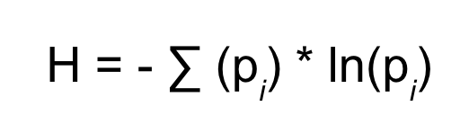
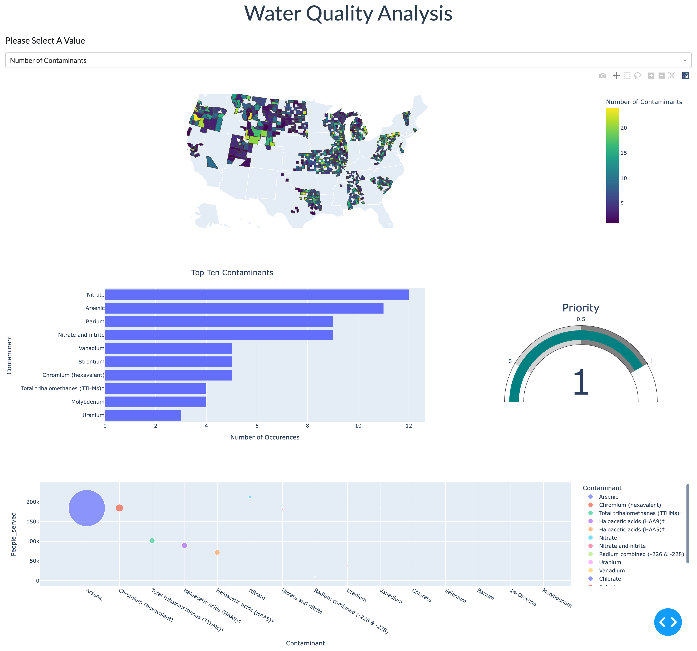

# Identifying at-risk and underserved communities with poor quality drinking water in the United States

## [View the Google Presentation](https://docs.google.com/presentation/d/1KNtJILQS13t8GJm_S1Poi-_9Wk_sNTs_-LUTHM7UoB4/edit?usp=sharing)

## Project Overview
The purpose of this project is to analyze drinking water quality to determine if the quality of the community's drinking water is correlated with certain demographic markers, such as income level. Specifically, we are aiming to use socioeconomic data and drinking water quality data to identify at-risk communities that are historically underserved. By identifying which communities are at most risk (i.e., poverty level, racial inequity) alongside our analysis of water quality data and our supervised machine learning model results, we can identify those high-priority communities. We can then have a subset of communities that can be targeted that need humanitarian support to remediate their water source.

### Why
Free of chemicals and biological material, access to clean drinking water is a basic human right. In the United States, we take access to clean drinking water for granted. The news of lead in the drinking water in Flint, MI was a wake-up call that perhaps other communities are also dealing with sub-par water. Guidelines from the Environmental Protection Agency (EPA) have not been updated in decades, with some regulations dating back nearly 50 years without more recent revisions. [See the Summary of Drinking Water Regulations](https://www.epa.gov/sites/default/files/2015-10/documents/dw_regulation_timeline.pdf).

### Question
Do communities with traditionally underserved demographics have access to clean drinking water? If so, how can we prioritize which communities are most in the need of cleaner water?

## Data
Data is being sourced from web scraping of [Environmental Working Group's Tap Water Database](https://www.ewg.org/tapwater/), the 2020 United States Decennial Census ([curated on Kaggle.com](https://www.kaggle.com/datasets/zusmani/us-census-2020)), and Table B19083 from the United States Census American Community Survey, providing the Gini Index for each county in the United States.

## Project Flow Outline

### Data Collection and Preprocessing for ML Feature Engineering
1. Census Data Workflow
   - Download raw data from Kaggle and filter dataframe on column ```df['SUMLEV'] == 50``` to make a master .csv that includes the census data of all states.
   - Read CSV into a dataframe and keep columns relating to the total population, the population of one race, the population of two or more races, Hispanic and Not Hispanic population, and geographic identifiers GEOCODE and GEOID (aka county_FIPS). 
   - Calculation of diversity indices:
      - Simpson Diversity Index for Race
      - Simpson Diversity Index for Ethnicity
      - The Simpson Diversity Index, D, is calculated as follows:
      
      - Shannon Diversity Index for Race
      - Shannon Diversity Index for Ethnicity
      - The Shannon Diversity Index, H, is calculated as follows:
      
  - Import Gini index data as .csv, save as DataFrame and merge with Census DataFrame on GEOID (unique geographic identifier).
  - Using Sqlite3, export to a new table in the database, with the primary key "County_FIPS"
2. EWG Web scraping
   - The [`web scraping script`](/Web_Scraping/PyScripts/scrape_EWG.py) receives a state ID from the user. It then creates [directory](/Resources/Data/user_scrape_data/) for that state where all of the scraped data are stored. The script generates a [list](/Resources/Data/user_scrape_data/AL/utilities.csv) of all of the water utilities in that state, visits each one, and pulls out the [data](/Resources/Data/user_scrape_data/AL/contaminants.csv) contained on each site about contaminants. 
   - Cleaning of web scraped data is done by executing the [`clean_and_build_v2.py`](/Web_Scraping/PyScripts/clean_and_build_v2.py) which steps through each state directory created by the [`web scraping script`](/Web_Scraping/PyScripts/scrape_EWG.py) and generates the [cleaned data file](/Resources/Data/user_scrape_data/AL/contaminants_cleaned.csv), and builds a master [dataset](/Resources/Data/Cleaned_Data/) containing all of the scraped data to update the database.
   - To update the database, the [`update_DB.py`](/Database/update_DB.py) script is run, which then generates the final table that can be merged with the census data. This table is a county-level summary of the contamination data from web scraping.
3. Feature Engineering for ML 
   - To obtain the initial DataFrame for input into any of our ML models, the following SQLite query is performed which does an inner join on the census data table and the summary contaminants table.
      ``` python 
     df = pd.read_sql_query("SELECT * FROM Census_Data INNER JOIN Contaminant_Summary on Census_Data.county_FIPS = Contaminant_Summary.county_FIPS",conn)
     ```
 4. Target Engineering for Binary Classification
    - The Following SQLite Queries builds the features used for the Binary Classification:
 ```python
con.execute('''
CREATE TABLE Contaminant_Summary AS SELECT Utilities.County_FIPS,
                                           COUNT(county_FIPS) AS Num_Contaminants,
                                           SUM(Population_Served) AS Sum_Population_Served,
                                           SUM(Contaminant_Factor) AS Sum_ContaminantFactor,
                                           min(Contaminant_Factor) AS Min_Contaminant_Factor,
                                           max(Contaminant_Factor) AS Max_Contaminant_Factor,
                                           round(avg(Contaminant_Factor), 2) AS Avg_Contaminant_Factor
                                      FROM Utilities
                                     GROUP BY County_FIPS;
                                 
''')

df = pd.read_sql_query("SELECT * FROM Census_Data INNER JOIN Contaminant_Summary on Census_Data.county_FIPS = Contaminant_Summary.county_FIPS",conn)

 ``` 
   - To have a target for ML models to predict an algorithm had to be developed to establish the weights of the features and determine a final priority level. In the case of the binary classification models, this target is a high-priority (1) or low-priority (0). The [algorithm](/Priority_Algo_dev/Priority_algo_dev_v2.ipynb) which establishes the binary target was used for all binary classification model development. This algorithm was adapted from a previous version to only establish a high priority taret if the water quality index (Sum_ContaminantFactor) was greater than the median.
5. To gain access to predicting multiple levels of priorities, we are also exploring the development of an ordinal logistic regression model which will be developed in `R`. This model allows us to predict variables that are not only categorical but they are also following an order (low to high / high to low). These efforts have not been fully implemented and are stillunder construction.
6. Supervised ML Binary Classification
   - The benefit of choosing a binary classifier model is that there are many models to choose from and many hyperparameters for tuning. The drawback is that we are limited to only two priority values (high-prority to low-priority). 
   - The top-performing model was Balanced Random Forest Classifier with a 98% accuracy and the Easy Ensemble AdaBoost Classifier performed with a 97% accuracy.
   - Feature Selection:
      - Simpson_Race_DI           
      - Simpson_Ethnic_DI         
      - Shannon_Race_DI           
      - Shannon_Ethnic_DI         
      - Gini_Index                
      - Num_Contaminants          
      - Sum_ContaminantFactor     
      - Avg_Contaminant_Factor
### Figure 1. `sns.pairplot` of our feature distributions colored by the priority target high or low priority


### Figure 2. Bubble plot of the top three features based on importance in the Random Forest model. Note: Size is proportional to the Total Number of Contaminants

   - These features have been selected based on previous models showing the feature importance weights (see the code blocks below). 
```python
# List the features sorted in descending order by feature importance
sorted(zip(brf_model.feature_importances_, X.columns), reverse=True)
```
    [(0.3328339120046307, 'Simpson_Ethnic_DI'),
     (0.30260330303838934, 'Shannon_Race_DI'),
     (0.2502549828888729, 'Sum_ContaminantFactor'),
     (0.060136657356903975, 'Num_Contaminants'),
     (0.03967709824887343, 'Avg_Contaminant_Factor'),
     (0.014494046462329805, 'Gini_Index')]
   - Only the top weighted ethnic and race diversity indices were chosen because redundancy of a correlated feature is unnecesary and does not affect the accuracy of the model.    
   - Outlier detection and filtering on the Sum_Contaminant feature was done as a Inter-quartile Range method (see code blocks below for more detail).
   - Features were then scaled using scikit-learn `StandardScalar`
   - The models are saved using `pickle`. This model can then be loaded in to our Dash app for active prediction of newly scraped data from user input of a zip code.
   - The models were used to make predictions on the new test data from Arkansas (see the [script](/Machine_Learning/Binary_Classification/New_Predictions.ipynb) for details). This test data recieved all low-priority predictions from both the Easy Ensemble Classifier and the Balanced Random Forrest model. This is due to the fact that the feature (Sum_ContaminantFactor) was not at high enough levels for any of the counties with similar levels of ethinic and race indices, so the models predicted low-priority. 
   - Example from the new test data: A county had a `Sum_ContaminantFactor` > 5000 yet a `Simpson_Ethnic_DI` < 0.15. These parameters alone are enough to trigger a low-priority prediction form these models.
7. Dashboard Construction:
   - The dashboard we are using to host this project is a multi-page Plotly Dash App
   - The app will be hosted on Heroku
   - A link to our dashboard will be at the top of this README and is also here: [the link will go here](www.heroku.com) 
   - The interactive portion of the (draft) dashboard looks like the below image. The user can select a value to display on the Choropleth map. In this screenshot, the default value of Number of Contaminants is shown. When the user clicks on a county, the histogram, gauge, and scatterplot all update to display information for that county:
   

### Code for Binary Classification Model
```python
db = r'C:/Users/jonat/UO_Bootcamp/Group_project/git_Water_Quality_Analysis/Water_Quality_Analysis/Database/database.sqlite3'
# Connect to SQLite database
conn = sqlite3.connect(db)
  
# Create cursor object
cursor = conn.cursor()

#Read in the Data from the DB
df = pd.read_sql_query("SELECT * FROM Census_Data INNER JOIN Contaminant_Summary on Census_Data.county_FIPS = Contaminant_Summary.county_FIPS",conn)
```


```python
#Get the target binary data from the .csv file that was generated in the Priority_algo_dev.ipynb
target = pd.read_csv(os.path.join('..', '..', 'Priority_Algo_dev', 'new_priority.csv'), usecols=['New_Priority'])
target
```


<div>

<table border="1" class="dataframe">
  <thead>
    <tr style="text-align: right;">
      <th></th>
      <th>New_Priority</th>
    </tr>
  </thead>
  <tbody>
    <tr>
      <th>0</th>
      <td>0</td>
    </tr>
    <tr>
      <th>1</th>
      <td>1</td>
    </tr>
    <tr>
      <th>2</th>
      <td>1</td>
    </tr>
    <tr>
      <th>3</th>
      <td>1</td>
    </tr>
    <tr>
      <th>4</th>
      <td>0</td>
    </tr>
    <tr>
      <th>...</th>
      <td>...</td>
    </tr>
    <tr>
      <th>877</th>
      <td>0</td>
    </tr>
    <tr>
      <th>878</th>
      <td>0</td>
    </tr>
    <tr>
      <th>879</th>
      <td>0</td>
    </tr>
    <tr>
      <th>880</th>
      <td>1</td>
    </tr>
    <tr>
      <th>881</th>
      <td>1</td>
    </tr>
  </tbody>
</table>
<p>882 rows × 1 columns</p>
</div>


```python
sr = pd.Series(target.New_Priority)
sr
```


    0      0
    1      1
    2      1
    3      1
    4      0
          ..
    877    0
    878    0
    879    0
    880    1
    881    1
    Name: New_Priority, Length: 882, dtype: int64


```python
target_labels = sr.apply(lambda x : 'High Priority' if x>0 else 'Low Priority')
```


```python
df['Target'] = target.New_Priority
```

## Feature Selection


```python
df_model = df.drop(columns=['county_FIPS', 
                            'Geographic_Area_Name', 
                            'County', 'GEOID',
                            'Total_Population',
                            'White', 
                            'Black', 
                            'Native', 
                            'Asian',
                            'Pacific_Islander', 
                            'Other', 
                            'Two_or_more_Races', 
                            'Hispanic',
                            'Not_Hispanic', 
                            'Not_White',
                            'pct_White', 
                            'pct_Black', 
                            'pct_Native',
                            'pct_Asian', 
                            'pct_Pacific_Islander', 
                            'pct_Other', 
                            'pct_Not_White',
                            'pct_Hispanic', 
                            'pct_Not_Hispanic', 
                            'pct_Two_or_more_Races',
                            'County_FIPS',
                            'Sum_Population_Served',
                            'Min_Contaminant_Factor', 
                            'Max_Contaminant_Factor',
                            ])
```


```python
#Check to make sure the data types don't need fixing
df_model.dtypes
```


    Simpson_Race_DI           float64
    Simpson_Ethnic_DI         float64
    Shannon_Race_DI           float64
    Shannon_Ethnic_DI         float64
    Gini_Index                float64
    Num_Contaminants            int64
    Sum_ContaminantFactor       int64
    Avg_Contaminant_Factor    float64
    Target                      int64
    dtype: object


```python
#Check for Nan even though cleaning scripts should have excluded them by this stage
df_model.isna().sum()
```


    Simpson_Race_DI           0
    Simpson_Ethnic_DI         0
    Shannon_Race_DI           0
    Shannon_Ethnic_DI         0
    Gini_Index                0
    Num_Contaminants          0
    Sum_ContaminantFactor     0
    Avg_Contaminant_Factor    0
    Target                    0
    dtype: int64


## Filter the Data using the IQR method


```python
percentile25 = df_model['Sum_ContaminantFactor'].quantile(0.25)
percentile75 = df_model['Sum_ContaminantFactor'].quantile(0.75)
```


```python
SCF_IQR = iqr(df_model['Sum_ContaminantFactor'])
```


```python
print(percentile25, percentile75, SCF_IQR)
```

    1966.5 11049.5 9083.0
    


```python
upper_limit = percentile75 + 1.5 * SCF_IQR
lower_limit = percentile25 - 1.5 * SCF_IQR
```


```python
new_df = df_model[df_model['Sum_ContaminantFactor'] < upper_limit]

```


```python
new_df['Label'] = target_labels
```


```python
new_df.sample(20)
```


<div>

<table border="1" class="dataframe">
  <thead>
    <tr style="text-align: right;">
      <th></th>
      <th>Simpson_Race_DI</th>
      <th>Simpson_Ethnic_DI</th>
      <th>Shannon_Race_DI</th>
      <th>Shannon_Ethnic_DI</th>
      <th>Gini_Index</th>
      <th>Num_Contaminants</th>
      <th>Sum_ContaminantFactor</th>
      <th>Avg_Contaminant_Factor</th>
      <th>Target</th>
      <th>Label</th>
    </tr>
  </thead>
  <tbody>
    <tr>
      <th>811</th>
      <td>0.123800</td>
      <td>0.024524</td>
      <td>0.362783</td>
      <td>0.066826</td>
      <td>0.4616</td>
      <td>3</td>
      <td>3856</td>
      <td>1285.33</td>
      <td>0</td>
      <td>Low Priority</td>
    </tr>
    <tr>
      <th>461</th>
      <td>0.595608</td>
      <td>0.265007</td>
      <td>1.523013</td>
      <td>0.435026</td>
      <td>0.3817</td>
      <td>3</td>
      <td>8607</td>
      <td>2869.00</td>
      <td>1</td>
      <td>High Priority</td>
    </tr>
    <tr>
      <th>600</th>
      <td>0.149196</td>
      <td>0.041241</td>
      <td>0.443405</td>
      <td>0.102151</td>
      <td>0.4200</td>
      <td>4</td>
      <td>106</td>
      <td>26.50</td>
      <td>0</td>
      <td>Low Priority</td>
    </tr>
    <tr>
      <th>271</th>
      <td>0.126232</td>
      <td>0.050211</td>
      <td>0.418627</td>
      <td>0.119712</td>
      <td>0.4202</td>
      <td>5</td>
      <td>3964</td>
      <td>792.80</td>
      <td>0</td>
      <td>Low Priority</td>
    </tr>
    <tr>
      <th>563</th>
      <td>0.094933</td>
      <td>0.023446</td>
      <td>0.302269</td>
      <td>0.064395</td>
      <td>0.4524</td>
      <td>1</td>
      <td>926</td>
      <td>926.00</td>
      <td>0</td>
      <td>Low Priority</td>
    </tr>
    <tr>
      <th>148</th>
      <td>0.403550</td>
      <td>0.325308</td>
      <td>1.179164</td>
      <td>0.506509</td>
      <td>0.4353</td>
      <td>9</td>
      <td>2897</td>
      <td>321.89</td>
      <td>0</td>
      <td>Low Priority</td>
    </tr>
    <tr>
      <th>63</th>
      <td>0.487995</td>
      <td>0.100374</td>
      <td>1.076582</td>
      <td>0.207240</td>
      <td>0.4363</td>
      <td>15</td>
      <td>5281</td>
      <td>352.07</td>
      <td>0</td>
      <td>Low Priority</td>
    </tr>
    <tr>
      <th>408</th>
      <td>0.209698</td>
      <td>0.037032</td>
      <td>0.565055</td>
      <td>0.093614</td>
      <td>0.4291</td>
      <td>11</td>
      <td>13612</td>
      <td>1237.45</td>
      <td>0</td>
      <td>Low Priority</td>
    </tr>
    <tr>
      <th>401</th>
      <td>0.218188</td>
      <td>0.056749</td>
      <td>0.612333</td>
      <td>0.132048</td>
      <td>0.4381</td>
      <td>10</td>
      <td>7270</td>
      <td>727.00</td>
      <td>0</td>
      <td>Low Priority</td>
    </tr>
    <tr>
      <th>48</th>
      <td>0.399721</td>
      <td>0.089576</td>
      <td>0.956214</td>
      <td>0.189574</td>
      <td>0.4594</td>
      <td>1</td>
      <td>1096</td>
      <td>1096.00</td>
      <td>0</td>
      <td>Low Priority</td>
    </tr>
    <tr>
      <th>21</th>
      <td>0.228871</td>
      <td>0.075716</td>
      <td>0.679439</td>
      <td>0.166065</td>
      <td>0.4321</td>
      <td>9</td>
      <td>5812</td>
      <td>645.78</td>
      <td>0</td>
      <td>Low Priority</td>
    </tr>
    <tr>
      <th>6</th>
      <td>0.144976</td>
      <td>0.033514</td>
      <td>0.447271</td>
      <td>0.086308</td>
      <td>0.4265</td>
      <td>4</td>
      <td>7408</td>
      <td>1852.00</td>
      <td>0</td>
      <td>Low Priority</td>
    </tr>
    <tr>
      <th>151</th>
      <td>0.618971</td>
      <td>0.321972</td>
      <td>1.609691</td>
      <td>0.502678</td>
      <td>0.4296</td>
      <td>24</td>
      <td>11252</td>
      <td>468.83</td>
      <td>1</td>
      <td>High Priority</td>
    </tr>
    <tr>
      <th>445</th>
      <td>0.299979</td>
      <td>0.271371</td>
      <td>0.940018</td>
      <td>0.442787</td>
      <td>0.4328</td>
      <td>1</td>
      <td>985</td>
      <td>985.00</td>
      <td>0</td>
      <td>Low Priority</td>
    </tr>
    <tr>
      <th>708</th>
      <td>0.171324</td>
      <td>0.063603</td>
      <td>0.502696</td>
      <td>0.144568</td>
      <td>0.5167</td>
      <td>5</td>
      <td>719</td>
      <td>143.80</td>
      <td>0</td>
      <td>Low Priority</td>
    </tr>
    <tr>
      <th>68</th>
      <td>0.538178</td>
      <td>0.159892</td>
      <td>1.212859</td>
      <td>0.297000</td>
      <td>0.4741</td>
      <td>15</td>
      <td>11654</td>
      <td>776.93</td>
      <td>1</td>
      <td>High Priority</td>
    </tr>
    <tr>
      <th>92</th>
      <td>0.340404</td>
      <td>0.053646</td>
      <td>0.804621</td>
      <td>0.126235</td>
      <td>0.3916</td>
      <td>2</td>
      <td>2846</td>
      <td>1423.00</td>
      <td>0</td>
      <td>Low Priority</td>
    </tr>
    <tr>
      <th>568</th>
      <td>0.127527</td>
      <td>0.079044</td>
      <td>0.444908</td>
      <td>0.171803</td>
      <td>0.4232</td>
      <td>22</td>
      <td>21493</td>
      <td>976.95</td>
      <td>0</td>
      <td>Low Priority</td>
    </tr>
    <tr>
      <th>414</th>
      <td>0.114847</td>
      <td>0.036273</td>
      <td>0.357974</td>
      <td>0.092052</td>
      <td>0.4145</td>
      <td>4</td>
      <td>5199</td>
      <td>1299.75</td>
      <td>0</td>
      <td>Low Priority</td>
    </tr>
    <tr>
      <th>585</th>
      <td>0.401754</td>
      <td>0.083862</td>
      <td>0.999394</td>
      <td>0.180004</td>
      <td>0.4650</td>
      <td>9</td>
      <td>2963</td>
      <td>329.22</td>
      <td>0</td>
      <td>Low Priority</td>
    </tr>
  </tbody>
</table>
</div>


```python
new_df.shape
```


    (834, 10)


```python
df_model.shape
```


    (882, 9)


```python
new_df.columns
```


    Index(['Simpson_Race_DI', 'Simpson_Ethnic_DI', 'Shannon_Race_DI',
           'Shannon_Ethnic_DI', 'Gini_Index', 'Num_Contaminants',
           'Sum_ContaminantFactor', 'Avg_Contaminant_Factor', 'Target', 'Label'],
          dtype='object')


```python
fig = px.scatter(
    new_df, 
    x="Simpson_Ethnic_DI", 
    y="Sum_ContaminantFactor", 
    color="Label",
    size='Num_Contaminants', 
    hover_data=['Sum_ContaminantFactor'],
    labels={
        "Sum_ContaminantFactor": "Total Conatmainant Factor",
        "Simpson_Ethnic_DI" : " Simpson Ethnic Index"
                     
                 },
)

fig.update_layout(
    title={
        'text': "Plot of the Adaboost Top Feature Importance",
        'y':0.95,
        'x':0.5,
        'xanchor': 'center',
        'yanchor': 'top'})


fig.show()

```

```python
fig = px.scatter(
    new_df, 
    x="Shannon_Ethnic_DI", 
    y="Sum_ContaminantFactor", 
    color="Label",
    size='Num_Contaminants', 
    hover_data=['Sum_ContaminantFactor'],
    labels={
        "Sum_ContaminantFactor": "Total Conatmainant Factor",
        "Shannon_Ethnic_DI" : " Shannon Ethnic Index"
                     
                 },
)

fig.update_layout(
    title={
        'text': "Plot of the Adaboost Top Feature Importance",
        'y':0.95,
        'x':0.5,
        'xanchor': 'center',
        'yanchor': 'top'})


fig.show()
```

```python
plt.figure(figsize=(30,30))
sns.pairplot(new_df, hue='Label')
```


    <seaborn.axisgrid.PairGrid at 0x15f067552e0>


    <Figure size 2160x2160 with 0 Axes>


    

    


## Drop extra features then split the data into training and test data


```python
new_df.columns
```


    Index(['Simpson_Race_DI', 'Simpson_Ethnic_DI', 'Shannon_Race_DI',
           'Shannon_Ethnic_DI', 'Gini_Index', 'Num_Contaminants',
           'Sum_ContaminantFactor', 'Avg_Contaminant_Factor', 'Target', 'Label'],
          dtype='object')


```python
mdf = new_df.drop(columns=['Shannon_Ethnic_DI', 'Simpson_Race_DI', 'Target', 'Label'])
mdf.sample(5)
```


<div>

<table border="1" class="dataframe">
  <thead>
    <tr style="text-align: right;">
      <th></th>
      <th>Simpson_Ethnic_DI</th>
      <th>Shannon_Race_DI</th>
      <th>Gini_Index</th>
      <th>Num_Contaminants</th>
      <th>Sum_ContaminantFactor</th>
      <th>Avg_Contaminant_Factor</th>
    </tr>
  </thead>
  <tbody>
    <tr>
      <th>767</th>
      <td>0.018794</td>
      <td>0.271860</td>
      <td>0.4112</td>
      <td>9</td>
      <td>7936</td>
      <td>881.78</td>
    </tr>
    <tr>
      <th>98</th>
      <td>0.069004</td>
      <td>0.554265</td>
      <td>0.4852</td>
      <td>1</td>
      <td>126</td>
      <td>126.00</td>
    </tr>
    <tr>
      <th>426</th>
      <td>0.092984</td>
      <td>1.164492</td>
      <td>0.4658</td>
      <td>19</td>
      <td>23578</td>
      <td>1240.95</td>
    </tr>
    <tr>
      <th>818</th>
      <td>0.016446</td>
      <td>0.274129</td>
      <td>0.3967</td>
      <td>5</td>
      <td>4497</td>
      <td>899.40</td>
    </tr>
    <tr>
      <th>647</th>
      <td>0.037614</td>
      <td>0.400051</td>
      <td>0.4195</td>
      <td>3</td>
      <td>1106</td>
      <td>368.67</td>
    </tr>
  </tbody>
</table>
</div>


```python
# Create our features
X = mdf
# Create our target
y = new_df.Target
```


```python
# define standard scaler
scaler = StandardScaler()
# transform data
X_scaled = scaler.fit_transform(X)
```


```python
X_train, X_test, y_train, y_test = train_test_split(X, y, random_state=1)
```


```python
#Check the imbalance in the training set
y_train.value_counts()
```


    0    521
    1    104
    Name: Target, dtype: int64


### Easy Ensemble AdaBoost Classifier


```python
# Train the EasyEnsembleClassifier
from imblearn.ensemble import EasyEnsembleClassifier 
eec = EasyEnsembleClassifier(n_estimators=100, random_state=1)
eec.fit(X_train,y_train)
```


    EasyEnsembleClassifier(n_estimators=100, random_state=1)


```python
# Calculated the balanced accuracy score
y_pred = eec.predict(X_test)
balanced_accuracy_score(y_test, y_pred)
```


    0.9767226890756302


```python
# Display the confusion matrix
cm = confusion_matrix(y_test, y_pred)

cm_df = pd.DataFrame(
    cm, index=["Actual High-Priority", "Actual Low-Priority"],
    columns=["Predicted High-Priority", "Predicted Low-Priority"]
)

# Displaying results
display(cm_df)
```


<div>

<table border="1" class="dataframe">
  <thead>
    <tr style="text-align: right;">
      <th></th>
      <th>Predicted High-Priority</th>
      <th>Predicted Low-Priority</th>
    </tr>
  </thead>
  <tbody>
    <tr>
      <th>Actual High-Priority</th>
      <td>172</td>
      <td>3</td>
    </tr>
    <tr>
      <th>Actual Low-Priority</th>
      <td>1</td>
      <td>33</td>
    </tr>
  </tbody>
</table>
</div>


```python
# Print the imbalanced classification report
print(classification_report_imbalanced(y_test, y_pred))
```

                       pre       rec       spe        f1       geo       iba       sup
    
              0       0.99      0.98      0.97      0.99      0.98      0.96       175
              1       0.92      0.97      0.98      0.94      0.98      0.95        34
    
    avg / total       0.98      0.98      0.97      0.98      0.98      0.95       209
    
    


```python
y_score = eec.predict_proba(X)[:, 1]

fpr, tpr, thresholds = roc_curve(y, y_score)

fig = px.area(
    x=fpr, y=tpr,
    title=f'ROC Curve (AUC={auc(fpr, tpr):.4f})',
    labels=dict(x='False Positive Rate', y='True Positive Rate'),
    width=700, height=500
)
fig.add_shape(
    type='line', line=dict(dash='dash'),
    x0=0, x1=1, y0=0, y1=1
)

fig.update_yaxes(scaleanchor="x", scaleratio=1)
fig.update_xaxes(constrain='domain')
fig.show()
```

```python
# The histogram of scores compared to true labels
fig_hist = px.histogram(
    x=y_score, color=y, nbins=50,
    labels=dict(color='True Labels', x='Score')
)

fig_hist.show()


# Evaluating model performance at various thresholds
df = pd.DataFrame({
    'False Positive Rate': fpr,
    'True Positive Rate': tpr
}, index=thresholds)
df.index.name = "Thresholds"
df.columns.name = "Rate"

fig_thresh = px.line(
    df, title='TPR and FPR at every threshold',
    width=700, height=500
)

fig_thresh.update_yaxes(scaleanchor="x", scaleratio=1)
fig_thresh.update_xaxes(range=[0, 1], constrain='domain')
fig_thresh.show()
```

```python
precision, recall, thresholds = precision_recall_curve(y, y_score)

fig = px.area(
    x=recall, y=precision,
    title=f'Precision-Recall Curve (AUC={auc(fpr, tpr):.4f})',
    labels=dict(x='Recall', y='Precision'),
    width=700, height=500
)
fig.add_shape(
    type='line', line=dict(dash='dash'),
    x0=0, x1=1, y0=1, y1=0
)
fig.update_yaxes(scaleanchor="x", scaleratio=1)
fig.update_xaxes(constrain='domain')

fig.show()
```

## Save the model using pickle


```python
# save the model to disk
filename = 'EEC_model.sav'
pickle.dump(eec, open(filename, 'wb'))
 
```

## some time later...
 


```python
# load the model from disk
loaded_model = pickle.load(open(filename, 'rb'))
result = loaded_model.score(X_test, y_test)
print(result)
```

    0.9808612440191388
    

# Balanced Random Forest Classifier


```python
# Resample the training data with the BalancedRandomForestClassifier
from imblearn.ensemble import BalancedRandomForestClassifier
brf_model = BalancedRandomForestClassifier(n_estimators=100, random_state=1) 
brf_model.fit(X_train,y_train)
# Calculated the balanced accuracy score
y_pred = brf_model.predict(X_test)
balanced_accuracy_score(y_test, y_pred)
```


    0.982436974789916


```python
# List the features sorted in descending order by feature importance
sorted(zip(brf_model.feature_importances_, X.columns), reverse=True)
```


    [(0.3328339120046307, 'Simpson_Ethnic_DI'),
     (0.30260330303838934, 'Shannon_Race_DI'),
     (0.2502549828888729, 'Sum_ContaminantFactor'),
     (0.060136657356903975, 'Num_Contaminants'),
     (0.03967709824887343, 'Avg_Contaminant_Factor'),
     (0.014494046462329805, 'Gini_Index')]


```python

```

     


